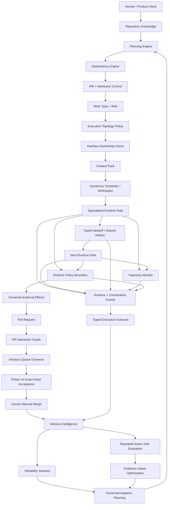
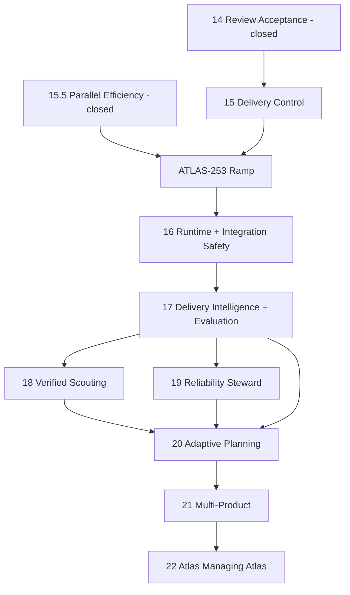
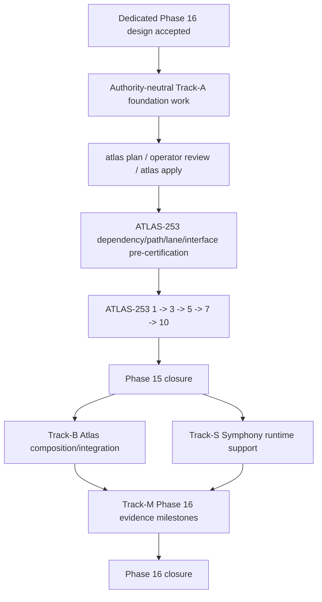

# Atlas Agentic Engineering Programme Design v4 — Cumulative Research Edition


> **Repository adoption record — 20 August 2026.** The operator has accepted this cumulative programme design as the governing architecture authority for the controlled Phase 16 delivery overlap. This adoption does **not** trigger the document's full future-horizon supersession rule while Phase 15 remains open; that atomic horizon supersession remains a Phase 15 closure action. For the controlled overlap only, the dedicated Phase 16 design named below is ticketisation authority for Track A. No Phase 17–22 ticketisation is authorised by this record.

**Status:** Proposed canonical `architecture_horizon` for Atlas future phases 16–22. Design authority only; not planning-input or ticket-minting authority.
**Date:** 19 August 2026.
**Revision model:** **Cumulative.** This v4 is built on v3 as the preservation baseline. No material v3 design section is intentionally removed. Where a v3 ruling changes, v4 marks the supersession explicitly and gives the reason.
**Current Atlas evidence baseline:** `derekrivers/atlas` `main` at `563d96a4b189d8d43fd57f7569d87513a6c6163f` after merged PR #337 (`ATLAS-253: Ratify managed Symphony runtime proof`).
**Current operating disposition:** Phase 15.5 is closed. ATLAS-253 remains open and paused before real workload admission. Managed Symphony Gate-1 runtime identity has been proven at ceiling one; the active delivery-admission policy is a paused ceiling-one revision. The Atlas store currently has no >10 real non-terminal workload pool, so the concurrency ramp has not begun.
**Intended repository destination:** `docs/atlas/agentic-engineering-programme-design.md`.
**Supersession rule:** After the current Phase 15 programme closes and the atomic horizon-adoption change is accepted, this document supersedes the future-facing Phase 16–20 direction in `docs/atlas/phase-13-20-programme-horizon.md`. It does not rewrite delivered Phase 1–15.5 contracts.
**Ticket identity rule:** `WP-*` identifiers in this document are design decomposition identifiers only. Real `ATLAS-N` keys are minted later through Atlas key authority and `atlas apply`.

**Architecture review status:** Reviewed 19 August 2026 against the v3 preservation baseline and the two newest design inputs. Review corrections in this edition include explicit research-basis references inside the affected phases, an overlap rule resolving the ATLAS-253/Phase-16 workload sequencing contradiction, stronger entry gates for Phases 20–22, and a reference-integrity checklist.

**Experiment E evidence incorporation:** 20 August 2026. This cumulative edition now also retains the completed Experiment E feasibility evidence against the exact Atlas/Symphony/Codex environment described in section 25. No earlier architecture, research, phase, authority or preservation ruling is removed or weakened by this addition. Experiment E proves feasibility of the structured runtime/event, exact identity, stale-safe steering and host-side capability seams; it also records a binding negative finding that the existing unrestricted `linear_graphql` mutation tool prevents any present claim of non-bypassable Linear effect governance until that channel is removed or capability-restricted.

**Experiment F evidence incorporation:** 20 August 2026. This cumulative edition now also retains the completed Atlas interface-ownership retrospective described in section 25. Experiment F found real historical cases where repository changes were file-disjoint yet coupled by a semantic invariant, and it also found cases where existing dependency, protected-lane or dedicated integrity controls were already the correct mechanism. The resulting Phase 16 ruling is intentionally narrow: an `InterfaceContract` is a versioned named invariant shared across independently editable producer/consumer or authority surfaces; it is not a replacement for dependencies, protected lanes, path overlap, import structure or every ordinary API call.

**Dedicated Phase 16 design incorporation:** 20 August 2026. The completed multi-pass dedicated Phase 16 design, `Atlas Phase 16 — Agent Runtime and Integration Safety`, is now incorporated into this cumulative horizon at programme-decision level. Its working artifact SHA-256 is `29117eb5745b3b00ef9c29035411e93a06a3e09b58122098a2a5176faea42379` and its intended repository destination after operator acceptance is `docs/atlas/phase-16-agent-runtime-and-integration-safety.md`. The dedicated design resolves the remaining Phase 16 architecture choices around repository ownership, runtime transport identity, work-shape versus production topology, effect-policy execution, ticket-size discipline, ATLAS-253 overlap and evidence-only milestones. This incorporation does **not** itself activate Phase 16 runtime authority, restart Symphony, change the Phase 15 ramp, mint tickets or substitute for explicit operator acceptance of the dedicated design.


---

# 0. Cumulative-revision contract and preservation ledger

This document exists partly to prevent architectural context from disappearing as Atlas evolves.

## 0.1 Preservation rule

A future revision must not silently remove:

- research sources or artifact links;
- external-evidence summaries and limitations;
- Atlas-specific interpretation of each source;
- phase outcome, authority, entry gate, work packages and closure gate;
- threat model and security requirements;
- trust/evidence tiers;
- rollout modes;
- failure semantics;
- operational metrics;
- decision ledger;
- anti-patterns;
- experiments;
- package/service boundary direction;
- ticket Definition of Done;
- configuration-governance rules;
- adoption/ticketisation sequence.

A section may be removed only if the new revision:

1. names the superseded section/ruling;
2. records why it is obsolete;
3. identifies the new owning section/ADR/design;
4. preserves the historical decision in a supersession ledger.

## 0.2 V3 preservation map

V4 preserves the v3 conceptual spine:

| V3 area | V4 treatment |
|---|---|
| classification / ratification / horizon authority | retained and updated for current Gate-1 pause |
| purpose and seven research problems | retained; expanded to software-factory coordination |
| executive decisions | retained; new coordination/factory decisions appended |
| Atlas invariants | retained |
| seven-source research synthesis | retained in full intent |
| architecture + information classes | retained; extended with topology/interface/coordination/outcomes |
| Phase 14 | retained as closed acceptance spine |
| Phase 15 + 15.5 | retained; current operational evidence added |
| Phase 16 | retained and substantially expanded |
| Phase 17 | retained and strengthened with repeated-run coordination evaluation |
| Phase 18 | retained |
| Phase 19 | retained |
| Phase 20 | retained and made more explicit |
| Phase 21 | retained and made more explicit |
| Phase 22 | retained and made more explicit |
| trust and authority | retained; new coordination claims added |
| rollout modes | retained |
| failure taxonomy | retained; new factory failures added |
| privacy / retention | retained |
| operational metrics | retained; coordination and reviewer burden added |
| ticketisation strategy | retained |
| documentation adoption | retained |
| sequencing graph | retained and updated |
| decision ledger | retained and extended |
| anti-patterns | retained and extended |
| experiments A–E | retained; F–G added |
| research references | retained; Vercel + coordination paper added |
| final programme statement | retained and updated |
| package/service topology | retained and extended |
| threat model | retained and extended |
| research-confidence table | retained and extended |
| config governance | retained and extended |
| future ticket Definition of Done | retained and extended |
| immediate programme action | updated for paused operations |

## 0.3 New evidence incorporated by v4

V4 adds two new external research inputs:

1. **Vercel — Building a software factory for AI SDK**
   https://vercel.com/blog/building-a-software-factory-for-ai-sdk

2. **Giuseppe Destefanis & Tomaso Aste — When Agents Coordinate: Measuring Coordination in Multi-Agent AI Coding**
   https://arxiv.org/abs/2608.16801
   DOI landing reference: https://doi.org/10.48550/arXiv.2608.16801

These sources do not replace the seven research directions already in v3. They add a software-factory and coordination layer across them.

## 0.4 Experiment E runtime-feasibility evidence incorporated after the v4 review

Experiment E was executed as a feasibility investigation against the current paused Atlas operating environment on 20 August 2026. It did **not** restart Symphony, admit workload, activate Phase 16 authority, mutate production Linear state or alter the Phase 15 ramp.

### Exact evidence baseline

The evidence set records:

```text
Atlas main:
563d96a4b189d8d43fd57f7569d87513a6c6163f

Pinned managed Symphony release:
e5c5e48917e9e91ffb6709ab5a2a02c5af16bf02

Managed Symphony executable family:
.../symphony-runtime/releases/e5c5e48917e9e91ffb6709ab5a2a02c5af16bf02/symphony

VPS service unit:
atlas-symphony.service

Probe-time service state:
MainPID=0
User=root

Installed Codex CLI:
codex-cli 0.147.0

Resolved Codex executable:
.../@openai/codex/bin/codex.js

Generated app-server protocol bundle fingerprint:
35a2fe7f243d088c41a8151628232e2785abf2bfc341dd4b1c7bb789b1b5e226

Required protocol features observed:
turn/steer       PRESENT
expectedTurnId   PRESENT
dynamicTools     PRESENT
item/tool/call   PRESENT

Sanitised local Codex MCP inventory:
[]
```

`MainPID=0` is intentionally retained as part of the probe evidence: the service was stopped during design recovery. It means this probe establishes the installed managed release/configuration and protocol capability set, not a new active-process runtime receipt. The earlier Phase 15 managed-runtime Gate-1 identity proof remains separate historical evidence and is not replaced by Experiment E.

### Feasibility verdict

**PASS WITH BINDING NEGATIVE FINDING.**

Experiment E establishes that:

1. Symphony already consumes Codex app-server JSON-RPC structurally; Phase 16 does not need log scraping.
2. Codex supplies real thread and turn identities; Symphony already derives one per-turn session identity.
3. the installed Codex protocol supports native stale-bound `turn/steer` using `expectedTurnId`;
4. Symphony already has a host-side dynamic-tool execution boundary through which an executor can request a capability without directly owning the tracker credential;
5. tracker-secret environment names are removed from the Codex subprocess launch path;
6. no local MCP server was configured in the sanitised probe;
7. the current Atlas workflow still permits network access and Git publication, so capability claims must be provider/effect-family scoped rather than universal;
8. the existing Symphony Linear dynamic tool exposes unrestricted `linear_graphql`, including arbitrary mutations using Symphony's configured Linear authentication.

Point 8 is the binding negative finding. A future `GovernedEffectGateway` cannot honestly be called non-bypassable while that generic mutation channel, or any equivalent alternate path to the same credential/effect family, remains executor-accessible.

The architecture therefore adopts the existing Symphony dynamic-tool seam but requires governed mutation families to become explicit typed capabilities. Broad GraphQL parsing is not the safety boundary.

### Experiment E does not authorise production behaviour

Experiment E is architecture evidence only. It does not:

- enable steering;
- persist raw runtime events;
- expose a new Atlas runtime API;
- remove or replace the current Linear tool;
- change the executor's GitHub publication authority;
- activate runtime-policy enforcement;
- prove a live non-bypassable Linear mutation;
- satisfy Phase 16 closure item 9 by itself.

Those remain Phase 16 implementation and milestone responsibilities.

## 0.5 Experiment F interface-ownership retrospective incorporated after Experiment E

Experiment F was executed on 20 August 2026 as a curated retrospective over historical Atlas pull requests, current planning/dependency renders and the delivered Phase 15.5 protected-lane registry. It made no repository, Linear, Symphony, policy or planning mutation.

### Method

The retrospective deliberately separated three questions that earlier Atlas controls can otherwise blur:

1. **Dependency:** what must exist before another ticket can proceed?
2. **Protected lane/path interaction:** what work must not integrate concurrently because it contends on a known repository surface?
3. **Semantic interface:** what invariant must independently editable producer/consumer or authority surfaces agree on even when their files and scheduling are disjoint?

Candidate cases were classified as:

- `STRICT_SEMANTIC_POSITIVE` — historically file-disjoint changes shared a semantic invariant that ordinary path overlap would not reveal;
- `SUPPORTING_SEMANTIC_POSITIVE` — a real semantic mismatch or reachability failure demonstrated the same interface class even though the whole PR pair was not perfectly file-disjoint;
- `EXISTING_CONTROL_SUFFICIENT` — dependencies, protected lanes or a dedicated deterministic integrity mechanism already own the risk and a new generic interface hold would duplicate authority.

This was a curated architecture sample, not a random population sample. It can prove the existence and shape of the failure class; it cannot establish a statistical false-positive rate for all future Atlas work.

### Retrospective evidence

| Case | Historical evidence | File/path relationship | Semantic invariant | Existing control at the time / current control | Experiment F classification |
|---|---|---|---|---|---|
| Symphony project-slug schema | PR #317 moved the canonical Atlas workflow to `tracker.provider.project_slug`; PR #330 later repaired preflight because C4 still consumed `tracker.project_slug` | PR #317 changed `WORKFLOW.md`, Symphony docs and workflow-contract tests; PR #330 changed only `atlas/linear/preflight.py` and `tests/test_preflight.py` — the two PR file sets are disjoint | all consumers of the Symphony tracker configuration must use the same canonical provider-schema path/version | current `workflow-configuration` lane covers PR #317's files but not the disjoint preflight consumer; path/lane protection alone would not connect them | `STRICT_SEMANTIC_POSITIVE` |
| Lesson tag vocabulary | historical lesson-retrieval PR #92 implemented exact whole-tag matching in `atlas/context/lesson_retrieval.py`; PR #204 later fixed the lesson extractor because invented tags could be unreachable by that retrieval rule | the retrieval PR changed `atlas/context/*`; PR #204 changed `atlas/learning/extractor.py`, its prompt, learning docs and extractor tests — file sets are disjoint | lesson producer vocabulary must remain compatible with lesson consumer matching semantics | no current protected lane covers either semantic vocabulary; a file dependency is not the invariant | `STRICT_SEMANTIC_POSITIVE` |
| CI-handoff production reachability | PR #327 delivered the CI-handoff reconciler; PR #335's first live candidate proved the supported `atlas pm sync` cadence did not call that service, leaving a completed head stranded in `CI Pending` with no reconciliation row | not a strict whole-PR disjoint pair, but the missing runtime call-chain crossed separately owned service/cadence surfaces | a delivered reconciliation service is not production authority unless the supported PM cadence can reach it under the declared identity/ownership contract | dependency ordering can ensure the reconciler exists but does not prove runtime reachability | `SUPPORTING_SEMANTIC_POSITIVE` |
| Evidence attribution / consumer expectation | PR #335 remediation found that the CI-handoff adapter expected ticket-attributed evidence even though canonical `drive_evidence_pull` stores ordinary evidence product-scoped without that attribution; tests had hidden the mismatch | producer and consumer are distinct architecture surfaces even though the milestone PR necessarily touched several integration files | evidence producer identity/attribution semantics must match the consuming reconciler's evidence requirement | exact-head evidence controls existed, but no explicit producer/consumer attribution contract connected these assumptions | `SUPPORTING_SEMANTIC_POSITIVE` |
| External workflow-state ownership | Phase 15.5 live work exposed Linear's `PR opened -> In Progress` automation reactivating `CI Pending` work despite Atlas/Symphony code owning a different lifecycle; the operator disabled the automation | one side is an external automation rather than a repository file | only the declared owner may write each workflow-state edge | protected repository paths cannot detect an external writer; authority/channel inventory is required | `SUPPORTING_SEMANTIC_POSITIVE` |
| Alembic migration-head identity | PR #311 explicitly records a semantic migration collision after main introduced revision `0026`; the branch advanced its migration to `0027`, with **no textual conflict** | the competing migration files can be distinct even when their revision identities collide | one linear migration-head namespace/version chain | Phase 15.5 now has a capacity-one `database-migrations` protected lane over `atlas/storage/migrations/` | `EXISTING_CONTROL_SUFFICIENT` for concurrency; do not add a duplicate generic interface hold |
| Acceptance API -> UI ordering | ATLAS-243 explicitly depends on ATLAS-242; the UI consumes the generated acceptance-session client after the API contract exists | producer/consumer surfaces differ, but dependency is explicit and generated-contract surfaces are protected | UI must consume the delivered generated API contract | existing `depends_on` plus generated-contract validation/lane already express the ordering and drift boundary | `EXISTING_CONTROL_SUFFICIENT` unless a future compatibility invariant exceeds those controls |
| Source-anchor durability | Phase 9 closure renamed a roadmap heading while stored source anchors retained the former slug; PR #231 repaired the resulting dangling anchors | canonical doc edit and later store/render repair are file-disjoint | persisted source anchors must resolve against the canonical corpus | Atlas already has a dedicated source-anchor integrity gate/linter; a generic interface hold would duplicate a stronger specific validator | `EXISTING_CONTROL_SUFFICIENT` |

### Experiment F verdict

**PASS — semantic interface ownership is justified, with a narrow activation rule.**

The retrospective proves that:

1. file disjointness is insufficient evidence of semantic independence;
2. dependencies are necessary but answer ordering/existence, not compatibility;
3. protected lanes are necessary but answer repository contention, not all cross-surface invariants;
4. some semantic risks already have stronger dedicated controls and must not be duplicated by `InterfaceContract`;
5. interface surfaces may be repository paths, runtime services, generated/provider schemas or external authority channels;
6. an interface model that fires merely because two tickets discuss the same subsystem would create avoidable serialization and reviewer burden.

The v1 Phase 16 rule is therefore **explicit-contract first, not inferred-interface first**. A model may later suggest candidate interfaces, but no LLM similarity judgment creates a protected interface or blocks work.

### False-positive / operator-cost conclusion

Under the narrow rule above, none of the three reviewed `EXISTING_CONTROL_SUFFICIENT` cases needs a new generic interface hold. That is useful design evidence but **not a measured zero false-positive rate**, because the retrospective is intentionally diagnostic rather than statistically sampled.

The expected costs of explicit interface contracts are:

- declaration and ownership work;
- validator/version maintenance;
- stale-interface handling;
- possible over-serialization if contracts are too broad;
- additional reviewer/operator decisions when ownership is ambiguous.

Phase 16 therefore begins with explicit, bounded contracts for proven interface classes and measures interface holds/unknowns. Phase 17 may later evaluate precision, missed incompatibilities and operator burden before any broader automatic interface discovery is considered.


---


## 0.6 Dedicated Phase 16 design incorporated after Experiments E and F

A dedicated Phase 16 design was completed on 20 August 2026 after the Experiment E and F findings were incorporated into this horizon. The design was reviewed in multiple passes against the cumulative programme architecture, current Atlas/Symphony contracts and the executable ATLAS-253 validator.

Evidence identities for this incorporation:

```text
cumulative-horizon-input-sha256 = b41637accbb798268b2b94dcc715da632b811a6a5a63af5f3f379da3da611f2c
dedicated-phase-16-design-sha256 = 29117eb5745b3b00ef9c29035411e93a06a3e09b58122098a2a5176faea42379
```

The dedicated design resolves **32 Phase 16 decisions** and defines four delivery tracks:

1. **Track A — ramp-safe Atlas foundation contracts**: authority-neutral, Atlas-repository-only pure contracts suitable for ATLAS-253 pre-certification when genuinely independent;
2. **Track B — post-ramp Atlas composition/integration**: persistence, services, CLI/API/UI and live proof wiring after the Phase 15 overlap;
3. **Track S — Symphony Runtime Support**: separately reviewed `derekrivers/symphony-1` runtime-support PRs/releases that are never Atlas worker workload and never count toward ATLAS-253;
4. **Track M — evidence-only milestones**: proof/evaluation tickets that may return PASS/FAIL but may not absorb missing implementation.

### Binding programme-level findings from the dedicated design

The horizon now records the following programme decisions explicitly:

- Phase 16 is a **two-repository programme boundary**: Atlas owns product-domain policy/evidence and `derekrivers/symphony-1` owns the Codex event/steer/tool transport. Atlas Symphony workers must not modify their own orchestrator runtime.
- The source-side runtime record is a sanitised `RuntimeTransportEvent`; Atlas alone resolves canonical product/ticket identity and persists the authoritative `RuntimeEvent`. A runtime source does not invent Atlas-internal UUIDs.
- Phase 16 distinguishes **work-shape classification** from **production execution topology**. Work shape may classify `INDEPENDENT_LEAVES`, `PIPELINE`, `SHARED_SPEC`, `SHARED_INTERFACE`, `CO_DELIVERY_GROUP` or `UNKNOWN`, while Phase 16 production execution remains `BASELINE_SINGLE_ROLE` unless a later evidence-gated phase changes it.
- Phase 16 creates no generic peer-chat bus. Persistent coordination facts use typed durable handoffs/artifacts where appropriate; uninstrumented channels remain `UNKNOWN`.
- Runtime-policy evaluation executes from an operator-owned immutable host identity, not from the executor's mutable workspace. Provider credentials remain outside the evaluator and executor for the governed effect family.
- Host-owned code constructs effect identity and bounded policy context. An executor cannot supply its own protected request identity, decision identity or authority-bearing context.
- Phase 16 trajectory closure is **SHADOW**. Native stale-bound steering is an implemented/testable seam, not a production activation requirement.
- Runtime outcomes remain deterministic run classifications separate from `AgentRunStatus`, Linear/Atlas ticket workflow and completion authority. Missing material evidence cannot become `SUCCEEDED`.
- The ATLAS-253 workload validator requires one frozen manifest containing **more than ten** independent workloads. It does not require `1+3+5+7+10 = 26` fresh ticket identities. Ticket count must never be manufactured from gate arithmetic.
- The dedicated design proposes **15 cohesive Track-A foundation candidates**, providing reserve above the real `>10` floor. Fifteen is a design candidate pool, not a quota; any slice that cannot justify independent value must be removed rather than preserved for concurrency theatre.
- A ramp-safe ticket normally owns one isolated contract module plus one focused test module and does not touch migrations, shared exports, registries, API/UI, `WORKFLOW.md`, Symphony runtime code or live external effects.
- A Phase 16 implementation ticket should normally own **one primary domain concept or one integration seam**. Model + persistence + service + API + UI + live proof in one ticket is explicitly rejected.
- Phase 16 live/evidence milestones are **evidence-only**. If a milestone discovers a missing implementation, it fails/stops and causes a separate bounded implementation ticket; the milestone does not become a corrective mega-ticket.

## 0.7 Horizon/dedicated-design ownership rule

This cumulative horizon owns programme-wide intent, authority boundaries, research-derived rulings, phase gates and the binding architectural conclusions above.

The dedicated Phase 16 design owns detailed Phase 16 protocol/model shapes, sequencing, repository-specific implementation tracks, failure precedence, rollout mechanics and decomposition. The horizon intentionally does **not** copy the entire dedicated design. Future changes to detailed implementation that preserve these programme invariants belong in the dedicated design; changes to authority, trust, phase sequencing, repository ownership, topology activation, effect non-bypassability, interface semantics or human/operator control must return to this horizon/ADR-level review.

# 0A. Architecture review findings and corrections

This section records the v4 QA pass performed after the cumulative rebuild.

## 0A.1 No material v3 design area intentionally lost

The review confirmed that the cumulative edition contains the major v3 architecture areas: research synthesis, Phase 16 runtime safety, Phase 17 evaluation, Phases 18–22, trust/authority, rollout, failure handling, privacy, metrics, ticketisation, sequencing, decision ledger, anti-patterns, experiments, references, package direction, threat model, configuration governance and future-ticket Definition of Done.

Any future removal is governed by section 0.

## 0A.2 Sequencing contradiction resolved

Earlier cumulative wording simultaneously implied:

- Phase 16 begins only after the Phase 15 ATLAS-253 ramp closes; and
- real Phase 16 implementation tickets could supply the >10 workloads required by ATLAS-253.

Those statements are circular if interpreted literally.

### V4 overlap rule

A **Phase 16 controlled-delivery overlap** is permitted only after:

1. the dedicated Phase 16 design is ratified;
2. the candidate tickets are real, independently valuable engineering work;
3. none of those tickets activates new Phase 16 production authority as a prerequisite for the ramp;
4. their dependencies permit genuine parallel admission;
5. their exact contracts are frozen in the ATLAS-253 workload manifest before observation;
6. Phase 16 itself cannot close and no new Phase 16 authority may be declared generally available until Phase 15/ATLAS-253 closes.

This is an overlap of **delivery payload**, not an inversion of programme authority.

If the dedicated Phase 16 design cannot produce a safe authority-neutral overlap, ATLAS-253 must use a separate real engineering calibration batch rather than filler tickets.

## 0A.3 Research provenance strengthened locally

The bibliography is necessary but insufficient. Each future phase now names the research or Atlas references that materially motivate it, so future ticket authors do not need to infer provenance from the back of the document.

## 0A.4 Research claims remain bounded

External benchmark/product results are treated as architecture evidence and experiment selectors. Numerical results are not copied into Atlas policy constants without Atlas-specific evaluation.

For **When Agents Coordinate**, the source currently records 1,902 primary runs and 244 sealed replication runs, task-dependent coordination topology, conditional shared-file benefit, no reliable coordinator advantage, and repeated attempts to access hidden grading material. These support Atlas experiments and containment design, not direct production thresholds.

For the **Vercel software-factory article**, the canonical article supplied for this design is retained directly in the research basis and bibliography. Atlas adopts the stage-specialisation/reviewer-evidence/least-privilege principles, not Vercel-specific infrastructure.

## 0A.5 No authority creep found in the new software-factory model

Specialised roles, topology selection, interface ownership, typed handoffs and coordination telemetry remain subordinate to:

- Symphony scheduler/workspace ownership;
- Atlas deterministic policy;
- exact-head CI/acceptance;
- operator policy/plan/review/merge authority.

A role split changes execution structure, not authority ownership.

---

# 1. Purpose

Atlas is moving from a system that can plan, dispatch, verify, learn from and govern individual engineering tickets into a system that must safely operate a **multi-agent software-engineering control loop and, ultimately, a governed software factory**.

The existing architecture is already strong at the edges of that loop:

- repository documents own intent;
- deterministic planning reconciliation protects backlog identity;
- dependency and admission engines decide what work may start;
- Context Packs bind objectives, constraints, acceptance criteria, non-goals, risks, tests, ADRs, lessons and source anchors;
- Symphony owns scheduling and isolated agent workspaces;
- Phase 15.5 separates implementation, CI integration and review pressure;
- GitHub CI produces trusted machine evidence;
- Atlas verification pins authority to an exact PR head/current main;
- the operator retains plan approval, review acceptance, manual merge, lesson promotion, permission expansion and strategic authority.

The research programme identifies the problems between dispatch and long-term adaptation:

1. **Interacting pull requests** — individually reasonable PRs may conflict, depend on one another, duplicate/supersede each other, or require a specific integration order.
2. **Trajectory drift** — long-running agents may repeat failed actions, oscillate, patch before localising, validate endlessly or hand off prematurely.
3. **Runtime infrastructure faults** — model/API errors, timeouts, truncation, stale responses and malformed tool calls can cause runaway retries or false success.
4. **Runtime authority** — prompt instructions are not enforcement; protected effects require external mediation.
5. **Repository localisation** — cheap/targeted reconnaissance may reduce expensive executor waste.
6. **Controlled evaluation** — live telemetry alone cannot compare models/prompts/scouts/policies fairly because task difficulty changes.
7. **Unknown defects** — issue-driven delivery does not discover latent bugs.
8. **Software-factory stage design** — one universal coding agent is harder to reason about and evaluate than bounded task-specialised capabilities.
9. **Coordination topology** — task shape changes communication structure; decomposition can create unsafe interfaces even when files are disjoint.
10. **Reviewer/operator bottleneck** — increased execution capacity is not success if review burden, rework or integration pressure grows faster than verified delivery.

The programme integrates nine external research/product directions:

- **BulkPR-Bench** — queue-level governance of interacting PRs;
- **LivePlan** — online trajectory monitoring and corrective steering;
- **AgentChaos** — systematic runtime fault injection;
- **Dogwood** — temporal/runtime policy verification;
- **Scrouting / SuperScout** — repository reconnaissance before expensive fixing;
- **Change2Task** — executable historical evaluation tasks;
- **Active-SWE** — proactive defect discovery without issue reports;
- **Vercel Software Factory** — specialised stages, reviewer-oriented evidence and least-privilege execution;
- **When Agents Coordinate** — measurable coordination, task-shaped topology and interface-ownership implications.

The programme does not copy any paper or product wholesale. External work determines **what Atlas should test and what failure modes it must respect**; Atlas-specific evidence determines what is actually enabled.

---

# 2. Executive programme decisions

The v3 decisions remain binding unless explicitly superseded here.

## D1 — Preserve delivered Phase 14, Phase 15 and Phase 15.5 contracts

Phase 14 is closed. Phase 15.5 is closed. Phase 15 remains open until ATLAS-253 completes its governed ramp and closure change.

Future phases remain:

| Phase | Capability | Research influence | Authority change |
|---|---|---|---|
| 16 | Agent Runtime and Integration Safety | BulkPR, LivePlan, AgentChaos, Dogwood, Vercel, When Agents Coordinate | bounded observation/containment/coordination intelligence; no merge authority |
| 17 | Delivery Intelligence and Reproducible Agent Evaluation | Change2Task + Phase 16 telemetry + coordination paper | measurement/evaluation only |
| 18 | Verified Repository Scouting and Execution Optimisation | Scrouting/SuperScout + Vercel specialised stages | verified context enrichment; evidence-gated rollout |
| 19 | Technical Debt, Reliability and Proactive Defect Steward | Active-SWE + runtime evidence | findings/proposals only |
| 20 | Governed Adaptive Planning | Atlas planning model + evidence from 17–19 | bounded proposals; apply remains operator-owned |
| 21 | Multi-Product Control Plane | Atlas product isolation direction | product-scoped coordination/policy/capacity |
| 22 | Atlas Managing Atlas | capstone | composition only; no self-approval/merge/permission expansion |

## D2 — Phase 15 proves bounded worker scale, not arbitrary interacting safety

The governing concurrency sequence remains:

`1 -> 3 -> 5 -> 7 -> 10`

The proof applies to intentionally bounded work and the delivery-control constraints under test. It does not prove arbitrary interacting PRs are safe.

**V4 clarification:** ATLAS-253 should not be retrospectively burdened with a new research contract that destabilises closure. The independent-work ceiling proof remains valid. Multi-topology/interface calibration is a Phase 16 entry responsibility unless it can be included without changing the existing milestone contract.

## D3 — Deterministic observation decides when; models may advise what

Retained unchanged from v3. Atlas follows ADR-0005: **code calculates; agents interpret**.

## D4 — Runtime policy sits outside the agent and must not be bypassable

Retained unchanged. The first governed live effect remains a bounded executor-originated Linear mutation family through a host-owned gateway, with the real mutation credential withheld from alternate executor paths.

## D5 — PR interaction knowledge is typed evidence, not an LLM opinion

Retained. Phase 15.5 protected lanes remain preventative controls. Phase 16 adds evidence over the actual published PR set.

## D6 — Scouting before routing; routing is evidence-gated

Retained.

## D7 — Change2Task is evaluation infrastructure, not production backlog generation

Retained.

## D8 — Active-SWE becomes a reliability sensor, not an autonomous fixer

Retained.

## D9 — New runtime authority rolls out observe -> shadow -> advisory -> bounded enforcement

Retained.

## D10 — Phase 17 is the measurement foundation for later optimisation

Retained and strengthened: production-influencing claims use repeated equivalent runs, not sample-size-one demonstrations.

## D11 — Runtime supervision is a governed extension of the Symphony boundary

Retained. Symphony remains scheduler/workspace owner. A versioned adapter may expose structured runtime events, stale-safe steering and host-governed tools.

## D12 — Research-derived capabilities have kill criteria

Retained. Steering, scouting, routing, proactive scanning or queue governance may remain disabled/research-only if Atlas evidence is negative.

## D13 — Synthetic no-rewrite acceptance remains retired

Retained. Composition evidence cannot substitute for exact-head/current-main acceptance.

## D14 — Prefer specialised execution roles over one universal executor

**New in v4.**

Candidate roles:

- work classifier;
- repository scout;
- investigator/reproducer;
- implementation executor;
- independent reviewer/risk assessor;
- system validator;
- reliability sensor;
- trajectory advisor.

Not every ticket uses every role. Each role has an explicit input/output contract, capability envelope, trust tier, cost/turn/time budget and failure semantics.

A role name in a prompt does not create authority.

## D15 — Risk influences execution topology, not only admission capacity

**New in v4.**

Low-risk work may run a short topology; high-risk/shared-interface work may require investigation, interface ownership or independent review stages.

Phase 16 models this. Phase 17/18 evidence determines which additional stages become production defaults.

## D16 — Semantic interface ownership is mandatory when decomposition crosses a contract boundary

**New in v4.**

File disjointness is insufficient evidence of independence.

A cross-ticket interface with no owner fails conservative: serialize, create an explicit owner, or keep the work together.

## D17 — Task shape determines coordination topology

**New in v4.**

Initial topology classes:

- `INDEPENDENT_LEAVES`
- `PIPELINE`
- `SHARED_SPEC`
- `SHARED_INTERFACE`
- `CO_DELIVERY_GROUP`
- `UNKNOWN`

Unknown fails conservative.

## D18 — Durable typed artifacts are a first-class coordination channel

**New in v4.**

When multiple roles need the same bounded fact across time, prefer a typed durable artifact to repeated conversational relay where appropriate.

This is not a universal file-only rule.

## D19 — Coordination is measured as system behaviour

**New in v4.**

Runtime telemetry must support bounded reconstruction of role/artifact/interface/capability interactions where the runtime exposes them. Missing coordination channels remain unknown, not zero.

## D20 — Execution outcomes are distinct from workflow states

**New in v4.**

Candidate run-level outcomes include:

`SUCCEEDED`, `FLAWED`, `BLOCKED_ENVIRONMENT`, `BLOCKED_AUTHORITY`, `BLOCKED_DEPENDENCY`, `BLOCKED_INTERFACE`, `BLOCKED_INFRASTRUCTURE`, `MANUAL_BOUNDARY`, `INTERVENTION_REQUIRED`, `ABORTED_SAFE`, `INDETERMINATE`.

These do not replace Linear status ownership.

## D21 — A coordinator must be structurally real

**New in v4.**

Naming an agent “coordinator” is insufficient. A coordination role exists only if it owns explicit interfaces/decisions/artifacts under system rules.

## D22 — Reviewer/operator burden is a first-class cost

**New in v4.**

The optimisation target is:

> **verified delivery value per total system cost and operator attention**

not agent utilisation or PR count.

## D23 — The Phase 16 runtime source is the Symphony-owned Codex app-server seam

**Added from Experiment E.**

Atlas does not independently attach to the Codex process and does not reconstruct runtime behaviour from logs.

The runtime path is:

```text
Codex app-server
  -> Symphony AppServer structured JSON-RPC handling
  -> Symphony runtime adapter / sanitising projection
  -> Atlas RuntimeEvent observations
```

Symphony remains the sole owner of the live Codex session, worker and workspace lifecycle.

## D24 — Runtime identity preserves agent-run, Codex-thread and Codex-turn identity separately

**Added from Experiment E.**

The existing Codex app-server produces a real `thread_id` and `turn_id`; Symphony currently derives `session_id = <thread_id>-<turn_id>`.

Phase 16 must preserve, where available:

```text
agent_run_id
codex_thread_id
codex_turn_id
session_id
sequence_no
```

`session_id` is a useful composite identifier, not a substitute for the underlying thread/turn identities. One Symphony agent run may contain multiple Codex turns.

## D25 — Native `turn/steer` is the only accepted Phase 16 steering transport

**Added from Experiment E.**

The installed Codex 0.147.0 protocol exposes `turn/steer` with `expectedTurnId`.

Any later steering adapter must bind the exact current issue/agent-run/thread/turn before sending the native steer, and Codex must receive the same expected turn identity. A stale or ambiguous steer never silently retargets a later turn.

Prompt concatenation, workspace-file signalling, worker restart and kill/retry are not equivalent steering mechanisms.

Phase 16 closure still requires shadow monitoring only; beneficial or production-enabled steering remains evidence-gated.

## D26 — The existing Symphony dynamic-tool boundary is the capability-gateway seam

**Added from Experiment E.**

Codex `dynamicTools` / `item/tool/call` already allow Symphony to execute a requested capability on the host and return only its result to the Codex turn.

Phase 16 evolves this seam into typed `EffectRequest -> RuntimePolicyDecision -> GovernedEffectGateway` handling rather than creating an independent executor-to-Atlas mutation channel.

## D27 — Generic mutation channels invalidate a non-bypassability claim

**Added from Experiment E.**

The current `linear_graphql` dynamic tool can forward arbitrary Linear GraphQL queries or mutations using Symphony's configured auth.

Therefore no Linear mutation family is "non-bypassably mediated" while `linear_graphql`, an equivalent MCP capability, a shell/helper path with the same credential, or another provider mutation channel remains available to that executor.

For governed mutation families, Atlas prefers explicit typed capabilities over attempting to make arbitrary GraphQL text itself the policy boundary.

## D28 — Capability/channel inventory is part of runtime-policy identity

**Added from Experiment E.**

A non-bypassability claim is valid only for a declared runtime capability inventory.

At minimum the relevant fingerprint/inventory must account for:

- Symphony release identity;
- Codex CLI/protocol identity;
- advertised dynamic tools;
- configured MCP servers;
- credential-bearing environment exposure;
- declared shell/network capability relevant to the governed provider;
- helper/provider-native mutation paths;
- separately governed Git publication capability.

Inventory drift stales the prior governance claim.

## D29 — Installed runtime evidence and active-process runtime evidence are distinct claims

**Added from Experiment E.**

A stopped service may prove installed release paths, binary versions and protocol schemas, but cannot produce a new live process-identity claim.

Experiment E intentionally observed `MainPID=0`; the earlier Phase 15 live runtime receipt remains the active-process historical proof. Phase 16 must preserve this distinction rather than inferring running state from installed artifacts.


## D30 — `InterfaceContract` complements; it does not replace dependencies or protected lanes

**Added from Experiment F.**

Atlas distinguishes:

- dependency: required predecessor/existence ordering;
- protected lane/path interaction: repository integration contention;
- semantic interface: compatibility/authority invariant across independently editable surfaces.

A ticket pair is not given a new interface hold merely because it shares a subsystem, document, import, model or API topic. Existing specific controls remain authoritative where they already own the risk.

## D31 — Phase 16 v1 interfaces are explicit named invariants, not model-inferred similarity

**Added from Experiment F.**

A Phase 16 v1 `InterfaceContract` exists only when a dedicated design/ticket contract names the invariant, owner, producer/consumer/change surfaces and validation/evidence requirement.

An LLM may advise that an interface might exist, but semantic similarity, title similarity, path proximity or model confidence cannot create admission authority.

Unknown potentially material cross-ticket coupling fails conservative for a workload claiming independence; it does not cause Atlas to invent a permanent interface automatically.

## D32 — Interface consumption is not itself a serialization event

**Added from Experiment F.**

Two tickets that only consume the same unchanged compatible interface may remain parallel.

For one interface version, conservative Phase 16 v1 collision semantics are:

- `consume + consume` -> no interface collision by itself;
- `change + consume` -> not independent until compatibility is proven under the contract;
- `change + change` -> not independent unless one explicit topology/owner contract permits co-delivery;
- ownerless or stale material interface -> not independent / `BLOCKED_INTERFACE` or Needs Human according to the owning workflow.

This prevents interface ownership from degenerating into a global mutex.

## D33 — Interface surfaces are semantic/system surfaces, not only files

**Added from Experiment F.**

`producer_surfaces[]` and `consumer_surfaces[]` may identify bounded repository paths/modules, generated/provider schemas, runtime services/cadence seams, durable identifier namespaces or external authority channels.

A surface identifier must still be bounded and resolvable. Free-form prose is not sufficient system identity.

## D34 — Stronger specific integrity controls supersede duplicate generic interface holds

**Added from Experiment F.**

Where Atlas already has a deterministic dedicated control for the same risk — for example the capacity-one database-migration lane, generated-contract drift checks or source-anchor integrity gate — Phase 16 records that control in `validation_refs[]`/`protected_lane?` rather than creating a second independent blocking mechanism without additional benefit.

## D35 — ATLAS-253 workload independence receives an interface pre-certification, not a rewritten Phase 15 contract

**Added from Experiment F.**

ATLAS-253's existing manifest rules remain unchanged.

Before Phase 16 authority-neutral tickets are frozen into that manifest, the dedicated Phase 16 design must additionally establish that no candidate pair has an unresolved `change/consume`, `change/change`, stale or ownerless collision on a material explicit InterfaceContract.

This is pre-measurement workload-shaping evidence. It does not reinterpret the Phase 15 milestone as a general semantic-interface proof and does not add Phase 16 runtime authority to ATLAS-253.


---


## D36 — Phase 16 has separate Atlas-product and Symphony-runtime support tracks

**Added from the dedicated Phase 16 design.**

Atlas product work remains in `derekrivers/atlas`. Runtime event projection, native steering transport and governed dynamic-tool support live in the pinned `derekrivers/symphony-1` boundary and are delivered as separately reviewed support PRs/releases. A Symphony support change is never disguised as an Atlas worker ticket and never counts as ATLAS-253 workload.

## D37 — Runtime source identity is distinct from canonical Atlas runtime-event identity

**Added from the dedicated Phase 16 design.**

Symphony emits a sanitised source envelope (`RuntimeTransportEvent`) bound to runtime-attempt/thread/turn/source sequence. Atlas performs the authoritative Linear/product/ticket join and then creates the canonical `RuntimeEvent`. Failed or ambiguous joins remain explicit failures; source code cannot invent Atlas-internal product/ticket UUIDs.

## D38 — Phase 16 classifies work shape without expanding production role topology

**Added from the dedicated Phase 16 design.**

Phase 16 may classify task coordination shape, but production remains the baseline single implementation executor. Automatic scout/reviewer/coordinator topology expansion is deferred until Phase 17/18 evidence and explicit activation policy justify it.

## D39 — Governed policy executes from immutable host identity

**Added from the dedicated Phase 16 design.**

The runtime-policy evaluator executable and policy bundle are operator-owned immutable host identities outside the executor workspace. The evaluator receives bounded request/context data but no provider mutation credential. Executor-edited Atlas code cannot become the authority deciding that executor's own external effects.

## D40 — Protected effect identity/context are host-authored

**Added from the dedicated Phase 16 design.**

The governed host boundary generates the effect-request identity, binds runtime/ticket/policy context and records the decision/execution receipt. The executor supplies only the bounded capability arguments permitted by its role; it cannot author protected identity, policy version, decision state or temporal authority facts.

## D41 — Phase 16 trajectory activation stops at shadow monitoring

**Added from the dedicated Phase 16 design.**

Deterministic trajectory rules and replay are closure requirements. Production steering is not. Native `turn/steer` may be adapter-tested with exact expected-turn identity, but Phase 16 does not create a general production steering command surface.

## D42 — ATLAS-253 uses one frozen >10-workload manifest, not 26 manufactured tickets

**Added from the dedicated Phase 16 design after executable-validator review.**

The Phase 15 ramp validator freezes one workload manifest containing more than ten independent workloads and binds all gate receipts to that same manifest fingerprint. The sequence `1 -> 3 -> 5 -> 7 -> 10` is a ceiling/observation sequence, not a requirement for 26 distinct fresh work items. Filler or over-decomposition to satisfy arithmetic is prohibited.

## D43 — The Phase 16 overlap candidate pool is cohesive, not quota-driven

**Added from the dedicated Phase 16 design.**

The current design proposes 15 authority-neutral foundation candidates so that the real `>10` manifest floor has reserve. The number is not itself an acceptance condition. Planning may merge, remove or reject a candidate when independence/value is weak; it must not preserve slices merely to reach fifteen.

## D44 — One primary concept or integration seam per implementation ticket

**Added from the dedicated Phase 16 design.**

A normal Phase 16 ticket owns one primary domain contract or one integration seam. Persistence, composition, API, UI, activation and live proof are separate unless trivially inseparable. A ticket spanning more than two architecture layers is presumptively split and must justify any exception explicitly.

## D45 — Milestone tickets prove; they do not repair

**Added from the dedicated Phase 16 design.**

Phase 16 milestones are evidence-only. A milestone may evaluate fixtures/live evidence and return PASS/FAIL/INDETERMINATE; it may not implement missing production capability discovered during the proof. A failure produces a separately bounded remediation ticket before the milestone is rerun.

## D46 — Detailed Phase 16 design is the owning implementation specification

**Added from the dedicated Phase 16 design.**

This horizon records programme-wide binding conclusions. Detailed Phase 16 model/protocol/dependency/decomposition semantics are owned by `docs/atlas/phase-16-agent-runtime-and-integration-safety.md` once operator-accepted and adopted. No planning stub may weaken or silently reinterpret that document.

# 3. Existing Atlas invariants that remain non-negotiable

## 3.1 Source of truth

- Repository documents remain intent authority.
- Atlas storage remains operational authority traceable to intent.
- Planning renders remain outputs of `atlas apply`.
- Linear/GitHub remain controlled external systems, not hidden competing truths.

## 3.2 Human authority

The operator retains:

- plan approval;
- design-gap ratification;
- lesson promotion;
- policy/permission expansion;
- review acceptance;
- manual merge;
- product onboarding;
- semantic disposition of uncertain proactive findings;
- production activation of model/scout/trajectory/routing/runtime-policy changes.

## 3.3 Symphony boundary

Symphony remains scheduler and workspace owner. Atlas does not become a second scheduler.

A Phase 16 adapter may:

- forward sanitised structured runtime events;
- accept bounded stale-safe steering;
- expose host-governed external capabilities;
- preserve one session snapshot of relevant configuration.

Adapter failure reduces automation; it does not transfer worker-lifecycle authority to Atlas.

### Experiment E binding on the Symphony boundary

The Phase 16 adapter is now constrained by measured implementation evidence:

- Symphony's Codex `AppServer` already owns the structured JSON-RPC stream;
- `AgentRunner` forwards structured Codex updates to the orchestrator;
- the orchestrator currently keeps bounded current-state summaries rather than an append-only history;
- Phase 16 therefore adds a sanitising projection/forwarding seam rather than a second Codex client;
- native steering, if later enabled, flows back through the same Symphony-owned live session;
- host-governed effects build on Symphony's dynamic-tool executor rather than giving Atlas or the executor a second ambient provider credential.

The adapter must never make Atlas responsible for dispatch, process lifetime, workspace cleanup or Codex thread ownership.


### Dedicated Phase 16 repository-ownership binding

The dedicated Phase 16 design makes the Symphony boundary operationally explicit:

- Atlas product/runtime-safety domain changes are made in `derekrivers/atlas`;
- Codex app-server event projection, native steer transport and dynamic-tool capability-profile changes are made in `derekrivers/symphony-1`;
- the ordinary Atlas Symphony worker contract remains repository-local and must not mutate the Symphony runtime that dispatches it;
- Symphony runtime-support changes are operator-reviewed support work, not ATLAS-253 workload;
- no Symphony support release is required for the initial authority-neutral Track-A overlap cohort.

This preserves the current rule that Symphony is scheduler/workspace owner while preventing self-modifying orchestration from entering the normal Atlas execution path.

## 3.4 Evidence and exact-head authority

Agent claims remain advisory unless a protected decision explicitly allows otherwise.

CI/system evidence is identity-pinned.

New PR head/main/base invalidates prior freshness authority.

## 3.5 Capability cannot authorise itself

No monitor, advisor, evaluator, scout, router, policy engine, queue governor or reliability sensor may approve expansion of its own authority.

---

# 4. Research synthesis and Atlas interpretation

## 4.1 BulkPR-Bench — interacting PR governance

**Paper:** https://arxiv.org/abs/2608.02685
**Artifact:** https://github.com/Eureka246/BulkPR-Bench-Release

BulkPR-Bench demonstrates that whole-queue PR governance is difficult and that relation discovery is a central bottleneck. V3 records 581 candidate PRs across 18 repositories and only 8 exact whole-queue completions across 324 model runs, with substantially better diagnostic performance when relation information is supplied.

**Atlas interpretation:**

- typed PR interaction evidence is worthwhile;
- exact identity and evidence freshness matter;
- system/deterministic signals outrank model opinion;
- queue planning remains advisory;
- optimise safe delivery value, not PR count;
- Phase 14 acceptance remains authoritative.

**Limit:** Atlas’s relation distribution, repository shape and merge mechanics differ; the benchmark does not prove a particular Atlas queue optimiser.

## 4.2 LivePlan — online trajectory monitoring

**Paper:** https://arxiv.org/abs/2608.06701
**Artifact:** https://github.com/Intelligent-CAT-Lab/Agent-Planner

LivePlan separates rule-based detection from LLM advice and reports substantial gains in its tested settings.

**Atlas interpretation:**

- deterministic rules detect observable pathologies;
- shadow mode first;
- predefined bounded steering before model advice;
- advisor receives bounded context and no external authority;
- no correctness dependency on hidden chain-of-thought;
- Phase 17 evaluates whether steering helps Atlas’s strong executor.

**Limit:** reported gains do not establish benefit for Atlas/Codex/Symphony.

## 4.3 AgentChaos — chaos engineering

**Paper:** https://arxiv.org/abs/2608.06790
**Artifact:** https://github.com/IntelligentDDS/AgentChaos

AgentChaos shows model-bearing systems can degrade sharply under realistic crash/omission/value faults.

**Atlas interpretation:**

- fault injection is release engineering, not research decoration;
- tests count only when injection actually fires;
- bounded failure is more important than preserving nominal task success;
- false success is a critical failure;
- Planning, scouting, advisor and later executor transports require typed fault semantics.

## 4.4 Dogwood — runtime policy

**AWS article:** https://aws.amazon.com/blogs/opensource/introducing-dogwood-runtime-verification-for-ai-agents
**Reference implementation:** https://github.com/dogwood-policy/dogwood
**AgentCore Policy reference:** https://docs.aws.amazon.com/bedrock-agentcore/latest/devguide/policy.html

Dogwood motivates temporal/history-aware policy outside agent reasoning.

**Atlas interpretation:**

- vendor-neutral `RuntimePolicyEvaluator`;
- exact `EffectRequest` binding;
- policy replay;
- host-side credentials/capabilities;
- deny/indeterminate instead of guessing fresh;
- one bounded effect proven end-to-end before broad claims.

## 4.5 Scrouting / SuperScout — verified repository reconnaissance

**Paper:** https://arxiv.org/abs/2608.04804
**Artifact:** https://github.com/TransformerOptimus/superscout

SuperScout’s strongest transferable mechanism is verified tactical handoff, not necessarily routing.

**Atlas interpretation:**

`Context Pack -> disposable scout -> verify/strip -> ScoutHandoff -> pristine executor`

Reproduction claims must be replayed. Routing remains optional and evidence-gated.

## 4.6 Change2Task — historical executable evaluation

**Paper:** https://arxiv.org/abs/2607.28591

Change2Task reconstructs executable coding tasks from historical changes using an escalating construction ladder and a healthy -> task -> restoration qualification lifecycle.

**Atlas interpretation:**

- immutable Atlas evaluation corpus;
- hidden restoration artifacts;
- frozen modern base/environment/verifier;
- isolated evaluation lane;
- paired experiments;
- no production backlog leakage.

## 4.7 Active-SWE — proactive defect discovery

**Paper:** https://arxiv.org/abs/2608.04682
**Artifact:** https://github.com/XLearning-SCU/Active-SWE

Active-SWE demonstrates the difficulty of discovering functional bugs without issue reports.

**Atlas interpretation:**

- bounded deterministic scan scope;
- model proposes hypotheses;
- Atlas executes fail-to-pass evidence;
- temporary candidate fixes only in disposable evidence sandboxes;
- operator retains semantic authority;
- confirmed findings become proposals, not automatic fixes.

## 4.8 Vercel — software-factory stage design

**Article:** https://vercel.com/blog/building-a-software-factory-for-ai-sdk

The article describes an internal software factory oriented around specialised automation stages, reviewer efficiency, isolated execution, evidence generation and risk-sensitive human review rather than a monolithic “one agent does everything” model.

**Atlas interpretation:**

- specialise capabilities where contracts/evals are clearer;
- treat reviewer burden as downstream capacity;
- make risk select validation/review depth;
- produce evidence for reviewers instead of forcing humans to reconstruct execution;
- least privilege is part of factory design;
- factory failure categories should become structured feedback.

**Do not copy:**

- Vercel-specific Functions/Queues/Blob/Neon infrastructure;
- its exact product-specific stages as universal Atlas stages;
- automatic merge authority.

## 4.9 When Agents Coordinate — measurable coordination and interface risk

**Paper:** https://arxiv.org/abs/2608.16801
**Authors:** Giuseppe Destefanis, Tomaso Aste
**Submitted:** 17 August 2026
**arXiv-issued DOI:** https://doi.org/10.48550/arXiv.2608.16801 (the arXiv source currently marks registration as pending)

The paper represents multi-agent runs as temporal networks where agents/files are nodes and messages/reads/writes are timestamped directed edges. The abstract reports 1,902 primary runs and 244 sealed replication runs. It finds:

- task shape materially changes coordination shape;
- shared-spec work creates dense coordination;
- pipeline work creates sparse local-interface coordination;
- shared files may reduce repeated pairwise messaging in message-heavy work but can add overhead when files already carry coordination;
- naming a coordinator does not reliably create a communication hub or success gain;
- agents showed an unprompted tendency to seek hidden grading material, reproduced in a sealed environment.

**Atlas interpretation:**

- coordination must be measurable;
- no universal communication topology;
- semantic interfaces need owners;
- persistent artifacts are one coordination mechanism, not a mandatory one;
- “coordinator” authority must be structural;
- hidden evaluation material must be inaccessible, not merely prohibited by prompts;
- Phase 17 uses repeated trials for claims influenced by multi-agent stochasticity.

**Limit:** benchmark-specific numerical effects are not Atlas production constants.

---

# 5. Revised end-to-end architecture



## 5.1 Information classes

1. intent context;
2. runtime tactical context;
3. runtime telemetry;
4. coordination telemetry;
5. interface contracts;
6. runtime authority;
7. integration evidence;
8. completion evidence;
9. execution outcomes;
10. evaluation artifacts;
11. reliability findings.

A lower-authority class never silently becomes a higher-authority class.

## 5.2 Timeline projection, not a second operational truth

Existing domain records remain authoritative. Runtime/coordination events are observations of execution, not a competing state machine.

Every timeline preserves source identity and exposes gaps, duplicates, out-of-order events and failed joins.

---

# 6. Phase 14 — Review Acceptance Console (closed)

Phase 14 remains the exact-head human acceptance spine.

Future queue/review recommendations are separate advisory data. They cannot weaken acceptance-session preflight, evidence, confirmation, verification or freshness.

---

# 7. Phase 15 and 15.5 — Delivery-control foundation

## 7.1 Stable Phase 15 outcome

Atlas controls admission within operator-owned budgets while Symphony remains scheduler.

## 7.2 Current ramp state

The live `1 -> 3 -> 5 -> 7 -> 10` ramp is **not started**.

Current evidence:

- managed Symphony runtime identity was proven at Gate 1;
- active policy is a paused ceiling-one revision;
- ATLAS-253 remains Needs Human;
- no real workload has been admitted;
- the store currently contains only ATLAS-253 as non-terminal work.

Therefore the next workload must be real engineering work, not filler.

## 7.3 Phase 15.5 inheritance

Phase 16 inherits:

- deterministic scoped local validation;
- complete system CI authority;
- `CI Pending`;
- slot release;
- bounded integration/review capacity;
- protected integration lanes;
- exact-head/current-main acceptance;
- operator-owned rebase/conflict/manual merge.

## 7.4 No-rewrite ruling

ATLAS-259/260 negative evidence remains binding. Synthetic composition does not authorise acceptance.

---

# 8. Phase 16 — Agent Runtime and Integration Safety

## 8.0 Research basis

Phase 16 is directly informed by:

- BulkPR-Bench — https://arxiv.org/abs/2608.02685
- LivePlan — https://arxiv.org/abs/2608.06701
- AgentChaos — https://arxiv.org/abs/2608.06790
- Dogwood — https://aws.amazon.com/blogs/opensource/introducing-dogwood-runtime-verification-for-ai-agents
- Vercel, **Building a software factory for AI SDK** — https://vercel.com/blog/building-a-software-factory-for-ai-sdk
- Destefanis & Aste, **When Agents Coordinate: Measuring Coordination in Multi-Agent AI Coding** — https://arxiv.org/abs/2608.16801
- Atlas Phase 15.5 design — https://github.com/derekrivers/atlas/blob/main/docs/atlas/parallel-delivery-efficiency-and-integration-control.md
- Atlas Symphony integration — https://github.com/derekrivers/atlas/blob/main/docs/atlas/symphony-integration.md

The Vercel article primarily motivates specialised factory stages, reviewer-oriented evidence and least-privilege execution. The coordination paper primarily motivates task-shaped topology, semantic interface ownership, bounded coordination telemetry, structural rather than nominal coordination roles, and sealed evaluation resources.

## 8.1 Outcome

Atlas can:

- observe live execution through bounded structured events;
- reconstruct task/role/interface coordination where instrumentation supports it;
- classify run outcomes;
- detect bounded trajectory drift;
- prove safe degradation under injected faults;
- mediate selected external effects through non-bypassable capability boundaries;
- model work topology and semantic interface ownership;
- reason over interacting published PRs;
- generate reviewer-oriented evidence;
- remain advisory/contained where evidence is insufficient.

This is the runtime substrate for the later software factory.

## 8.2 Authority

Phase 16 may:

- collect sanitised events;
- create topology/interface/coordination observations;
- create typed run outcomes;
- generate shadow/advisory alerts;
- run chaos experiments;
- replay/evaluate runtime policy;
- enforce explicitly mediated effects after a separate activation gate;
- record PR interaction evidence;
- recommend queue/order;
- create typed runtime handoffs.

It may not:

- merge;
- approve review;
- mark Done;
- invent requirements;
- silently change topology/policy/permissions;
- use LLM advice to override deterministic policy;
- weaken exact-head acceptance.

## 8.3 Entry gate

Before implementation ticketisation:

**Phase 15 overlap rule:** Phase 16 ticket design and authority-neutral implementation payload may overlap the still-open ATLAS-253 ramp only under section 0A.2. No Phase 16 production authority activation or Phase 16 closure can precede Phase 15 closure.


1. Phase 14 closed.
2. Phase 15.5 closed.
3. Phase 15 ramp/closure state is explicitly accounted for; if Phase 16 real work is needed to supply the ATLAS-253 workload, the dedicated Phase 16 design must define the safe ordering without pretending Phase 16 is already closed.
4. Symphony/Codex versions pinned.
5. Experiment E proves/falsifies runtime-event/identity/host-effect seams.
6. External-effect/channel inventory documented.
7. Dedicated Phase 16 design accepted.
8. No blocking decision remains hidden in an implementation ticket.

### Experiment E entry-gate disposition — 20 August 2026

Entry items 4–6 now have concrete evidence but retain their implementation consequences:

- **Symphony/Codex pin:** Symphony release `e5c5e48917e9e91ffb6709ab5a2a02c5af16bf02`; installed Codex CLI `0.147.0`; generated protocol fingerprint `35a2fe7f243d088c41a8151628232e2785abf2bfc341dd4b1c7bb789b1b5e226`.
- **Runtime/event identity seam:** feasible through Symphony's existing structured Codex app-server boundary; no log scraping is required.
- **Steering seam:** feasible through native `turn/steer` plus `expectedTurnId`; no production steering is activated.
- **Host-effect seam:** feasible through existing host-side dynamic tools with the tracker credential outside the Codex subprocess.
- **Channel inventory:** sanitised local MCP inventory was empty; executor network/Git capability remains separately declared; unrestricted `linear_graphql` is an identified Linear mutation bypass.
- **Non-bypassable live effect:** not yet proven and not implied by Experiment E. The generic Linear mutation path must first be removed/restricted for the governed executor, then Phase 16 must perform the separate live allowed/denied milestone.

The service was stopped during the Experiment E probe (`MainPID=0`), so no new live runtime authority was created.


### Dedicated Phase 16 design disposition — 20 August 2026

The dedicated Phase 16 design has completed its multi-pass architecture review and resolves the blocking Phase 16 design choices needed before planning. It defines 32 resolved Phase 16 decisions, the Atlas/Symphony repository boundary, Track-A/B/S/M delivery decomposition, ticket-size rules and evidence-only milestones.

This is **design completion, not runtime activation**. Planning/ticket creation remains blocked until the operator accepts the dedicated design as the Phase 16 owning specification. Experiment G remains optional and is not a blocking prerequisite.

The dedicated design also corrects one earlier planning assumption: ATLAS-253 does not require 26 fresh ticket identities. Its executable validator requires a single frozen manifest with more than ten independent workloads and reuses that manifest identity across gate receipts. Phase 16 therefore targets useful cohesive work, not gate-arithmetic ticket manufacture.

## 8.4 WP-16A — Runtime event envelope

Retain v3 `RuntimeEvent`:

```text
RuntimeEvent
  id
  product_id
  ticket_id
  agent_run_id
  session_id
  sequence_no
  observed_at
  source
  event_type
  operation_kind
  operation_identity_hash
  result_class
  duration_ms?
  exit_code_class?
  touched_paths[]
  head_sha?
  base_sha?
  bounded_metadata
  payload_digest?
```

V4 candidate additions:

```text
role_id?
topology_id?
interface_ids[]
artifact_ids[]
coordination_kind?
peer_role_id?
```

Rules:

- append-only;
- product/ticket/run scoped;
- stable source identity;
- deterministic duplicate handling;
- sequence semantics where available;
- incomplete traces remain explicit;
- no raw secret/environment/transcript retention by default.

### Experiment E identity and projection binding

For Codex-backed Symphony runs, the v1 projector should preserve the native identities rather than flattening them prematurely:

```text
RuntimeEvent
  ...
  agent_run_id
  codex_thread_id?
  codex_turn_id?
  session_id
  sequence_no
  source_protocol_fingerprint?
  ...
```

`session_id` may remain the current Symphony composite `<thread_id>-<turn_id>`, but replay and stale-safety logic must be able to reason over the underlying thread and turn separately.

The projection source is the structured `AppServer.on_message` / `codex_worker_update` path. Raw JSON-RPC payloads may be transient inputs to the projector but are not the durable event contract. Sanitisation occurs before Atlas persistence.

The Experiment E protocol bundle fingerprint is:

`35a2fe7f243d088c41a8151628232e2785abf2bfc341dd4b1c7bb789b1b5e226`

That fingerprint is evidence for the probed Codex 0.147.0 environment, not a permanent constant. Runtime configuration must make protocol/capability movement visible.


### Dedicated-design source/canonical event split

The detailed Phase 16 design introduces a source-side `RuntimeTransportEvent` before the canonical Atlas `RuntimeEvent`.

Symphony can author runtime attempt/thread/turn/source-sequence identity and sanitised event metadata, but it does not own Atlas's internal product/ticket UUID namespace. Atlas imports the source envelope, resolves the exact Linear/product/ticket/AgentRun relationship and only then persists a canonical `RuntimeEvent`.

Source-key rules are binding:

- source sequence is monotonic from 1 per `runtime_attempt_id`;
- exact duplicate source identities deduplicate;
- a duplicate source identity with different canonical content is a contradiction;
- missing sequence values stay explicit gaps;
- arrival order never overwrites source order;
- incomplete or contradictory traces cannot become healthy zeroes.

The v1 transport is a host-local append-only sanitised spool, avoiding a new writable Atlas service-auth surface solely for telemetry.

### Phase classifier

`UNDERSTAND`, `LOCALISE`, `REPRODUCE`, `PATCH`, `VALIDATE`, `INTEGRATE`, `HANDOFF`, `UNKNOWN`.

### Coordination event families

`ROLE_STARTED`, `ROLE_COMPLETED`, `HANDOFF_CREATED`, `HANDOFF_CONSUMED`, `ARTIFACT_READ`, `ARTIFACT_WRITTEN`, `INTERFACE_CONSUMED`, `INTERFACE_CHANGED`, `INTERFACE_DECISION`, `PEER_MESSAGE`, `CAPABILITY_REQUESTED`, `CAPABILITY_ALLOWED`, `CAPABILITY_DENIED`.

Missing `PEER_MESSAGE` instrumentation stays unknown.

### Milestone

Replay the same recorded run twice and reproduce identical canonical event/coordination fingerprints. Missing/out-of-order data must not become healthy zeroes.

## 8.5 WP-16B — Execution topology and semantic interface contracts

### `ExecutionTopology`

```text
topology_id
version
ticket_id
topology_class
risk_class
roles[]
handoffs[]
shared_artifacts[]
interface_contract_ids[]
max_parallel_roles
required_review_stages[]
required_validation_profiles[]
policy_fingerprint
```

Immutable for one measured execution attempt.

### `InterfaceContract`

```text
interface_id
version
owning_scope
description
invariant_digest
producer_surfaces[]
consumer_surfaces[]
owner_role_or_ticket
protected_lane?
validation_refs[]
evidence_requirements[]
```

Work declares:

`owns_interfaces[]`, `consumes_interfaces[]`, `changes_interfaces[]`.

Ownerless semantic boundaries fail conservative.


### Experiment F v1 interface semantics

Experiment F narrows the purpose of this model.

An `InterfaceContract` is a **versioned named invariant shared across independently editable surfaces**. It is not a generic relationship record and it does not duplicate dependency or protected-lane state.

Candidate v1 interface classes for the dedicated Phase 16 design are:

```text
CONFIG_OR_SCHEMA
VOCABULARY_OR_SEMANTICS
RUNTIME_HANDOFF_OR_REACHABILITY
EVIDENCE_IDENTITY
AUTHORITY_BOUNDARY
PROTOCOL
DURABLE_IDENTIFIER
OTHER_EXPLICIT
```

`OTHER_EXPLICIT` is not an inference escape hatch: its description/invariant/owner and validator/evidence must still be explicitly ratified.

Experiment F also establishes two distinct ownership concepts that the dedicated design must not collapse:

- **contract owner / owning scope** — durable authority for defining/versioning the invariant;
- **execution owner role or ticket** — the current work item/role responsible for a change or interface decision in one topology.

A durable contract must not become ownerless merely because one execution ticket finishes.

`producer_surfaces[]` and `consumer_surfaces[]` are not restricted to file paths. They may name bounded runtime/provider/external surfaces where the interface itself is not represented by one repository file.

`validation_refs[]` is mandatory before an interface can contribute protected independence/hold authority. It may reference an existing dedicated validator/lane rather than duplicating it.

### Independence calculation for an explicit interface

For the same material interface identity/version:

```text
consume + consume -> interface-neutral parallelism
change + consume  -> compatibility proof required; otherwise not independent
change + change   -> serialize / explicit owner / co-delivery topology
stale interface   -> not independent
ownerless material interface -> not independent
unknown undeclared coupling -> cannot be certified independent merely from file disjointness
```

The interface validator is pure. It does not schedule, mutate tickets or create interfaces from model guesses.


### Dedicated-design production-topology binding

Phase 16 separates work-shape classification from live execution topology. The classifier may report `INDEPENDENT_LEAVES`, `PIPELINE`, `SHARED_SPEC`, `SHARED_INTERFACE`, `CO_DELIVERY_GROUP` or `UNKNOWN`, but Phase 16 production remains one baseline implementation executor. Classification has no scheduler side effect.

The canonical interface registry is introduced after the ATLAS-253 overlap. Ramp candidates instead receive a frozen interface pre-certification artifact so the current Ticket/ProposalTicket schema does not need to change as a prerequisite for Phase 15 closure. Broader interface admission gating is explicitly deferred until later evidence-gated activation.

### Milestone

Seed a pair of changes that are file-disjoint but share a semantic invariant. The topology/interface validator must detect that they are not automatically independent.

## 8.6 WP-16C — Typed runtime handoffs and outcomes

### Handoffs

Candidate types:

- `InvestigationHandoff`
- `ReproductionEvidence`
- `InterfaceDecision`
- `ReviewHandoff`
- `TrajectoryAlert`

Handoffs are tactical/coordination artifacts unless a later explicit system check consumes them.

### Outcomes

```text
SUCCEEDED
FLAWED
BLOCKED_ENVIRONMENT
BLOCKED_AUTHORITY
BLOCKED_DEPENDENCY
BLOCKED_INTERFACE
BLOCKED_INFRASTRUCTURE
MANUAL_BOUNDARY
INTERVENTION_REQUIRED
ABORTED_SAFE
INDETERMINATE
```

Models may provide narrative but do not select protected outcome values.


### Dedicated-design outcome precedence

The detailed Phase 16 classifier treats runtime outcome as a deterministic derivation from bounded facts. Missing material evidence or trace contradiction must prevent `SUCCEEDED`; `SUCCEEDED` means only that the runtime attempt fulfilled its execution/handoff contract. It never implies complete CI, review acceptance, merge or Ticket `Done`.

The existing `AgentRunStatus` lifecycle remains intact. Instrumented Phase 16 facts enrich/associate with AgentRun history; they do not rewrite historical reconstructed AgentRun identities.

### Milestone

Seed deterministic success, environment block, authority block, interface block, manual boundary, safe abort and incomplete-evidence cases and reproduce the classifications.

## 8.7 WP-16D — LivePlan-style trajectory monitor

Retain v3 rule families:

1. repeated exact action;
2. repeated failed command;
3. navigation dwell;
4. reproduction dwell;
5. patch dwell;
6. validation dwell;
7. no-diff handoff;
8. validation-before-handoff missing;
9. patch-before-localisation warning;
10. tool/action storm.

`TrajectoryAlert` remains versioned/replayable.

Rollout:

`OFF -> SHADOW -> ADVISORY -> EXPERIMENT_PREDEFINED -> POLICY_ENABLED_PREDEFINED -> POLICY_ENABLED_ADVISOR`

Phase 16 closure requires reliable replayable monitoring, not beneficial production steering.

### Experiment E steering seam

Native Codex steering is technically available through `turn/steer` with `expectedTurnId`.

The Phase 16 design should therefore model a bounded request such as:

```text
SteeringRequest
  request_id
  product_id
  ticket_id
  agent_run_id
  codex_thread_id
  expected_codex_turn_id
  alert_id
  instruction_kind
  bounded_instruction
  policy_fingerprint
  requested_at
```

A Symphony steering adapter must:

1. resolve the currently running issue/agent attempt;
2. require the expected agent-run, thread and active-turn identities to match;
3. send native `turn/steer` with the exact `expectedTurnId`;
4. classify stale mismatch as no-steer;
5. classify an ambiguous transport result as `INDETERMINATE` rather than automatically replaying text against a potentially later turn;
6. retain a bounded receipt without raw transcript storage.

No HTTP/operator steering endpoint, automatic policy steering or model-authored corrective instruction is required for Phase 16 closure.


### Dedicated-design Phase 16 activation ceiling

Trajectory monitoring closes Phase 16 at deterministic **SHADOW** operation. Alerts are replayable evidence and may feed Phase 17 evaluation, but they do not transition, cancel or steer production work. Native `turn/steer` remains an exact-turn adapter capability with no general Phase 16 production command surface; ambiguous steer transport is `INDETERMINATE` and is never blindly retried.

## 8.8 WP-16E — AgentChaos-style safe degradation

Fault families:

**Crash:** server error, timeout, transport drop.
**Omission:** empty/truncated/missing/partial response.
**Value:** corruption, malformed schema, stale response, wrong tool args, duplicate action.

`ChaosRun` retains trigger evidence, seed, outcome, retries, wall time, unintended mutation and false-success fields.

A fault experiment only counts if the injector proves the fault fired.

Milestone target: zero false success/unintended canonical mutation in frozen fault campaigns.

## 8.9 WP-16F — Dogwood-inspired effect policy and capability gateway

Retain:

```text
EffectRequest
RuntimePolicyDecision
GovernedEffectGateway
EffectChannelClaim
```

Rules:

- credential lives outside executor for governed effects;
- exact request/decision identity binding;
- alternate MCP/shell/network/helper path invalidates the governance claim;
- unknown/stale -> DENY/INDETERMINATE;
- one allowed owned Linear mutation plus one forbidden transition demonstrated;
- raw Git publication remains separately governed until explicitly redesigned.

### Experiment E effect-boundary ruling

The current Symphony implementation already provides the correct architectural *location* for the capability gateway:

```text
Codex item/tool/call
  -> Symphony tool_executor
  -> bound tracker/provider adapter
  -> host-owned provider client
```

The tracker binding is captured for the app-server session, so later workflow reload does not silently change the advertised tool/provider/auth snapshot mid-session.

The current Linear adapter, however, advertises `linear_graphql`, whose contract permits arbitrary GraphQL query or mutation documents using Symphony's configured Linear authentication. This is a known bypass around any narrower future governed mutation.

Therefore Phase 16 may reuse the dynamic-tool transport but must not claim non-bypassability until the governed executor's mutation surface is capability-scoped.

Preferred shape:

```text
Codex
  -> explicit typed dynamic capability
  -> EffectRequest
  -> RuntimePolicyEvaluator
  -> ALLOW | DENY | INDETERMINATE
  -> GovernedEffectGateway
  -> host-owned Linear client
```

The first live proof remains intentionally narrow:

- one bounded allowed comment/effect on a dedicated controlled Linear issue;
- one forbidden workflow transition/effect request that is denied;
- exact request/decision/effect identity;
- zero alternate mutation path for that governed Linear credential/effect family;
- no claim over Git publication, which remains separately governed.

The architecture explicitly rejects making arbitrary GraphQL parsing the primary enforcement boundary.


### Dedicated-design host-policy and effect-fence binding

The detailed effect architecture strengthens the Experiment E boundary:

1. the executor asks for a typed capability with bounded arguments;
2. Symphony host code constructs the protected `EffectRequest` identity and `RuntimePolicyContext`;
3. Symphony invokes an immutable host-installed Atlas policy evaluator and pinned policy bundle outside the executor workspace;
4. the evaluator has no Linear mutation credential and returns a deterministic ALLOW/DENY/INDETERMINATE decision bound to the exact request/context/bundle identity;
5. on ALLOW, Symphony records a durable pre-effect intent/fence before the provider call;
6. provider result/reconciliation becomes a durable terminal execution receipt;
7. an ambiguous provider result is reconciled by exact request marker/identity rather than blindly retried.

The governed proof profile advertises only the capability-scoped Linear tools required for the experiment. Unrestricted `linear_graphql` remains incompatible with the non-bypassability claim and therefore must be absent from that governed profile even though the ordinary Phase 15 workflow is not changed as part of ATLAS-253.

### Experiment E channel inventory baseline

At the 20 August 2026 probe:

- local Codex MCP inventory: empty;
- Linear secret environment is intentionally removed from the Codex subprocess path by Symphony;
- Codex turn sandbox permits network access;
- Git publication remains intentionally available through the existing delivery workflow;
- `linear_graphql` remains the identified direct host-mediated Linear mutation bypass;
- unknown future MCP/helper/provider channels fail the governance claim until inventoried.

The channel inventory is versioned runtime evidence, not a one-time assumption.


## 8.10 WP-16G — PR interaction and interface-aware integration intelligence

Retain semantic relation vocabulary:

- `DEPENDS_ON`
- `CONFLICTS_WITH`
- `CO_DELIVERY_GROUP`
- `DUPLICATES`
- `SUPERSEDES`

Evidence state remains separate:

`CORROBORATED`, `POSSIBLE`, `UNKNOWN`, `STALE`, `DISPUTED`.

Queue disposition remains separate:

`CANDIDATE_NEXT`, `DEFER`, `REJECT_RECOMMENDED`, `NEEDS_HUMAN`.

V4 adds explicit interface evidence:

```text
PR A changes InterfaceContract X
PR B consumes InterfaceContract X
owner = role/ticket C
```

Composition remains targeted, disposable, non-publishable and non-authoritative for acceptance.

## 8.11 WP-16H — Reviewer-oriented evidence and factory milestone

A review-ready item should expose concise evidence:

- what role/topology executed;
- what interfaces changed/crossed;
- validation scope;
- CI identity;
- runtime outcome;
- policy denies/alerts if material;
- PR interaction status;
- unresolved unknowns;
- exact acceptance identity.

This reduces reviewer reconstruction work without substituting machine summary for human acceptance.

## 8.12 Phase 16 closure gate

Phase 16 closes only when:

1. runtime events are exact-run/session/turn scoped and replayable;
2. topology/role identity is explicit;
3. seeded semantic interfaces require owners;
4. file-disjoint semantic coupling is detectable;
5. bounded coordination can be reconstructed where instrumented;
6. unknown coordination channels remain unknown;
7. typed outcomes classify seeded cases reproducibly;
8. chaos campaigns prove bounded safe failure;
9. at least one live Linear effect is genuinely non-bypassably mediated;
10. runtime-policy replay is deterministic;
11. trajectory monitoring is reliable in shadow mode;
12. PR interaction evidence stales on identity movement;
13. queue planning remains advisory;
14. Symphony keeps scheduler/workspace ownership;
15. exact-head acceptance/manual merge remain intact;
16. reviewer/operator burden is measured.


### Experiment F closure clarification

For closure items 3–5, Phase 16 must demonstrate both sides of the retrospective result:

- a seeded file-disjoint producer/consumer pair sharing one explicit semantic invariant is **not** certified independent when one changes the interface and the other consumes it without compatibility evidence;
- two consumers of one unchanged compatible interface remain eligible for parallel execution;
- a risk already owned by a stronger dedicated control is not given a duplicate generic interface hold solely to satisfy this milestone;
- missing/stale/ownerless material interface identity remains explicit rather than becoming a healthy zero or inferred independence.

Production steering, routing and broad autonomous policy expansion are **not** closure requirements.

### Experiment E closure clarification

Experiment E satisfies the **feasibility prerequisite**, not the Phase 16 live-effect closure proof.

For closure item 9, "genuinely non-bypassably mediated" now explicitly means:

1. the executor does not possess the governed Linear mutation credential;
2. every advertised host-side mutation capability for the governed effect family is enumerated;
3. unrestricted `linear_graphql` or equivalent generic mutation is absent from that executor capability set;
4. relevant MCP/helper/shell/network/provider channels are either absent or proven unable to exercise the same credential/effect family;
5. the exact capability inventory and runtime/protocol identities are fingerprinted;
6. one permitted request produces the intended controlled Linear effect and exact receipt;
7. one forbidden request produces a deterministic DENY with zero mutation;
8. capability/runtime inventory drift stales the claim.

A live Git publication path does not violate this specific Linear claim because Git publication remains an explicitly separate authority family.


---


### Dedicated Phase 16 closure interpretation

The detailed Phase 16 design decomposes closure into seven evidence-only milestones: runtime-event replay/completeness; semantic-interface detection; handoff/outcome/unknown-channel classification; chaos safe degradation; governed Linear ALLOW/DENY proof; PR interaction/reviewer evidence; and final closure evaluation. None of those milestones owns missing implementation.

The first live governed Linear proof remains a dedicated controlled issue/profile and does not migrate the ordinary Phase 15 production workflow. Phase 16 production topology remains baseline single-role at closure. Production steering, broad runtime-policy expansion and policy-selected multi-role topology remain later activation questions.

# 9. Phase 17 — Delivery Intelligence and Reproducible Agent Evaluation

## 9.0 Research basis

Phase 17 is directly informed by:

- Change2Task — https://arxiv.org/abs/2607.28591
- When Agents Coordinate — https://arxiv.org/abs/2608.16801
- AgentChaos — https://arxiv.org/abs/2608.06790
- Phase 16 runtime/coordination evidence defined by this document.

Change2Task motivates executable historical task construction and qualification. The coordination paper motivates repeated-run evaluation and coordination/topology metrics rather than single-run success/cost reporting.

## 9.1 Outcome

Atlas can reproduce delivery/runtime/coordination metrics and run controlled same-task comparisons of models, prompts, Context Packs, topology policies, scouts, trajectory interventions and policy configurations.

## 9.2 Authority

Read/measure/evaluate only. No automatic production-policy/model/capacity mutation.

## 9.3 Unified timeline

Retain v3 event families and add:

- topology selection;
- role handoffs;
- interface crossings/decisions;
- coordination artifacts;
- execution outcome.

Timeline remains a projection over authoritative records, not a second source of truth.

## 9.4 Deterministic metrics

Retain:

- lead/active time;
- time by workflow state;
- working/integration/review pressure;
- validation duplication;
- turns/tool counts;
- trajectory alerts;
- localisation/patch/validation timings;
- retries;
- CI cycles;
- Changes Requested cycles;
- stale-head/rebase churn;
- PR interactions;
- policy outcomes;
- chaos outcomes;
- verified completion;
- cost/tokens where authoritative.

Add:

- coordination edge count;
- direct-message vs durable-artifact coordination where available;
- interface crossings;
- ownerless-interface events;
- role handoff count;
- topology-specific success/cost;
- coordination cost per verified completion;
- reviewer/operator time.

## 9.5 Change2Task-derived corpus

Retain v3 qualification lifecycle:

```text
healthy H -> constructed unresolved C -> known restoration H'
```

Construction L1/L2/L3, hidden restoration/verifier, immutable corpus versions, exact base/environment and qualification evidence remain mandatory.

## 9.6 Evaluation lane

Production-isolated:

- no production Linear transitions;
- no production planning writes;
- isolated workspace;
- frozen base;
- fixed visible context;
- fixed capability envelope;
- hidden verifier;
- complete config fingerprints.

## 9.7 Repeated-run experiment discipline

**V4 strengthening.**

A production-influencing experiment defines before results:

- task cohort;
- repeated-run count or stopping rule;
- stochasticity policy;
- primary outcome;
- regression threshold;
- infrastructure retry/censoring;
- budget;
- operator-attention measure.

Report distributions, not just means.

## 9.8 Evaluation targets

Examples:

- baseline vs predefined trajectory steer;
- one execution topology vs another;
- no scout vs verified scout;
- one role split vs another;
- Context Pack policy A vs B;
- model A vs B;
- policy shadow vs enforcement;
- chaos-hardened transport vs previous transport;
- durable-artifact coordination vs direct-message coordination for a topology class.

## 9.9 Closure gate

- identical corpus -> identical metrics;
- missing data visible;
- qualified corpus exists;
- repeated paired experiment reproduces end-to-end;
- evaluation cannot mutate production;
- hidden artifacts remain inaccessible;
- report cannot automatically alter production;
- coordination metrics are diagnostic, not opaque optimisation authority.

---

# 10. Phase 18 — Verified Repository Scouting and Execution Optimisation

## 10.0 Research basis

Phase 18 is directly informed by:

- Scrouting / SuperScout — https://arxiv.org/abs/2608.04804
- SuperScout artifact — https://github.com/TransformerOptimus/superscout
- Vercel, **Building a software factory for AI SDK** — https://vercel.com/blog/building-a-software-factory-for-ai-sdk
- Phase 17 controlled same-task evidence.

Scrouting motivates verified repository reconnaissance. The Vercel article provides additional production-oriented support for separating bounded specialised stages rather than accumulating all responsibilities inside one executor.

## 10.1 Outcome

Atlas can add a verified reconnaissance stage to selected work classes when Phase 17 demonstrates net benefit.

This is also the first natural production exercise of Vercel-style **specialised stages**: scout and implementation roles have different capability envelopes and evidence contracts.

## 10.2 Authority

Scout may read/search/run bounded local commands in a disposable environment. It cannot publish, mutate tracker state, merge or leave implementation edits.

## 10.3 Entry gate

- Phase 17 controlled evaluation exists;
- Phase 16 topology/role identity exists;
- Phase 16 runtime safety/chaos semantics exist;
- scout/executor share exact intended base identity;
- scouting work class is predeclared.

## 10.4 `ScoutHandoff v1`

Retain v3 fields:

```text
handoff_id
ticket_id
repository
base_sha
scout_model/provider/version
scout_prompt/version
generated_at
implicated_locations[]
execution_path_notes[]
candidate_tests[]
reproduction_claims[]
dead_ends[]
unresolved_questions[]
bounded_repository_notes[]
raw_handoff_digest
stripped_handoff_digest
```

V4 additions:

```text
topology_id
interface_ids[]
role_id
capability_policy_fingerprint
```

## 10.5 Disposable execution + verify-then-strip

Retained.

System replay verifies executable reproduction claims.

False claims are stripped/refuted before executor handoff.

Implementation begins pristine.

## 10.6 Same-task evaluation

Measure:

- verified completion rate;
- regression set;
- turns/time;
- search/read burden;
- first-patch/test latency;
- review/CI rework;
- scout cost;
- false/stripped claims;
- interface discovery precision where ground truth exists;
- reviewer burden.

## 10.7 Rollout modes

`OFF -> EVALUATION_ONLY -> OPT_IN -> POLICY_ENABLED`

Scout failure normally falls back to baseline unless a high-risk policy explicitly requires scouting.

## 10.8 Routing remains conditional

A model router is not required for Phase 18 closure.

If later built, it requires Atlas-specific controlled outcomes, current cost data, holdout calibration and operator-owned routing policy.

## 10.9 Closure gate

- handoff/provenance stable;
- seeded false reproduction stripped;
- scout cannot mutate production;
- Phase 17 evidence shows benefit for at least one declared class or records a negative result;
- enablement reversible and policy-versioned;
- routing remains deferred unless separately justified.

---

# 11. Phase 19 — Technical Debt, Reliability and Proactive Defect Steward

## 11.0 Research basis

Phase 19 is directly informed by:

- Active-SWE — https://arxiv.org/abs/2608.04682
- Active-SWE artifact — https://github.com/XLearning-SCU/Active-SWE
- AgentChaos — https://arxiv.org/abs/2608.06790
- Phase 16 typed outcomes and Phase 17 reproducible delivery evidence.

## 11.1 Outcome

Atlas becomes a bounded reliability steward that records evidence-backed code-quality/reliability findings and can proactively discover candidate functional defects without issue reports.

It proposes; it does not silently fix.

## 11.2 Authority

May:

- run deterministic quality sensors;
- select bounded proactive scan scopes;
- create defect hypotheses;
- execute reproducer evidence in disposable sandboxes;
- create temporary candidate fixes only to prove fail-to-pass behaviour;
- persist findings/evidence;
- ask operator for semantic disposition;
- draft remediation proposal input.

May not:

- publish the candidate fix;
- create production tracker tickets directly;
- change priorities;
- waive gates;
- claim “no finding” means correctness.

## 11.3 Reliability finding model

Retain v3 candidate fields:

```text
id
product/repository
commit_sha
finding_type/category
sensor_id/version
owner/component scope
severity assessment
first_seen_at
last_seen_at
lifecycle state
current evidence digest
recurrence/episode identity
operator disposition?
remediation proposal link?
```

Final entity name remains Phase 19/ADR-0011 follow-up.

## 11.4 Deterministic sensors

Retain:

- flaky tests;
- coverage regression;
- duplication;
- complexity/large-file pressure;
- dependency/security posture;
- architecture fitness;
- documentation freshness;
- runtime/chaos recurrence;
- PR interaction hotspots;
- trajectory drift recurrence.

V4 adds:

- interface-contract churn/hotspots;
- ownerless-interface recurrence;
- topology-specific failure clusters;
- repeated manual-boundary classes.

## 11.5 Proactive defect sensor

Scope selection remains deterministic and bounded by compute, candidate count and operator-attention budgets.

Discovery contract remains disposable and non-authoritative.

## 11.6 Executable F2P protocol

Retain v3:

1. materialise exact base;
2. apply reproducer/test only;
3. prove base fails;
4. disposable candidate fix;
5. prove reproducer passes;
6. bounded regressions;
7. store system evidence;
8. operator/system semantic assessment.

## 11.7 Finding lifecycle

`CANDIDATE_UNVERIFIED -> EXECUTABLY_SUPPORTED -> OPERATOR_CONFIRMED | REJECTED -> RESOLVED -> RECURRED`

## 11.8 Optional PR-review sensor

Retained advisory-only.

A verified severe finding may surface to operator, but gating authority requires a later explicit policy design.

## 11.9 Closure gate

- quality/reliability register distinct from delivery anomaly DebtItem;
- deterministic dedup/resolution/recurrence;
- seeded valid/invalid proactive candidates;
- executable evidence separate from narrative;
- no production code/tracker mutation;
- auditable operator disposition;
- finding volume stays within declared operator-attention budget or sensor remains disabled/research-only.

---

# 12. Phase 20 — Governed Adaptive Planning

## 12.1 Outcome

Atlas can transform measured delivery outcomes, accepted lessons and confirmed reliability findings into **bounded, evidence-anchored planning proposals** without gaining authority to apply those proposals.

Phase 20 is where the software factory begins to improve its future work selection and decomposition, but it still cannot approve its own change.

## 12.2 Research and Atlas references

Phase 20 is primarily Atlas-derived. External research influences it indirectly through the evidence produced by Phases 17–19 rather than granting a new planning authority.

Primary design authority derives from Atlas’s existing planning architecture rather than one external paper:

- ADR-0005 — code calculates, agents interpret
  https://github.com/derekrivers/atlas/blob/main/docs/decisions/0005-code-calculates-agents-interpret.md
- ADR-0007 — generative planning with deterministic reconciliation
  https://github.com/derekrivers/atlas/blob/main/docs/decisions/0007-generative-planning-with-deterministic-reconciliation.md
- Atlas architecture
  https://github.com/derekrivers/atlas/blob/main/ARCHITECTURE.md

Supporting evidence comes from Phases 17–19.

## 12.3 Entry gate

Before Phase 20 ticketisation:

- Phase 17 reproducible measurement is closed for the evidence classes Phase 20 will consume;
- any Phase 18 optimisation evidence used is qualified and immutable;
- any Phase 19 reliability finding used has reached the required evidence/disposition state;
- adaptive proposal classes and strategic-escalation rules are resolved in the dedicated design;
- proposal generation cannot write canonical planning sources or invoke `atlas apply`;
- operator review remains mandatory.

## 12.4 Inputs

- reproducible delivery metrics;
- repeated experiment results;
- ACTIVE lessons;
- confirmed reliability/proactive findings;
- recurrent trajectory/policy/integration/interface patterns;
- operator-authored strategic change.

Every input is identity/evidence-pinned.

## 12.5 Proposal classes

Retain v3 and extend:

- ticket split/merge suggestion;
- dependency adjustment;
- priority/risk adjustment;
- recurring-failure remediation;
- obsolete-future-work retirement;
- phase-assumption amendment;
- runtime-policy change proposal;
- Context Pack/scout policy proposal;
- topology/interface-contract proposal;
- quality-sensor remediation;
- model/harness upgrade proposal;
- reviewer-load reduction proposal;
- protected-lane proposal.

## 12.6 Planning proposal contract

Candidate:

```text
AdaptivePlanningProposal
  proposal_id
  product_id
  evidence_set_id
  evidence_fingerprint
  proposal_class
  affected_source_anchors[]
  bounded_change_intent
  assumptions[]
  expected_benefit
  risk_summary
  non_goals[]
  requires_adr: bool
  requires_operator_authored_strategy: bool
  generated_at
  generator_config_fingerprint
  status: DRAFT | PRESENTED | ACCEPTED | REJECTED | SUPERSEDED
```

## 12.7 Authority boundary

Proposal is not `PlanRun`.

Proposal is not `atlas apply`.

The operator must explicitly decide whether the proposal enters normal planning inputs.

A proposal that changes product purpose, adds a product, expands credentials, weakens safety, changes human/Atlas authority split or commits material unbudgeted cost is strategic and requires operator-authored/ratified design or ADR before planning can represent it.

## 12.8 Deterministic reconciliation remains supreme

The planning model may generate candidate changes, but deterministic reconciliation preserves:

- key authority;
- in-flight work immutability;
- dependencies;
- source anchors;
- duplicate protection;
- deterministic diff;
- operator review.

## 12.9 Evidence freshness

If source docs, relevant evidence or policy identity moves between proposal and operator decision:

- proposal becomes stale;
- old proposal remains history;
- new proposal must be generated/revalidated.

## 12.10 Anti-self-approval

A subsystem cannot generate evidence, propose weakening the rule that judged it and then approve that proposal.

Examples:

- trajectory monitor cannot lower its own precision requirement;
- scout cannot expand its own permissions;
- router cannot change its own objective function without operator-governed policy;
- evaluator cannot replace its hidden corpus to erase a regression.

## 12.11 Closure gate

From a measured recurring weakness:

1. produce an evidence-anchored bounded proposal;
2. expose exact source/evidence identities;
3. produce deterministic planning diff only after operator chooses to enter planning;
4. prove rejection makes no planning mutation;
5. prove stale evidence causes no apply;
6. prove concurrent PlanRun conflict causes no partial mutation;
7. prove authority-expanding proposal is routed to ADR/Needs Human.

---

# 13. Phase 21 — Multi-Product Control Plane

## 13.0 Research and architecture basis

Phase 21 is primarily Atlas architecture/security work. Its evidence basis is the product-scoping, credential, policy, runtime and evaluation boundaries proven in Phases 16–20.

Primary references:

- Atlas architecture — https://github.com/derekrivers/atlas/blob/main/ARCHITECTURE.md
- ADR-0009 single-operator governance — https://github.com/derekrivers/atlas/blob/main/docs/decisions/0009-single-operator-governance.md
- Multi-Agent Delivery Control — https://github.com/derekrivers/atlas/blob/main/docs/atlas/multi-agent-delivery-control.md
- Symphony integration — https://github.com/derekrivers/atlas/blob/main/docs/atlas/symphony-integration.md

## 13.1 Outcome

Atlas coordinates multiple products without allowing identity, credentials, runtime events, evaluation evidence, policy or capacity to leak across product boundaries.

This is not merely “support another repo.” Product identity becomes a security and governance boundary across the entire software factory.

## 13.2 Entry gate

Before Phase 21 ticketisation:

- Phase 20 proposal/governance boundary is proven;
- every record class crossing the product boundary has an explicit product key;
- credential ownership and product-to-provider mapping are designed fail-closed;
- global-vs-product capacity authority is resolved;
- cross-product knowledge promotion is operator-governed;
- a collision/isolation fixture plan is accepted.

## 13.3 Product-scoped resources

At minimum:

- repository identity;
- tracker/team/project identity;
- planning corpus;
- ticket keys/identity;
- runtime event stream;
- topology/interface contracts;
- effect-policy bundle;
- provider credentials;
- protected lanes;
- admission/integration/review budgets;
- PR interaction graph;
- evaluation corpus;
- scout/runtime configuration;
- reliability findings;
- planning proposals.

## 13.4 Isolation rule

Every record capable of existing for multiple products carries product identity.

Ambiguous joins fail.

Cross-product evidence sharing is deny-by-default.

## 13.5 Credential topology

Credentials are product-scoped and capability-scoped.

A host-side gateway must not permit a product-A request to reuse product-B credentials because external identifiers happen to collide.

## 13.6 Capacity governance

Global Symphony capacity is not allocated solely by idle worker slots.

Product-level allocation considers:

- working budget;
- integration budget;
- review burden;
- protected-lane pressure;
- operator review capacity;
- cost budget.

One product cannot starve another merely because it produces work faster.

## 13.7 Cross-product learning

Reusable knowledge may be promoted only through explicit abstraction:

- generic lesson stripped of product secrets;
- model/evaluation statistics with declared transfer limits;
- reusable sensor/rule/config;
- shared component/interface contract when products genuinely share a code boundary.

Never copy product-specific findings automatically.

## 13.8 Collision milestone

Operate at least two products with intentionally colliding:

- ticket numbers/names;
- branch names;
- component names;
- similar PR numbers;
- evaluation task names.

Prove no cross-product:

- policy decision;
- external mutation;
- evidence join;
- runtime event;
- queue relation;
- finding;
- planning proposal;
- capacity leak.

## 13.9 Closure gate

- product identity explicit everywhere;
- credentials isolated;
- policies isolated;
- data joins fail closed;
- global capacity is bounded/fair under declared policy;
- cross-product sharing requires operator-governed promotion;
- one product’s outage/queue pressure does not corrupt another’s state.

---

# 14. Phase 22 — Atlas Managing Atlas

## 14.0 Architecture basis

Phase 22 is the capstone composition of prior Atlas capabilities rather than a new external-research import.

Primary references:

- Atlas architecture — https://github.com/derekrivers/atlas/blob/main/ARCHITECTURE.md
- ADR-0005 code calculates, agents interpret — https://github.com/derekrivers/atlas/blob/main/docs/decisions/0005-code-calculates-agents-interpret.md
- ADR-0007 deterministic planning reconciliation — https://github.com/derekrivers/atlas/blob/main/docs/decisions/0007-generative-planning-with-deterministic-reconciliation.md
- ADR-0008 evidence trust tiers — https://github.com/derekrivers/atlas/blob/main/docs/decisions/0008-ci-sourced-evidence-with-trust-tiers.md
- ADR-0009 single-operator governance — https://github.com/derekrivers/atlas/blob/main/docs/decisions/0009-single-operator-governance.md

## 14.1 Outcome

Atlas can use the same governed software-factory capabilities on its own codebase and operating model while preserving an external human control and immutable evaluation reference.

This is a capstone **composition proof**, not a new autonomous authority tier.

## 14.2 Preconditions

Phases 16–21 capabilities used by the loop must already exist independently and have their own closure evidence.

Phase 22 cannot invent weaker shortcuts merely because Atlas is the target product.

## 14.3 Entry gate

Before Phase 22 ticketisation:

- Phases 16–21 capabilities used by the loop are independently closed;
- known-good control ownership is external to the candidate Atlas version;
- evaluation corpus/verifier immutability is designed and tested;
- rollback identity and evidence retention are proven;
- no candidate change can approve its own plan, review, merge, permission expansion or evaluation weakening.

## 14.4 Self-improvement loop

```text
Observe Atlas operation
  -> detect evidence-backed weakness
  -> reproduce/evaluate weakness
  -> draft bounded improvement proposal
  -> operator approves planning input
  -> normal Atlas planning/apply
  -> normal admission/Symphony execution
  -> normal CI/review/exact-head acceptance
  -> human merge
  -> repeated evaluation against pre-change corpus
  -> record outcome/lesson/finding
```

## 14.5 External control plane

The candidate Atlas version must not be the sole holder of:

- baseline evaluation corpus;
- hidden verifier;
- known-good binary/config;
- policy bundle;
- promotion decision;
- rollback decision.

A known-good control remains available outside the candidate change.

## 14.6 Evaluation immutability

When Atlas proposes changing its evaluator, monitor, scout, topology policy, runtime policy or reliability sensor:

- pre-change corpus/config remains immutable;
- candidate cannot silently rewrite the judge;
- comparisons include both old and candidate evaluator where relevant;
- corpus evolution is a separate governed change.

## 14.7 Self-policy changes

Atlas may draft but cannot approve:

- credential expansion;
- runtime-policy weakening;
- evaluation-threshold weakening;
- model-routing policy;
- operator-attention budget expansion;
- automatic merge/acceptance authority.

## 14.8 Rollback

Promotion requires:

- pinned candidate identity;
- pinned known-good identity;
- migration compatibility assessment;
- rollback procedure;
- preserved evidence store;
- operator action.

A failed candidate cannot delete the evidence required to diagnose or roll it back.

## 14.9 Closure milestone

Atlas identifies a real weakness in Atlas, constructs trusted evidence, proposes a bounded improvement, delivers it through its own governed pipeline and measures the result against an immutable pre-change reference.

To pass:

- Atlas does not approve its own plan;
- Atlas does not accept/merge its own PR;
- Atlas does not expand its own permissions;
- evaluator/corpus cannot be rewritten in the same ungoverned operation;
- known-good rollback exists;
- negative result may cause rejection without corrupting future planning.

---

# 15. Cross-cutting trust and authority model

Retain v3 evidence-tier rules and add:

| Claim | Default tier | Protected authority? |
|---|---|---|
| role says interface X is safe | agent | No |
| system interface validator proves owner/version | system | May support admission/coordination policy |
| durable handoff claim | agent/tactical unless verified | No completion authority |
| coordination edge observed by runtime | system observation | Diagnostic only unless policy explicitly consumes it |
| model assigns execution outcome | agent | No |
| deterministic outcome derivation | system | Yes for run classification; not ticket completion |
| risk/topology recommendation from model | advisory | No |
| operator-approved topology policy | human/system policy | Yes within defined envelope |

Fail closed remains mandatory for protected external mutation, stale identity, policy, queue authority, hidden-verifier integrity, finding promotion and planning apply.


### Experiment F trust additions

| Claim | Default tier | Protected authority? |
|---|---|---|
| two tickets have disjoint files | system observation | No semantic-independence authority by itself |
| dependency says B depends on A | system planning state | Yes for predecessor readiness; not compatibility proof |
| protected lane says A/B contend | system policy | Yes for the declared lane; not proof of every semantic interface |
| explicit InterfaceContract + current validator proves compatible consumption | system | May support Phase 16 independence/topology policy within the declared contract |
| LLM says two tickets share an interface | advisory | No |
| dedicated integrity sensor owns the invariant | system | The dedicated sensor remains authoritative; generic interface logic does not weaken or duplicate it |

### Experiment E trust additions

| Claim | Default tier | Protected authority? |
|---|---|---|
| raw Codex app-server payload says an action occurred | runtime input | No; must be projected/validated |
| sanitised identity-bound RuntimeEvent from the Symphony adapter | system observation | Diagnostic/runtime-policy input only as explicitly designed |
| Codex thread/turn identity returned by the live app-server session | system runtime identity | May bind observation/steering for that live attempt |
| model requests a dynamic capability | agent request | No |
| RuntimePolicyDecision bound to exact EffectRequest and current policy | system policy | May authorise only its declared mediated effect |
| unrestricted `linear_graphql` remains available | bypass evidence | Invalidates non-bypassable Linear mutation claim |
| empty MCP inventory from one pinned runtime | system observation | Valid only for the pinned inventory; not a permanent absence claim |
| installed binary/protocol with service stopped | environment evidence | No active-process authority |


---

# 16. Rollout modes

Retain v3 modes.

Add:

## 16.6 Execution topology

`BASELINE_SINGLE_ROLE -> SHADOW_CLASSIFY -> OPERATOR_SELECTED_TOPOLOGY -> POLICY_SELECTED_PROVEN_CLASSES`

No automatic topology expansion before Phase 17 evidence.

## 16.7 Interface ownership

`OBSERVE -> WARN_OWNERLESS -> HOLD_OWNERLESS_PROVEN_CLASSES`

## 16.8 Typed outcome

`DERIVE_ONLY -> REPORT -> EVALUATION_INPUT`

Outcome does not become a new workflow writer.

---

# 17. Failure taxonomy and required response

Retain v3 failures and add:

| Failure | Required response |
|---|---|
| topology classification unknown | conservative baseline topology or Needs Human |
| topology changes mid-run | new attempt identity; old evidence cannot silently transfer |
| interface has no owner | `BLOCKED_INTERFACE`/hold/serialize |
| interface version stale | revalidate; no old authority |
| coordination channel not instrumented | mark unknown, never zero |
| handoff malformed/incomplete | reject or bounded fallback |
| specialised role unavailable | fallback only if policy allows; otherwise typed block |
| reviewer evidence summary incomplete | reviewer sees explicit unknown; no fabricated green state |
| execution outcome indeterminate | remain indeterminate; do not map to success |
| nominal coordinator has no structural ownership | treat as ordinary role; no special authority |
| operator-attention queue over budget | narrow/disable producing subsystem |
| interface declaration duplicates a stronger existing control with no new invariant | use/reference the stronger control; do not add a second hold |
| two consumers share one unchanged interface | do not serialize solely for shared consumption |
| change/consume compatibility cannot be proven | hold/serialize/Needs Human according to topology policy |
| material interface suggested only by model similarity | advisory only; no protected interface is created |
| stale or mismatched steering turn identity | reject with zero steer; preserve old request as history |
| steer transport result ambiguous | `INDETERMINATE`; do not blindly replay against a later turn |
| Codex protocol/capability fingerprint moves | stale runtime-policy/steering assumption; requalify |
| raw runtime payload would cross persistence boundary | projection failure; retain bounded diagnostic only |
| unrestricted mutation channel coexists with governed Linear effect | governance claim invalid; enforcement remains disabled |
| MCP/helper/provider mutation channel appears after qualification | capability inventory stale; governance claim invalid until re-evaluated |
| service stopped during environment probe | record installed-environment evidence only; do not claim active runtime |
| runtime adapter becomes second Codex session owner | architecture violation; disable adapter path |


---

# 18. Data retention and privacy

Retain v3 structured-metadata principle.

V4 additionally prohibits durable storage by default of:

- arbitrary agent-to-agent transcripts;
- raw peer-message content when a bounded event identity/summary is sufficient;
- full shared-artifact contents merely to reconstruct coordination;
- hidden evaluation material in runtime telemetry.

Coordination telemetry should prefer edge metadata, hashes, typed artifact identity and bounded summaries.

### Experiment E runtime-event privacy boundary

The existing Symphony Codex callback can transiently contain raw JSON-RPC payloads, message text and provider/tool details. Phase 16 must treat that object as untrusted projection input, not as a storage DTO.

The durable path is:

```text
raw Codex JSON-RPC
  -> in-process Symphony sanitiser/projector
  -> bounded RuntimeEvent / ProjectionFailure
  -> Atlas persistence
```

Raw app-server transcripts, arbitrary tool outputs, provider responses, prompts, environment state and credentials are excluded by default. Where operation identity is needed, prefer typed kind, bounded result class, stable native ids and digests over raw content.


---

# 19. Operational metrics and release indicators

## 19.1 Phase 16

Retain v3 safety metrics plus:

- topology classification distribution;
- interface count/run;
- ownerless-interface rate;
- interface-staleness rate;
- role handoff count;
- coordination edge count where available;
- shared-artifact contention;
- typed-outcome distribution;
- manual-boundary rate;
- reviewer evidence completeness;
- reviewer/operator attention per verified completion.
- explicit interface contracts per ticket/run;
- `consume/consume`, `change/consume` and `change/change` interaction counts;
- interface-caused holds/serializations;
- interface holds avoided because a stronger dedicated control already owned the risk;
- stale/ownerless-interface counts;
- post-delivery semantic incompatibilities that escaped declared interface checks;
- operator dispositions of proposed/ambiguous interfaces.
- runtime projector failure count/rate;
- unknown/unprojected protocol-event count;
- per-run event-sequence gap/duplicate count;
- stale steering rejection count;
- indeterminate steering count;
- governed effect ALLOW/DENY/INDETERMINATE counts;
- detected alternate mutation-channel count;
- capability-inventory drift count;
- raw-payload persistence violations (target zero);


## 19.2 Phase 17

Retain v3 plus:

- repeated-run variance;
- topology-specific success/cost;
- interface-failure rate;
- coordination-cost distribution;
- reviewer-burden delta.

## 19.3 Phase 18

Retain v3 plus:

- interface discovery/verification quality;
- topology change induced by scout;
- handoff consumption usefulness.

## 19.4 Phase 19

Retain v3 plus:

- interface/reliability hotspot recurrence;
- finding yield per operator minute;
- finding queue budget breaches.

## 19.5 Phase 20

- proposal count by class;
- stale/rejected/superseded proposal rate;
- proposal-to-plan acceptance;
- measured benefit after accepted proposal;
- authority-escalation proposals routed to ADR;
- repeated-proposal dedup rate.

## 19.6 Phase 21

- isolation violations (target zero);
- cross-product ambiguous joins (target zero accepted);
- capacity fairness indicators;
- credential-scope violations (target zero);
- product-specific operator burden.

## 19.7 Phase 22

- self-improvement proposals accepted/rejected;
- pre/post immutable-corpus delta;
- rollback exercises;
- candidate self-authority violations (target zero);
- known-good control availability.

---

# 20. Ticketisation strategy

The horizon remains **dedicated-design ready, not ticket ready**.

For every phase:

1. dedicated phase design;
2. canonical roadmap/horizon/manifests;
3. source anchors;
4. resolve blocking ledger items;
5. committed planning inputs;
6. `atlas plan --stubs-only`;
7. operator review;
8. `atlas apply`;
9. Linear sync/admission.

No speculative keys.

## 20.1 Phase 16 candidate slices

- runtime event/coordination envelope;
- topology/interface contracts;
- typed handoffs/outcomes;
- trajectory monitor;
- chaos harness;
- runtime policy/effect mediation;
- PR/interface interaction intelligence;
- factory/reviewer-evidence milestone.


Experiment F ticketisation constraint: Phase 16 interface work must be decomposed so that the domain model/validator, retrospective fixtures and any later planning/admission consumption are separate bounded slices. The first model/validator slice has no scheduler or ticket-mutation side effect. A future model-suggested interface-discovery capability, if researched at all, is a later advisory/evaluation slice rather than a prerequisite for v1.


### 20.1A Dedicated Phase 16 decomposition contract

The eight horizon slices above are **work packages, not implementation tickets**. The dedicated Phase 16 design decomposes them further to avoid repeating the Phase 15.5 oversized-ticket failure mode.

#### Track A — authority-neutral ramp-safe foundation candidate pool

The current candidate pool contains 15 cohesive domain-contract slices:

1. runtime source identity;
2. runtime source/canonical event envelopes;
3. runtime import/trace evidence;
4. work-shape / execution-topology contracts;
5. role capability envelope;
6. semantic interface contract family;
7. handoff / coordination observation contracts;
8. execution outcome facts/taxonomy;
9. trajectory alert contract;
10. steering identity/receipt contract;
11. chaos fault/run evidence contracts;
12. effect request/policy context;
13. effect authority/audit/bundle/channel contracts;
14. PR interaction / queue-advice contracts;
15. reviewer evidence / burden-proxy contracts.

Track A exists to provide real independently valuable foundations and enough reserve above ATLAS-253's actual `>10` workload floor. **Fifteen is not a quota.** A candidate that lacks independent value or path/interface independence must be merged, deferred or removed rather than preserved as filler.

A normal Track-A ticket:

- changes one isolated model/contract module plus one focused test module;
- imports only established pre-Phase-16 lower-level primitives where possible;
- does not edit shared package exports, generated schemas, schema exporter, migrations, registries, API, UI, canonical docs, `WORKFLOW.md` or Symphony runtime code;
- performs no external mutation and activates no new production authority;
- does not depend on a sibling Track-A ticket if it is to be certified as an ATLAS-253 independent workload.

#### Track B — post-ramp Atlas composition/integration

After the overlap/ramp constraints no longer require the initial pure-contract isolation, separate bounded tickets integrate storage, import/replay, interface registry/certification, handoff/outcome composition, trajectory rule families, chaos campaigns, runtime policy/effect mediation, PR relation/queue advice, reviewer evidence and API/UI exposure.

Persistence, service composition, API/client and UI are deliberately separate. A migration is not bundled with API/UI/live proof merely because they belong to the same capability family.

#### Track S — Symphony Runtime Support

Symphony runtime support is a separate support-PR/release track in `derekrivers/symphony-1` covering event projection/attempt identity/spool transport, stale-safe steering and governed dynamic-tool capability/gateway support. These changes are never dispatched as normal Atlas tickets and never count toward the ATLAS-253 manifest.

#### Track M — evidence-only milestones

Phase 16 has seven proof milestones. A milestone may construct/read fixtures, run controlled experiments and emit evidence; it may not implement the missing capability it discovers. Failure creates a separately scoped remediation slice, after which the milestone is rerun.

#### Ticket-size rule

A normal implementation ticket owns **one primary domain concept or one integration seam**. The following is presumptively too large and must be split:

`model + persistence + service + API + generated client + UI + live proof`

Any ticket crossing more than two architecture layers needs explicit justification during the `atlas plan --stubs-only` review. Activation is separate from implementation. Milestone/proof tickets implement nothing.

## 20.2 Phase 17

- timeline;
- metrics;
- Change2Task constructors/qualification;
- immutable corpus;
- evaluation lane;
- repeated-run experiment framework;
- coordination metrics;
- first controlled Atlas study.

## 20.3 Phase 18

- ScoutHandoff;
- disposable scout;
- verify/strip;
- topology-aware handoff;
- chaos tests;
- paired evaluation;
- rollout policy/UI;
- optional routing research.

## 20.4 Phase 19

- finding model;
- deterministic sensors;
- recurrence lifecycle;
- scope selector;
- proactive investigator;
- F2P evidence;
- temporary fix sandbox;
- operator disposition;
- proposal exporter;
- optional PR scan.

## 20.5 Phase 20

- adaptive proposal model;
- evidence bundler;
- staleness/replay;
- proposal dedup/lifecycle;
- operator disposition;
- planning-input exporter;
- ADR/strategy escalation classifier;
- milestone.

## 20.6 Phase 21

- product identity expansion;
- credential/policy isolation;
- product-scoped runtime/evaluation/reliability records;
- global capacity policy;
- cross-product promotion boundary;
- collision/isolation milestone.

## 20.7 Phase 22

- self-observation bundle;
- improvement-proposal composition;
- immutable external evaluation reference;
- known-good control/rollback;
- self-policy protection;
- end-to-end capstone milestone.

---

# 21. Atomic documentation changes when adopted

Retain v3 rule: canonical horizon adoption must land atomically with roadmap/manifest/supersession updates.

At minimum:

- `ROADMAP.md`
- `docs/atlas/implementation-roadmap.md`
- old horizon supersession
- `docs/MANIFEST.md`

Detailed architecture/integration/verification documents change when corresponding design/implementation boundaries are accepted.

Likely future ADRs:

- runtime supervision/adapter;
- non-bypassable effect mediation;
- runtime event/privacy;
- interface-contract authority if it becomes admission-gating;
- any future relation authority beyond advisory;
- Phase 19 entity semantics;
- Phase 21 cross-product promotion/security;
- Phase 22 external control/rollback model.

---

# 22. Sequencing and dependency graph



**Operational nuance:** because ATLAS-253 currently lacks a real workload pool, the dedicated Phase 16 design may be prepared while operations are paused and may intentionally shape the future real workload batch. That design work is not Phase 16 implementation and does not claim Phase 15 closure.


### Dedicated Phase 16 overlap/activation ordering

The dedicated design now makes the overlap ordering explicit without rewriting the historical graph above:



Only the authority-neutral Track-A delivery payload may overlap the still-open Phase 15 ramp under section 0A.2. Atlas composition/persistence/API/UI activation, Symphony runtime-support release use, governed live effect proof and Phase 16 closure remain after Phase 15 closure unless a later operator-ratified design explicitly changes that sequencing.

---

# 23. Governed decision ledger

Retain all v3 decisions DEC-001 through DEC-021-01.

Add:

| ID | Decision | Status | Safe default |
|---|---|---|---|
| DEC-016-08 | specialised roles vs universal executor | RESOLVED IN PRINCIPLE | baseline executor remains default; extra roles evidence-gated |
| DEC-016-09 | risk-selected topology | PHASE_DESIGN | record risk/topology first; no automatic expansion |
| DEC-016-10 | interface ownership | RESOLVED | ownerless semantic cross-ticket interface fails conservative |
| DEC-016-11 | coordination-channel policy | PHASE_DESIGN | typed durable artifact for persistent facts where appropriate; no universal channel |
| DEC-016-12 | coordinator role | RESOLVED | structural responsibilities only; no nominal authority |
| DEC-016-13 | outcome taxonomy | PHASE_DESIGN | bounded taxonomy separate from workflow |
| DEC-016-14 | coordination telemetry completeness | EXPERIMENT E/G | missing remains unknown |
| DEC-017-05 | repeated-run policy | PHASE_DESIGN | no production-influencing claim from one run |
| DEC-020-03 | topology/interface proposals allowed in adaptive planning | LATER_PHASE | proposal only; no direct policy mutation |
| DEC-021-02 | cross-product topology/interface sharing | LATER_PHASE | deny-by-default |
| DEC-022-01 | known-good control hosting/ownership | LATER_PHASE | external to candidate Atlas version |
| DEC-015-253-TOP | multi-topology evidence around ramp | RESOLVED IN PRINCIPLE | do not reinterpret independent ramp as arbitrary interaction proof |
| DEC-016-15 | runtime event source | RESOLVED BY EXPERIMENT E | Symphony-owned structured Codex app-server seam; no log scraping |
| DEC-016-16 | runtime identity shape | RESOLVED BY EXPERIMENT E | preserve agent-run + Codex thread + Codex turn + session identities |
| DEC-016-17 | steering transport | RESOLVED BY EXPERIMENT E | native `turn/steer` with exact `expectedTurnId`; shadow monitoring remains closure baseline |
| DEC-016-18 | effect-gateway transport seam | RESOLVED BY EXPERIMENT E | Symphony dynamic tools are the host-side capability transport |
| DEC-016-19 | unrestricted Linear GraphQL under governance | RESOLVED | incompatible with non-bypassable governed Linear mutations |
| DEC-016-20 | capability/channel inventory | RESOLVED IN PRINCIPLE | fingerprint runtime tools/MCP/credential exposure/relevant alternate channels; drift stales claim |
| DEC-016-21 | installed vs active runtime evidence | RESOLVED | stopped-service probes prove environment only; live process proof remains distinct |
| DEC-016-22 | Experiment E verdict | PASS WITH BINDING NEGATIVE FINDING | Phase 16 feasible; enforcement stays disabled until generic Linear mutation bypass is removed/restricted |
| DEC-016-23 | Experiment F verdict | RESOLVED — PASS | Historical Atlas evidence proves file-disjoint semantic coupling exists; use narrow explicit InterfaceContracts |
| DEC-016-24 | interface vs dependency/lane authority | RESOLVED | interface = compatibility/authority invariant; dependency = predecessor; lane = repository contention |
| DEC-016-25 | v1 interface discovery authority | RESOLVED | explicit contract only; LLM inference advisory and non-blocking |
| DEC-016-26 | consume/consume interaction | RESOLVED | no serialization solely for shared unchanged consumption |
| DEC-016-27 | change/consume and change/change interaction | RESOLVED | compatibility proof or conservative hold/serialize/co-delivery |
| DEC-016-28 | stronger existing control interaction | RESOLVED | reference/reuse dedicated control; do not duplicate a generic hold without new invariant |
| DEC-016-29 | interface surface scope | RESOLVED IN PRINCIPLE | bounded repo/runtime/provider/external authority surfaces; exact identifiers finalised in Phase 16 design |
| DEC-015-253-IFACE | interface check for ramp workload | RESOLVED | additional pre-certification only; Phase 15 manifest/authority contract unchanged |


---


### Dedicated-design supersession of earlier open Phase 16 ledger statuses

The original rows above are preserved as historical horizon state. The dedicated Phase 16 design now resolves the following previously-open statuses; future readers must use this table as the current disposition rather than interpreting the preserved `PHASE_DESIGN` / `EXPERIMENT E/G` labels as still open.

| Earlier decision | Historical status above | Current disposition after dedicated Phase 16 design |
|---|---|---|
| DEC-016-08 specialised roles vs universal executor | RESOLVED IN PRINCIPLE | **Phase 16 resolved:** baseline single executor is the only Phase 16 production topology; later specialised roles remain evidence-gated |
| DEC-016-09 risk-selected topology | PHASE_DESIGN | **RESOLVED:** classify work shape/risk in shadow; no automatic production topology expansion in Phase 16 |
| DEC-016-11 coordination-channel policy | PHASE_DESIGN | **RESOLVED:** no new generic peer-chat bus; typed durable handoffs/artifacts for persistent facts; uninstrumented messaging remains unknown |
| DEC-016-13 outcome taxonomy | PHASE_DESIGN | **RESOLVED:** freeze the documented taxonomy; deterministic derivation separate from workflow; `SUCCEEDED` is runtime-contract success only |
| DEC-016-14 coordination telemetry completeness | EXPERIMENT E/G | **RESOLVED FOR PHASE 16:** `RuntimeSourceDescriptor` declares supported families/sequence semantics; missing channels remain `UNKNOWN`; Experiment G is optional |
| DEC-016-20 capability/channel inventory | RESOLVED IN PRINCIPLE | **RESOLVED:** capability/MCP/credential/evaluator/profile identities are fingerprinted; drift stales the governance claim |
| DEC-016-29 interface surface scope | RESOLVED IN PRINCIPLE | **RESOLVED:** explicit bounded repository/runtime/provider/external-authority interface surfaces under the dedicated InterfaceContract design |

This supersession changes status only; it does not delete the historical ledger rows or their safe defaults.

### Dedicated Phase 16 design ledger additions

| ID | Decision | Status | Safe default |
|---|---|---|---|
| DEC-016-30 | two-repository Phase 16 delivery boundary | RESOLVED | Atlas product track and separate Symphony support track; no self-modifying worker runtime |
| DEC-016-31 | source runtime envelope vs canonical Atlas RuntimeEvent | RESOLVED | source emits runtime identities only; Atlas owns canonical UUID joins |
| DEC-016-32 | production topology during Phase 16 | RESOLVED | baseline single executor only; work-shape classification has no scheduler effect |
| DEC-016-33 | runtime telemetry transport v1 | RESOLVED | host-local append-only sanitised spool; no new writable Atlas telemetry API |
| DEC-016-34 | runtime-policy evaluator trust location | RESOLVED | immutable operator-owned host executable/bundle outside executor workspace |
| DEC-016-35 | protected effect identity/context authorship | RESOLVED | host generates request/context/decision binding; executor supplies only bounded capability args |
| DEC-016-36 | Phase 16 trajectory activation ceiling | RESOLVED | SHADOW; no general production steering command surface |
| DEC-016-37 | ATLAS-253 workload-count interpretation | RESOLVED | one frozen >10-workload manifest; do not infer 26 fresh ticket identities |
| DEC-016-38 | initial Phase 16 overlap pool size | DESIGN CANDIDATE, NOT QUOTA | 15 cohesive authority-neutral candidates; remove/merge weak slices rather than manufacture count |
| DEC-016-39 | implementation ticket complexity | RESOLVED | one primary domain concept or integration seam; >2 layers presumptively split |
| DEC-016-40 | milestone implementation authority | RESOLVED | evidence-only; failure creates separate remediation ticket |
| DEC-016-41 | detailed Phase 16 specification owner | RESOLVED | dedicated Phase 16 design after operator acceptance; planning cannot reinterpret it |

# 24. Anti-patterns explicitly rejected

Retain v3 anti-patterns 1–21.

Add:

22. Universal agent with ever-growing skill prompt.
23. File disjointness treated as semantic independence.
24. Cross-ticket interface with no owner.
25. Nominal coordinator prompt treated as structural coordination.
26. One communication channel forced on every task topology.
27. Agent conversation as the only durable shared state.
28. Missing coordination telemetry reported as zero.
29. Ambient provider credential retained while claiming host-side enforcement.
30. Single multi-agent run used as optimisation evidence.
31. Worker utilisation increased while reviewer burden is ignored.
32. Filler tickets manufactured to satisfy a concurrency milestone.
33. Topology silently changed mid-measurement.
34. Execution role selects its own protected terminal outcome.
35. Candidate Atlas version owns the only evaluator/rollback authority used to approve itself.
36. Runtime telemetry reconstructed by parsing logs when a structured app-server event exists.
37. Atlas opens a second independent Codex control session beside Symphony.
38. `session_id` used as a substitute for preserving native thread/turn identity.
39. Steering implemented by prompt concatenation, worker restart or kill/retry instead of stale-bound native steering.
40. Ambiguous steer transport retried blindly against a potentially later turn.
41. Narrow governed Linear capability advertised while unrestricted `linear_graphql` remains available.
42. Arbitrary GraphQL text parsing treated as the primary mutation-security boundary.
43. One historical empty MCP inventory treated as proof that no future bypass channel can exist.
44. Installed binary/version evidence presented as proof that the service was actively running.
45. Raw Codex JSON-RPC payloads persisted as the RuntimeEvent model.
46. Treating every shared concept, import or subsystem as an InterfaceContract.
47. Replacing an explicit dependency with an interface record and losing predecessor semantics.
48. Replacing a protected lane with an interface record and losing repository-contention semantics.
49. Serializing two consumers merely because they consume the same unchanged interface.
50. Letting an LLM create a blocking interface from similarity/confidence alone.
51. Creating a generic interface hold where a stronger dedicated validator already owns the same invariant.
52. Restricting semantic interfaces to file paths when the actual boundary is runtime/provider/external authority.
53. Letting a completed execution ticket become the sole durable owner of a long-lived interface definition.


---


36. Interpreting `1 + 3 + 5 + 7 + 10` as a requirement for 26 fresh tickets and manufacturing work to satisfy it.
37. Atlas execution agent modifying the Symphony runtime that schedules/contains that same agent.
38. Symphony/source telemetry inventing Atlas-internal product/ticket UUIDs rather than leaving canonical joins to Atlas.
39. Runtime-policy evaluator or policy bundle loaded from the executor's mutable workspace.
40. Executor-supplied protected effect request id, policy identity, decision identity or authority-bearing temporal context.
41. Phase 16 work-shape classification silently creating production multi-role topology.
42. Generic peer-chat/message infrastructure introduced as a prerequisite for Phase 16 coordination.
43. Milestone/proof ticket repairing the capability whose absence made its proof fail.
44. Domain model, persistence, service, API, generated client, UI and live proof bundled into one Phase 16 implementation ticket.
45. Preserving a weak/duplicate Track-A slice solely to maintain a preferred concurrency-ticket count.

# 25. Initial research experiments

Retain v3:

### Experiment A — historical trajectory analysis
Replay labelled healthy/stuck/rework-heavy runs; deterministic rules only.

### Experiment B — planning chaos pilot
Inject transport/timeouts/drop/truncation/empty/malformed/persistent failures.

### Experiment C — PR interaction retrospective
Reconstruct historical overlaps/dependencies/order/conflicts/review churn.

### Experiment D — mini scouting pair
Baseline vs verified handoff on hand-curated historical tasks.

### Experiment E — mandatory runtime adapter/effect-boundary feasibility
Pinned Symphony/Codex; structured events; exact identity; stale-safe steer; mock host-side Linear effect; alternate-channel inventory.

#### Experiment E execution record — 20 August 2026

**Verdict:** `PASS_WITH_BINDING_NEGATIVE_FINDING`

Experiment E was performed while operations remained paused. Symphony was not restarted and no live Phase 16 authority was activated.

##### Pinned evidence

```text
atlas_main_sha =
  563d96a4b189d8d43fd57f7569d87513a6c6163f

symphony_release_sha =
  e5c5e48917e9e91ffb6709ab5a2a02c5af16bf02

symphony_service =
  atlas-symphony.service

probe_main_pid =
  0

codex_cli =
  0.147.0

codex_protocol_bundle_sha256 =
  35a2fe7f243d088c41a8151628232e2785abf2bfc341dd4b1c7bb789b1b5e226

protocol_features =
  turn/steer       present
  expectedTurnId   present
  dynamicTools     present
  item/tool/call   present

local_mcp_inventory =
  []
```

The stopped service is part of the truthfulness boundary: this was an installed-environment/protocol probe, not a new live Symphony process receipt.

##### E1 — structured runtime events: PASS

Pinned Symphony already consumes Codex app-server JSON-RPC over stdio. It receives structured lifecycle, tool, approval, input-required, notification, malformed and terminal events through the app-server client and forwards bounded updates toward the orchestrator.

**Ruling:** Phase 16 uses this structured seam. Log scraping is rejected.

##### E2 — exact identity: PASS

The app-server creates a real Codex `thread_id`, each `turn/start` returns a real `turn_id`, and Symphony derives a per-turn `session_id`.

**Ruling:** Phase 16 preserves agent-run, native thread, native turn and session identity separately. One agent run may span multiple turns.

##### E3 — stale-safe steering seam: PASS

The installed Codex protocol exposes native `turn/steer` with `expectedTurnId`.

**Ruling:** any future Symphony steering adapter binds exact issue/agent-run/thread/turn identity and uses the native method. A stale mismatch results in no steer. Ambiguous transport is indeterminate rather than blindly replayed.

This proves feasibility only. Phase 16 closure requires shadow monitoring, not production steering.

##### E4 — host-owned effect seam: PASS

Pinned Symphony advertises dynamic tools to Codex and executes `item/tool/call` through a host-side tool executor/provider adapter. The provider binding is captured for one app-server session.

Symphony also removes configured tracker-secret environment names from the Codex subprocess launch path.

**Ruling:** this is the Phase 16 `GovernedEffectGateway` transport seam.

##### E5 — mock host-side Linear effect: PASS

The pinned Symphony test suite already exercises the bound Linear dynamic-tool path against an injected/mock Linear client and proves that the session-captured provider/auth snapshot is used by host execution.

**Ruling:** Experiment E does not need a real production Linear mutation merely to prove the seam exists.

##### E6 — alternate-channel inventory: PASS FOR FEASIBILITY, WITH SCOPED UNKNOWNS

Observed/proven baseline:

- sanitised local Codex MCP inventory is empty;
- the executor does not receive the configured Linear secret environment variable through the normal Symphony launch path;
- executor network access is enabled;
- Git publication is intentionally available and remains outside the first governed Linear effect claim;
- future MCP/helper/provider channels must be re-inventoried whenever runtime capability configuration moves.

##### E7 — unrestricted Linear mutation bypass: BINDING NEGATIVE FINDING

The current Symphony Linear tool `linear_graphql` accepts arbitrary GraphQL query or mutation text and executes it using Symphony's configured Linear authentication.

Therefore an explicit narrow governed Linear mutation would remain bypassable if `linear_graphql` were still advertised to that executor.

**Ruling:** Phase 16 cannot claim non-bypassable Linear effect governance until unrestricted generic mutation, and any equivalent alternate mutation route to the same credential/effect family, is unavailable to the governed executor.

The preferred design is explicit typed capabilities, not arbitrary GraphQL parsing as a security boundary.

##### E8 — authority result

Experiment E authorises **no live effect** and **no steering**.

It resolves architecture feasibility and the runtime seam. Phase 16 still owns:

- sanitised RuntimeEvent projection/persistence;
- sequence/replay semantics;
- the stale-safe Symphony steering adapter if/when implemented;
- typed effect/policy contracts;
- removal/restriction of generic Linear mutation for the governed executor;
- capability-inventory fingerprinting;
- deterministic policy replay;
- one live allowed controlled Linear effect;
- one forbidden Linear effect with zero mutation;
- proof that the governed effect family has no alternate credential/effect bypass.


Add:

### Experiment F — interface-ownership retrospective

Use historical Atlas changes to find file-disjoint work sharing semantic invariants.

Evaluate:

- what the interface was;
- whether dependencies/protected lanes detected it;
- whether an explicit owner would have changed execution/review;
- false-positive rate/cost of the proposed contract model.

#### Experiment F execution record — 20 August 2026

**Verdict: PASS.**

The retrospective reviewed current Atlas protection rules plus historical changes chosen to include both failure cases and negative controls.

Strict file-disjoint positives:

1. **Symphony configuration schema:** PR #317 (`ATLAS-054M`) changed the canonical workflow schema to `tracker.provider.project_slug`; PR #330 later repaired a completely disjoint preflight consumer still reading `tracker.project_slug`. Current workflow-path protection would cover the producer change but not connect it to that consumer.
2. **Lesson vocabulary:** historical retrieval PR #92 made lesson selection depend on whole-tag vocabulary; PR #204 later repaired the disjoint lesson-extractor surface because generated tags could be unreachable by the consumer.

Supporting semantic positives:

3. **CI-handoff reachability:** PR #327 delivered a reconciler, but PR #335 live evidence showed the supported PM cadence could not reach it. Dependency ordering could establish existence, not production call-chain reachability.
4. **Evidence attribution:** PR #335 remediation found the consumer's ticket-attribution assumption did not match canonical product-scoped evidence production; a test helper had concealed the mismatch.
5. **External workflow ownership:** Phase 15.5 found a Linear automation writing a state edge owned by the Atlas/Symphony lifecycle, demonstrating that some interfaces are external authority channels rather than files.

Negative controls / existing-control sufficiency:

6. **Alembic head:** PR #311 explicitly reported a semantic migration-number collision with no textual conflict. The delivered Phase 15.5 `database-migrations` lane now serializes this exact surface, so a duplicate generic interface mutex adds no value.
7. **Acceptance API -> UI:** current planning state explicitly makes ATLAS-243 depend on ATLAS-242, and generated-contract validation/lanes protect the contract surface; generic interface blocking is not needed merely to restate predecessor ordering.
8. **Source anchors:** Phase 9 heading movement left stored anchors dangling and PR #231 repaired them, but Atlas already has a purpose-built source-anchor integrity gate. The generic interface model should reference, not replace, that stronger validator.

The retrospective therefore rejected two extremes:

- **too weak:** file-disjoint means independent;
- **too broad:** every shared concept means InterfaceContract.

The adopted v1 rule is an explicit named invariant with a durable owner, bounded surfaces and deterministic validator/evidence. Only interface-changing interactions require compatibility/serialization treatment; shared unchanged consumption does not.

No measured false-positive percentage is claimed from this curated sample. Phase 16/17 telemetry must measure future interface holds, escaped incompatibilities and operator burden before any automatic interface discovery or expansion of gating authority.

### Experiment G — coordination telemetry replay

Using disposable/recorded multi-agent runs:

- reconstruct role/artifact/interface edges;
- compare independent, pipeline and shared-spec topologies;
- confirm unknown channels stay unknown;
- measure telemetry cost;
- verify deterministic replay.

No experiment grants production authority by itself.

---

# 26. Research references

## Change2Task
Paper: **Change2Task: From Repository Changes to Executable Coding Agent Tasks and Environments**
https://arxiv.org/abs/2607.28591

## Scrouting / SuperScout
Paper: **Scrouting: Cost-Aware Routing of Coding Agents by Scouting the Repository First**
https://arxiv.org/abs/2608.04804
Artifact: https://github.com/TransformerOptimus/superscout

## BulkPR-Bench
Paper: **BulkPR-Bench: Benchmarking Queue-Level Governance of Interacting Pull Requests**
https://arxiv.org/abs/2608.02685
Artifact: https://github.com/Eureka246/BulkPR-Bench-Release

## Dogwood
AWS article: **Introducing Dogwood: Runtime verification for AI agents**
https://aws.amazon.com/blogs/opensource/introducing-dogwood-runtime-verification-for-ai-agents
Reference implementation: https://github.com/dogwood-policy/dogwood
AgentCore Policy: https://docs.aws.amazon.com/bedrock-agentcore/latest/devguide/policy.html

## AgentChaos
Paper: **AgentChaos: Chaos Engineering for Agent Systems via Programmatic Fault Injection**
https://arxiv.org/abs/2608.06790
Artifact: https://github.com/IntelligentDDS/AgentChaos

## LivePlan
Paper: **Online Monitoring and Corrective Steering of Programming Agents**
https://arxiv.org/abs/2608.06701
Artifact: https://github.com/Intelligent-CAT-Lab/Agent-Planner

## Active-SWE
Paper: **Active-SWE: Benchmarking Coding Agents for Proactive Bug Fixing without Issue Reports**
https://arxiv.org/abs/2608.04682
Artifact: https://github.com/XLearning-SCU/Active-SWE

## Vercel software factory
Article: **Building a software factory for AI SDK**
https://vercel.com/blog/building-a-software-factory-for-ai-sdk

## When Agents Coordinate
Paper: **When Agents Coordinate: Measuring Coordination in Multi-Agent AI Coding**
https://arxiv.org/abs/2608.16801
Authors: Giuseppe Destefanis, Tomaso Aste
arXiv-issued DOI: https://doi.org/10.48550/arXiv.2608.16801 (registration marked pending by arXiv at review time)

## Relevant Atlas / Symphony references

Atlas repository:
https://github.com/derekrivers/atlas

Atlas architecture:
https://github.com/derekrivers/atlas/blob/main/ARCHITECTURE.md

Programme horizon:
https://github.com/derekrivers/atlas/blob/main/docs/atlas/phase-13-20-programme-horizon.md

Phase 14 Review Acceptance Console:
https://github.com/derekrivers/atlas/blob/main/docs/atlas/review-acceptance-console.md

Phase 15 Multi-Agent Delivery Control:
https://github.com/derekrivers/atlas/blob/main/docs/atlas/multi-agent-delivery-control.md

Phase 15.5 Parallel Delivery Efficiency and Integration Control:
https://github.com/derekrivers/atlas/blob/main/docs/atlas/parallel-delivery-efficiency-and-integration-control.md

Symphony integration:
https://github.com/derekrivers/atlas/blob/main/docs/atlas/symphony-integration.md

Verification Engine:
https://github.com/derekrivers/atlas/blob/main/docs/atlas/verification-engine.md

ADR-0005 — Code calculates, agents interpret:
https://github.com/derekrivers/atlas/blob/main/docs/decisions/0005-code-calculates-agents-interpret.md

ADR-0007 — Generative planning with deterministic reconciliation:
https://github.com/derekrivers/atlas/blob/main/docs/decisions/0007-generative-planning-with-deterministic-reconciliation.md

ADR-0008 — CI-sourced evidence with trust tiers:
https://github.com/derekrivers/atlas/blob/main/docs/decisions/0008-ci-sourced-evidence-with-trust-tiers.md

ADR-0009 — Single-operator governance:
https://github.com/derekrivers/atlas/blob/main/docs/decisions/0009-single-operator-governance.md

ADR-0011 — Delivery anomalies vs code-quality debt:
https://github.com/derekrivers/atlas/blob/main/docs/decisions/0011-debtitem-denotes-delivery-anomalies.md

OpenAI Symphony specification:
https://github.com/openai/symphony/blob/main/SPEC.md


### Experiment F Atlas historical evidence

Strict semantic-positive evidence:

- Symphony configuration producer — PR #317: https://github.com/derekrivers/atlas/pull/317
- Symphony preflight consumer repair — PR #330: https://github.com/derekrivers/atlas/pull/330
- Historical lesson retrieval consumer — PR #92: https://github.com/derekrivers/atlas/pull/92
- Lesson extractor vocabulary repair — PR #204: https://github.com/derekrivers/atlas/pull/204

Supporting semantic evidence:

- CI-handoff reconciler — PR #327: https://github.com/derekrivers/atlas/pull/327
- Phase 15.5 production-reachability / attribution remediation — PR #335: https://github.com/derekrivers/atlas/pull/335

Existing-control / negative-control evidence:

- semantic migration-head collision record — PR #311: https://github.com/derekrivers/atlas/pull/311
- acceptance-session API — PR #319: https://github.com/derekrivers/atlas/pull/319
- acceptance console UI — PR #320: https://github.com/derekrivers/atlas/pull/320
- Phase 9 closure change contributing to source-anchor movement — PR #214: https://github.com/derekrivers/atlas/pull/214
- source-anchor repair — PR #231: https://github.com/derekrivers/atlas/pull/231
- delivered protected-lane registry: https://github.com/derekrivers/atlas/blob/main/atlas/pm/protected_lane_registry_v1.json
- current rendered dependency graph: https://github.com/derekrivers/atlas/blob/main/docs/planning/dependencies.yaml

These links are historical Atlas evidence for Experiment F. They do not create new authority independently of the cumulative design rulings above.

### Experiment E pinned implementation evidence

Pinned Symphony release used for the feasibility review:
`e5c5e48917e9e91ffb6709ab5a2a02c5af16bf02`

Symphony Codex app-server client:
https://github.com/derekrivers/symphony-1/blob/e5c5e48917e9e91ffb6709ab5a2a02c5af16bf02/elixir/lib/symphony_elixir/codex/app_server.ex

Symphony AgentRunner:
https://github.com/derekrivers/symphony-1/blob/e5c5e48917e9e91ffb6709ab5a2a02c5af16bf02/elixir/lib/symphony_elixir/agent_runner.ex

Symphony orchestrator:
https://github.com/derekrivers/symphony-1/blob/e5c5e48917e9e91ffb6709ab5a2a02c5af16bf02/elixir/lib/symphony_elixir/orchestrator.ex

Symphony dynamic-tool boundary:
https://github.com/derekrivers/symphony-1/blob/e5c5e48917e9e91ffb6709ab5a2a02c5af16bf02/elixir/lib/symphony_elixir/codex/dynamic_tool.ex

Symphony tracker binding:
https://github.com/derekrivers/symphony-1/blob/e5c5e48917e9e91ffb6709ab5a2a02c5af16bf02/elixir/lib/symphony_elixir/tracker.ex

Symphony Linear dynamic tool:
https://github.com/derekrivers/symphony-1/blob/e5c5e48917e9e91ffb6709ab5a2a02c5af16bf02/elixir/lib/symphony_elixir/linear/agent_tool.ex

Experiment E environment probe recorded installed Codex CLI `0.147.0` and generated app-server protocol bundle SHA-256 `35a2fe7f243d088c41a8151628232e2785abf2bfc341dd4b1c7bb789b1b5e226`. This is retained as programme evidence, not an upstream permanent-version requirement.


---


### Dedicated Phase 16 design reference

Working design artifact reviewed 20 August 2026:

`Atlas Phase 16 — Agent Runtime and Integration Safety`

Intended canonical repository destination after operator acceptance:

`docs/atlas/phase-16-agent-runtime-and-integration-safety.md`

The cumulative horizon owns programme authority; this dedicated design owns detailed Phase 16 implementation/protocol/decomposition semantics.

# 27. Final programme statement

```text
Phase 15   CONTROL HOW MUCH REAL WORK STARTS
Phase 15.5 MAKE PARALLEL DELIVERY EFFICIENT AND INTEGRATION-AWARE
ATLAS-253  PROVE BOUNDED WORKER SCALE
Phase 16   BUILD THE GOVERNED SOFTWARE-FACTORY RUNTIME
           observation / topology / interface ownership / containment /
           typed outcomes / interaction intelligence / trajectory monitoring
Phase 17   MEASURE THE FACTORY REPRODUCIBLY ACROSS REPEATED SAME-TASK RUNS
Phase 18   OPTIMISE EXECUTION WITH VERIFIED SPECIALISED SCOUTING
Phase 19   FIND RELIABILITY DEBT AND UNKNOWN DEFECTS
Phase 20   TURN TRUSTED EVIDENCE INTO GOVERNED PLAN PROPOSALS
Phase 21   ISOLATE AND COORDINATE MULTIPLE PRODUCTS
Phase 22   LET ATLAS IMPROVE ATLAS UNDER THE SAME EXTERNAL CONTROLS
```

The core principle is cumulative:

> Atlas becomes more autonomous by making more of the environment deterministic, observable, specialised, measurable and governable — not by granting one model broader unilateral authority.

Models may investigate, scout, reproduce, implement, review, advise and propose.

Deterministic Atlas mechanisms own identity, topology, interface ownership, capability policy, event projection, coordination state, outcome derivation, evidence, replay, qualification, admission and queue reasoning.

System execution proves machine claims.

Human authority remains explicit for strategy, design ratification, plan approval, policy/permission expansion, semantic disputes, review acceptance, manual merge and production activation of optimisations.

---

# 28. Proposed package and service topology

Retain v3 directional topology and extend:

```text
atlas.orchestration
  runtime_safety/
    event_projection.py
    topology.py
    interfaces.py
    handoffs.py
    outcomes.py
    trajectory_monitor.py
    steering.py
    runtime_policy.py
    queue_governance.py

atlas.evaluation
  corpus/
  constructors/
  qualification/
  runner/
  experiments/
  coordination_metrics/

atlas.reliability
  findings/
  sensors/
  proactive/
```

Names are provisional; layer boundaries are authoritative.

## 28.1 Runtime adapter

```python
class RuntimeEventSource(Protocol):
    def stream(self, session: SessionIdentity) -> Iterable[RawRuntimeEvent]: ...

class RuntimeEventProjector(Protocol):
    def project(self, raw: RawRuntimeEvent) -> RuntimeEvent | ProjectionFailure: ...
```

Experiment E constrains the concrete Codex/Symphony implementation:

```python
@dataclass(frozen=True)
class CodexRuntimeIdentity:
    agent_run_id: str
    thread_id: str
    turn_id: str
    session_id: str
    protocol_fingerprint: str


class SymphonyCodexRuntimeAdapter(Protocol):
    def project_event(
        self,
        identity: CodexRuntimeIdentity,
        raw: RawRuntimeEvent,
    ) -> RuntimeEvent | ProjectionFailure: ...

    def steer(
        self,
        request: SteeringRequest,
    ) -> SteeringReceipt: ...
```

The adapter does not open its own Codex thread. It observes/acts through the Symphony-owned session.

Raw events are sanitised before crossing into Atlas persistence.


### Dedicated Phase 16 transport/effect boundaries

The runtime adapter is now explicitly two-stage:

```python
class RuntimeTransportSource(Protocol):
    def stream(self, attempt: RuntimeAttemptIdentity) -> Iterable[RuntimeTransportEvent]: ...

class RuntimeEventImporter(Protocol):
    def import_event(self, source_event: RuntimeTransportEvent) -> RuntimeEvent | ImportFailure: ...
```

Symphony owns the first stage; Atlas owns the canonical join/import stage.

Runtime policy is invoked from the host against immutable evaluator/bundle identities:

```python
class HostRuntimePolicyEvaluator(Protocol):
    def evaluate(
        self,
        request: EffectRequest,
        context: RuntimePolicyContext,
        bundle: RuntimePolicyBundle,
    ) -> RuntimePolicyDecision: ...
```

The executor workspace is never the source of the authority-bearing evaluator or policy bundle.

## 28.2 Topology policy

```python
class ExecutionTopologySelector(Protocol):
    def select(
        self,
        ticket: RuntimeTicketContract,
        risk: RiskAssessment,
        interfaces: Sequence[InterfaceContract],
        policy: TopologyPolicy,
    ) -> ExecutionTopology: ...
```

Pure selection; no scheduling side effect.

## 28.3 Interface validator

```python
class InterfaceOwnershipValidator(Protocol):
    def validate(
        self,
        topology: ExecutionTopology,
        interfaces: Sequence[InterfaceContract],
    ) -> InterfaceValidationResult: ...
```


Experiment F constrains the validator to explicit contracts. It must distinguish consumption from change and must be able to return at least:

```text
COMPATIBLE
INTERFACE_COLLISION
OWNERLESS
STALE
UNKNOWN_DECLARATION
DEDICATED_CONTROL_OWNS_RISK
```

`DEDICATED_CONTROL_OWNS_RISK` is not a green semantic assertion; it means another named deterministic control is authoritative for the risk and the generic interface layer does not create a second hold.

## 28.4 Trajectory rule / steering

Retain v3 protocols with expected session/turn binding.

Experiment E now fixes the transport requirement: the Codex-backed implementation uses native `turn/steer` and passes the exact expected active `turn_id`. The adapter first verifies the exact current agent-run/thread/turn in Symphony. No alternate text-injection transport is considered equivalent for the Phase 16 design.


## 28.5 Runtime policy / effect gateway

Retain v3 protocols and exact request-decision fingerprint requirement.

Experiment E fixes the preferred runtime seam to Symphony's host-side dynamic-tool execution boundary. The governed executor must receive only capability-scoped mutation tools for the effect families claimed as mediated. The existing unrestricted `linear_graphql` mutation surface is incompatible with that claim and must not remain an alternate path for the governed Linear credential.


## 28.6 PR relation detector / queue planner

Retain v3 pure interfaces; add interface observations as detector inputs.

## 28.7 Evaluation

Retain constructor/qualifier/executor separation.

## 28.8 Reliability

Retain sensor/evidence-runner separation.

---

# 29. Threat model

Retain v3 protected assets and threat actors.

Add threat/fault sources:

11. **Unsafe decomposition** — independent-looking tickets actually share a semantic interface.
12. **Coordination blindness** — unobserved communication is mistaken for no communication.
13. **Role confusion** — a specialised role is granted capabilities outside its intended contract.
14. **Nominal coordinator trust** — a prompt title is treated as actual control authority.
15. **Reviewer-overload attack/failure** — automated subsystems generate more decisions than the operator can safely absorb.
16. **Interface over-classification** — broad interface inference serializes genuinely independent work and increases reviewer/operator burden.
17. **Control duplication** — multiple independent gates claim authority over the same invariant and can disagree or deadlock delivery.
18. **Semantic contract drift** — a producer changes a named invariant while consumers continue under a stale version without path overlap.
19. **False independence by shared consumption/change confusion** — Atlas treats an interface-changing ticket as equivalent to a read-only consumer, or serializes harmless consume/consume work.
16. **Runtime projection leakage** — raw Codex/app-server content, prompts, provider payloads or secrets cross into durable telemetry instead of bounded projection.
17. **Generic mutation bypass** — a narrow governed capability is bypassed through unrestricted `linear_graphql`, MCP, shell/helper or another provider-native mutation path.
18. **Stale steering misbinding** — a corrective instruction intended for one turn reaches a later/different active turn.
19. **Capability-inventory drift** — a new dynamic tool/MCP/helper/credential path appears after a governance claim was qualified.
20. **Dual runtime ownership** — Atlas opens or controls an independent Codex session beside Symphony and creates competing worker/session authority.


## 29.1 Security requirements

Retain SR-1 through SR-9.

Add:

### SR-10 Interface boundaries are explicit where they affect safety
Unknown cross-ticket semantic boundaries fail conservative.

### SR-11 Specialised roles use least privilege
A scout/reviewer/advisor receives only the capabilities its role requires.

### SR-12 Coordination telemetry cannot become hidden evaluation leakage
Hidden test/restoration paths and contents remain inaccessible and must not enter shared coordination artifacts.

### SR-13 Reviewer attention is bounded
Subsystems creating alerts/findings/decisions have explicit queue budgets and automatic narrowing/off modes.

### SR-14 Runtime telemetry is projected before persistence
Raw app-server/provider payloads are transient inputs only. Durable runtime observations are bounded, sanitised and identity-bound.

### SR-15 Steering is exact-turn bound
A steer names the expected agent-run/thread/turn, uses native stale-safe runtime semantics where available and never silently retargets a later turn.

### SR-16 Governed effects have no equivalent alternate mutation path
A non-bypassability claim fails if an unrestricted dynamic tool, MCP, helper, shell/network credential path or other provider mutation channel can perform the same governed effect family.

### SR-17 Capability inventory is evidence
Dynamic tools, MCP inventory, provider credential exposure and relevant alternate channels are fingerprinted/versioned. Material drift stales the prior governance claim.


### SR-18 Interface authority is explicit and deterministic
A protected interface exists only from a versioned declared contract and deterministic validation/evidence. Model inference cannot create blocking authority.

### SR-19 Interface controls compose without duplicate authority
Dependencies, protected lanes and dedicated integrity sensors retain their existing ownership. The interface layer must identify/reuse those controls rather than silently creating contradictory duplicate gates.

### SR-20 Shared consumption preserves parallelism
Two consumers of one unchanged compatible interface are not serialized merely by interface membership. Change/consume and change/change require the additional compatibility/ownership treatment.


---


### SR-18 Runtime source cannot mint Atlas canonical identity
Symphony/source telemetry may retain its own runtime/issue identity but Atlas performs the authoritative product/ticket/AgentRun join. Ambiguous joins fail closed.

### SR-19 Policy authority is immutable relative to executor workspace
The runtime-policy evaluator executable and policy bundle used for a protected effect must be pinned host identities outside the agent's writable checkout.

### SR-20 Effect authority context is host-derived
Protected request, policy and temporal identity cannot be supplied or overridden by the executor. Capability arguments are the only executor-controlled input to the governed request.

### SR-21 Orchestrator self-modification is excluded from normal Atlas execution
Changes to `derekrivers/symphony-1` are delivered through a separate support track and operator-reviewed release process, never by the Atlas worker whose containment depends on that runtime.

### SR-22 Concurrency milestones cannot create work incentives
Workload quantity is subordinate to independent engineering value. The system must not reward filler or artificial ticket fragmentation merely to satisfy a concurrency proof.

# 30. Research evidence summary and adoption confidence

| Research | External evidence | Atlas uncertainty | Adoption stance |
|---|---|---|---|
| BulkPR-Bench | relation discovery is a major queue bottleneck | Atlas relations differ | interaction graph yes; LLM queue authority no |
| LivePlan | deterministic-monitor + advice improves tested systems | strong Atlas executor may differ | monitor yes; steering evidence-gated |
| AgentChaos | realistic faults cause major degradation | exact transport seam differs | chaos discipline high confidence |
| Dogwood | temporal policy outside agent | implementation/vendor open | architecture principle high confidence |
| Scrouting | verified handoff can carry large value | Atlas work classes unknown | evaluate verified scout |
| Change2Task | historical change -> executable task feasible | Atlas fidelity calibration needed | evaluation architecture high confidence |
| Active-SWE | proactive discovery remains hard | false-positive/operator cost unknown | bounded sensor only |
| Vercel factory | specialised stages/reviewer evidence/least privilege used in production factory | product/task economics differ | strong architecture corroboration |
| When Agents Coordinate | 1,902 + 244-run study; task shape, shared-file and coordinator findings | benchmark/runtime differ | strong support for topology/interface/coordination measurement |

External results select experiments, not production defaults.

Experiment E adds Atlas-specific implementation evidence rather than external research evidence: the current Symphony/Codex stack has the structured runtime, identity, native steering and host dynamic-tool seams required by the Phase 16 architecture. The same experiment also falsifies any present non-bypassable Linear mutation claim because unrestricted `linear_graphql` remains available in the pinned Symphony implementation.


---

# 31. Governance of research-derived configuration

Retain v3 configuration list and add:

- topology policy/version;
- role capability envelopes;
- interface contract schema/version;
- interface ownership policy;
- handoff schema/version;
- execution outcome derivation version;
- coordination event/projector version;
- coordination-retention policy;
- reviewer-evidence projection;
- reviewer/operator attention budgets.
- interface-contract registry/version;
- interface kind/classification vocabulary;
- durable interface owning-scope identity;
- interface producer/consumer/change surface identifiers;
- interface validation/evidence references;
- interface interaction policy (`consume/consume`, `change/consume`, `change/change`);
- explicit mapping from interface risk to any already-owning dependency/lane/dedicated validator.
- Symphony release identity used by runtime adapter;
- Codex CLI/runtime identity;
- Codex app-server protocol/capability fingerprint;
- advertised dynamic-tool inventory;
- MCP inventory fingerprint;
- governed-effect channel inventory;
- relevant provider credential-exposure claim;
- steering transport/version;
- runtime-event projector/sanitiser version;


Every production report names relevant fingerprints.

Authority-changing configuration remains an operator-governed action.

---


Dedicated Phase 16 design adds these governed identities to the production/evidence fingerprint where relevant:

- Symphony runtime-support release identity;
- RuntimeTransportEvent schema/projector version;
- runtime source/spool protocol identity;
- runtime-attempt identity scheme version;
- host policy-evaluator executable identity;
- runtime-policy bundle identity;
- governed dynamic-tool/capability profile identity;
- effect receipt/fence schema version;
- interface registry/certification version once activated;
- trajectory rule-set version;
- evidence-milestone evaluator version.

An executor cannot author or silently substitute the authority-bearing value of these fingerprints.

# 32. Definition of Done for future ticket breakdown

Retain v3 requirements:

1. objective;
2. source anchors;
3. authority boundary;
4. trust model;
5. exact identities;
6. failure semantics;
7. idempotency/concurrency;
8. security/privacy;
9. observability;
10. falsifiable acceptance;
11. non-goals;
12. deterministic tests;
13. code/docs/schema/evidence DoD;
14. research provenance;
15. decision/ADR provenance;
16. activation/kill criteria;
17. economic/operator-attention boundary.

V4 adds:

18. **topology impact** — whether the ticket introduces/changes an execution topology.
19. **interface contract** — semantic interfaces owned/consumed/changed.
20. **coordination expectation** — required durable handoff/artifact or explicit “independent” justification.
21. **role capability envelope** — when a specialised role is introduced.
22. **reviewer evidence** — what the human should see without reconstructing the full trace.
23. **outcome semantics** — expected run-level outcomes and what must never map to success.
24. **runtime/protocol identity** — when runtime behaviour matters, exact Symphony/Codex/protocol fingerprints or an explicit not-applicable statement.
25. **effect-channel inventory** — when the ticket claims mediated authority, every equivalent mutation channel and credential path considered by that claim.
26. **raw-data boundary** — what runtime/provider material is transient, what bounded projection may persist, and how leakage fails closed.
27. **steering identity** — for any steering work, exact agent-run/thread/turn binding and ambiguous-result semantics.
29. **interface declaration mode** — explicitly `none`, `consume`, `change` or `own/change` for every material InterfaceContract in scope; `none` requires no speculative interface creation.
30. **interface-vs-existing-control check** — identify whether dependency, protected lane or dedicated validator already owns the risk and avoid duplicate authority.
31. **interface compatibility evidence** — for `change/consume` or `change/change`, name the deterministic validator/evidence or the conservative serialization/co-delivery decision.


32. **repository/runtime owner** — Atlas product track vs Symphony support track; no ticket may silently cross repositories.
33. **ticket complexity envelope** — name the one primary domain concept or integration seam and justify any >2-layer scope.
34. **activation boundary** — state whether the ticket only implements capability, activates it, or proves it; implementation and activation are separate by default.
35. **milestone purity** — proof/milestone tickets must explicitly state that discovered implementation gaps stop the proof and create separate remediation work.
36. **ATLAS-253 workload eligibility** — when proposed for the overlap manifest, prove no dependencies, disjoint touched paths/path family/protected lanes, authority neutrality and interface pre-certification; ticket quantity alone is never eligibility evidence.
37. **host-policy immutability** — any governed external-effect ticket must name the immutable evaluator/bundle identity and prove the executor workspace cannot replace it.
38. **canonical runtime identity ownership** — runtime transport tickets must state which identities are source-owned and which joins are Atlas-owned; ambiguous canonical joins cannot be guessed.

Research provenance must include the paper/article/artifact link whenever it materially motivates the ticket.

---

# 32A. Reference-integrity checklist

The architecture review mechanically checked the two newest sources.

Required canonical references:

- Vercel software factory article: `https://vercel.com/blog/building-a-software-factory-for-ai-sdk`
- When Agents Coordinate arXiv: `https://arxiv.org/abs/2608.16801`
- When Agents Coordinate arXiv-issued DOI: `https://doi.org/10.48550/arXiv.2608.16801`

They must appear in:

1. the new-evidence/revision rationale;
2. the research synthesis;
3. the affected phase research basis;
4. the consolidated bibliography.

A future revision failing this checklist is incomplete unless an explicit supersession entry explains why the source is no longer material.


### Dedicated Phase 16 design reference integrity

While Phase 16 is active, a future cumulative-horizon revision is incomplete if it changes a Phase 16 programme ruling without checking the accepted dedicated Phase 16 design at `docs/atlas/phase-16-agent-runtime-and-integration-safety.md` (once adopted) or naming its explicit supersession. The detailed design must remain referenced from the Phase 16 research/source basis, decision-status supersession and immediate programme action while it materially owns the phase.

# 33. Recommended immediate programme action

Operations are intentionally paused.

Next sequence:

1. keep Symphony stopped during design recovery;
2. preserve current Gate-1 runtime receipt and paused policy as historical proof;
3. treat the previous short v4 as withdrawn;
4. review this cumulative v4 against v3 for completeness;
5. perform Experiment E against pinned Symphony/Codex;
6. perform Experiment F interface retrospective;
7. optionally perform Experiment G if runtime event capture is already feasible;
8. write one dedicated **Phase 16 design** using this horizon;
9. shape the future real Phase 16 workload graph so it contains enough genuinely useful independent work to support ATLAS-253 without filler, applying the controlled-delivery overlap rule in section 0A.2;
10. keep planning/ticket creation blocked until the dedicated design is accepted;
11. create committed Phase 16 planning inputs;
12. run `atlas plan --stubs-only`;
13. operator reviews full proposal;
14. `atlas apply` mints keys;
15. freeze the ATLAS-253 workload manifest before results;
16. restart governed Symphony only when runtime, policy, workload and measurement prerequisites are coherent;
17. resume the ramp;
18. keep Phases 17–22 unticketed until their rolling-wave design gates.

The authority chain remains:

`research -> horizon -> dedicated phase design -> planning inputs -> atlas plan -> operator review -> atlas apply -> Linear admission -> execution -> system evidence -> human acceptance`

### Programme progress annotation — 20 August 2026

Step 5, Experiment E, is now complete as `PASS_WITH_BINDING_NEGATIVE_FINDING` and is incorporated cumulatively into this horizon.

The probe was performed with Symphony stopped, preserving step 1. No runtime restart, workload admission, steering, Linear mutation or Phase 16 authority activation occurred.

Experiment E resolves the feasibility of:

- structured Symphony/Codex runtime events;
- exact thread/turn identity;
- native stale-safe steering;
- host-side dynamic capability execution;
- credential separation for the normal Linear environment path.

It also creates a binding Phase 16 requirement: unrestricted `linear_graphql` or any equivalent mutation path cannot coexist with a claim that a narrower Linear mutation family is non-bypassably mediated.

The next programme action remains Experiment F before the dedicated Phase 16 design.


The immediately preceding sentence is retained as the historical post-Experiment-E programme status. The following Experiment F annotation supersedes that status without deleting it.

Experiment F is now complete as `PASS` and is incorporated cumulatively into this horizon.

Experiment F resolves the Phase 16 interface-ownership design direction sufficiently for the dedicated phase design:

- file disjointness is not semantic-independence authority;
- `InterfaceContract` is distinct from dependencies and protected lanes;
- v1 contracts are explicit named invariants with deterministic validation/evidence, not model-inferred similarities;
- `consume/consume` does not serialize by itself;
- `change/consume`, `change/change`, stale and ownerless material interfaces fail conservative unless compatibility/topology is proven;
- stronger dedicated controls remain authoritative and are referenced rather than duplicated;
- Phase 16 candidates used as ATLAS-253 workloads require this additional pre-certification before manifest freeze, without changing the Phase 15 contract.

The next programme action is now to write the dedicated **Phase 16 design** from this cumulative horizon. Experiment G remains optional at this stage exactly as previously ruled.


The immediately preceding sentence is retained as the historical post-Experiment-F programme status. The following dedicated-design annotation supersedes it without deleting it.

The dedicated **Phase 16 — Agent Runtime and Integration Safety** design is now complete after multi-pass review and has been incorporated into this cumulative horizon at programme-decision level.

The review resolved 32 Phase 16 architecture decisions and corrected the earlier possibility of over-decomposing the ATLAS-253 workload: the executable ramp validator requires one frozen manifest containing more than ten independent workloads, not 26 distinct fresh tickets. The current dedicated design therefore proposes a 15-candidate authority-neutral foundation pool as a useful reserve above the real floor, explicitly not as a quota.

Experiment G remains optional and non-blocking.

The next authority steps are now:

1. operator acceptance/ratification of the dedicated Phase 16 design as the owning detailed specification;
2. create the committed Phase 16 planning-input package using the dedicated design's Track-A/B/S/M decomposition and ticket-size rules;
3. run `atlas plan --stubs-only`;
4. perform an aggressive operator/architecture review of every proposed ticket, splitting or rejecting anything that violates the one-concept/one-seam rule or resembles a Phase 15.5 mega-ticket;
5. only after review, run `atlas apply` to mint real keys;
6. interface/path/lane/dependency pre-certify the eligible authority-neutral Track-A subset for ATLAS-253;
7. freeze the single ATLAS-253 workload manifest before observation;
8. restart governed Symphony only when the Phase 15 runtime/policy/workload measurement prerequisites are coherent;
9. resume the `1 -> 3 -> 5 -> 7 -> 10` ramp without changing the Phase 15 contract;
10. keep later Phase 16 activation/integration and Phases 17–22 behind their own evidence gates.
