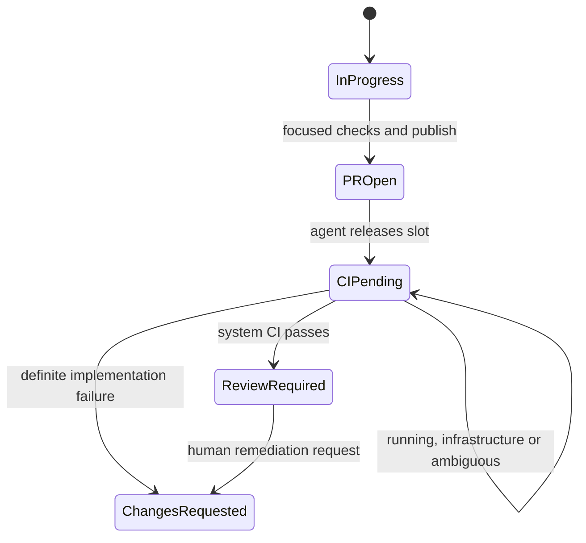
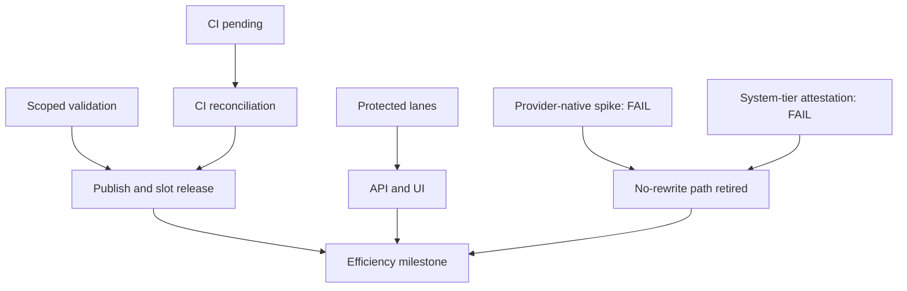

# Parallel Delivery Efficiency and Integration Control (Phase 15.5)

Status: CLOSED. The controlled comparison and remediated ATLAS-263 production
live-authority proof passed at the accepted PR #335 head, releasing ATLAS-253
for Phase 15's separately governed live ceiling ramp.

ATLAS-084M later ratified the target architecture in
`post-review-release-orchestration.md`. Its supersession ledger preserves this
phase's manual rebase/merge rulings as active runtime authority until a
dedicated Release Controller is separately implemented, proven and activated.

## Problem and outcome

Ten available workers do not create ten useful delivery lanes when every agent
repeats the repository-wide test matrix, waits for CI and rewrites its branch
after every sibling merge. That operating model spends agent turns on work CI
already owns and turns independent implementation into avoidable integration
contention.

Phase 15.5 separates four kinds of capacity and authority:

- an agent owns implementation and focused local confidence;
- CI owns complete system-tier validation for the published identity;
- Atlas owns deterministic admission and bounded queue state;
- the operator owns review, rebase, conflict resolution and merge.

The outcome is higher accepted flow with less duplicated validation and fewer
unnecessary branch rewrites. The phase does not raise concurrency. Its closure
is the explicit operator release gate for ATLAS-253, which still owns Phase
15's controlled one-to-three-to-five-to-seven-to-ten exercise.

## Binding decisions

| Decision | Contract |
| --- | --- |
| Local validation | Agents run ticket-required and affected checks selected by a deterministic repository-owned registry. Unknown or protected surfaces fall back to a complete local sweep. |
| CI authority | Complete CI remains mandatory and is the only system-tier authority. Scoped local checks are confidence evidence, never completion evidence. |
| Agent lifetime | After focused checks and one successful publication, the ticket enters `CI Pending`; the Symphony slot is released and the agent does not poll CI. |
| CI reconciliation | Each supported PM tick deterministically considers at most one local `CI Pending` ticket, resolves its exact repository/PR/full-head identity from the latest handoff episode's bounded system-tier evidence, and delegates to the trusted reconciler. Infrastructure, pending, missing, stale, malformed, contradictory and identity-ambiguous outcomes remain held without retry churn. |
| Capacity accounting | Working, CI/integration and review occupancy are separate budgets. Freeing a worker never makes the CI-pending queue unbounded. |
| Conflict avoidance | Declared protected surfaces are exclusive integration lanes. Independent surfaces remain parallel. |
| Freshness | Review Required enters acceptance only when the exact contributor head satisfies current-main ancestry. Mechanically stale candidates use the operator-owned rebase lane; synthetic composition is diagnostic only. |
| Rebase fallback | A conflict, stale identity, provider ambiguity or failed spike routes to the delivered operator-owned rebase lane. Atlas never resolves or publishes a rebase automatically. |
| Existing Phase 15 work | ATLAS-250 and ATLAS-251 continue normally and become prerequisites of the Phase 15.5 API/UI tickets. They are not recreated or rewritten. |
| Ramp release | Accepted PR #335 closed Phase 15.5 at the remediated exact head and released ATLAS-253; it did not change or authorise automatic change of the Symphony ceiling. |

ATLAS-259 proved that GitHub required results are pinned to the contributor
head rather than a synthetic integration candidate. ATLAS-260 did not produce
an independent trusted attestation that closes that identity gap. Both results
remain FAIL and the synthetic no-rewrite route is retired. Head or base
movement, provider ambiguity, stale evidence and indeterminate identity fail
closed; tree equality and mergeability never create acceptance authority.

The ATLAS-261/262 `CI Pending -> In Progress -> PR Open -> CI Pending`
reactivation was caused by Linear's `PR opened -> In Progress` GitHub workflow
automation, not the trusted CI reconciler or the configured Atlas state map.
The operator disabled that automation on 17 August 2026. GitHub/Linear may
still link pull requests and expose evidence, but it must not mutate
Atlas-owned workflow state. ATLAS-263 requires zero recurrence in ATL-437's
live authority window; any unexplained transition from `CI Pending` to a
Symphony-active state is an immediate FAIL.

## Authority and non-authority

Phase 15.5 may calculate validation plans, observe commit-pinned CI, classify
outcomes, hold or advance tickets through governed PM transitions, calculate
protected-lane occupancy and present integration pressure.

It may not skip required CI, mark agent claims as system-tier, merge a pull
request, rebase or force-push a branch, resolve a conflict, cancel a worker,
change the Symphony ceiling, approve a plan, weaken branch protection, mutate
GitHub checks or grant itself credentials. An optimisation that cannot prove
its inputs fails closed to the existing safer path.

## Local confidence and complete CI

### Validation registry

A digest-pinned declarative registry at
`atlas/verification/validation_registry_v1.json` maps narrow repository paths
and registered ticket requirements to ordered profiles. The versioned v1
profiles are Python tests, static checks, documentation, database/schema,
generated OpenAPI client drift, Operator UI unit/build, browser/end-to-end,
workflow contracts and the complete local sweep. The registry declares both
commands and selection reasons. Its content hash is checked before use; a
schema, version or digest mismatch is registry drift and selects the safe
complete-sweep baseline embedded in code.

`atlas validation-plan` accepts a full lowercase 40- or 64-character base
object id, a full head object id, and every repository-relative path in that
exact diff. Repeatable `--ticket-requirement` values name registry ids and
repeatable `--ticket-test` values add explicit test files. The optional
`--expect-registry-version` pins a caller to the policy version it reviewed.
The CLI uses only read-only Git operations to derive the exact base-to-head
name-status diff, including both sides of renames, and compares that trusted
set with the supplied paths. It also proves every explicit ticket test is a
blob at the supplied head. It does not execute validation commands or write
repository/external state. It emits human-readable output by default or
canonical compact JSON with `--json`, containing:

- the repository identities used;
- the changed-path proof status;
- every selected profile and command;
- the path or ticket requirement that selected it;
- every mandatory changed or ticket-declared test file;
- any protected-surface reason; and
- whether the complete-sweep fallback is mandatory.

`atlas validation-run` consumes the same exact-candidate inputs and repeats the
planner's diff and ticket-test proofs before execution. Targeted plans retain
their emitted serial order. A full sweep has exactly three repository-owned
concurrent groups: `python` runs the unfiltered Pytest command;
`static-governance` runs Ruff check, Ruff format check, mypy, the documentation
linter and import contracts serially in that order; and `operator-ui` runs
`apps/operator-ui/scripts/ci.sh` followed by
`apps/operator-ui/scripts/ci-e2e.sh`. A bounded three-worker executor is the
only concurrency authority. Agents cannot supply a topology or worker count.

Every lane and every command continues independently after an observed failure
to retain complete diagnostics. The aggregate succeeds only when the planned
lane and command inventories match the observed evidence exactly and all eight
commands exit zero. A child-start or lane error, non-zero exit, missing result,
duplicate result or unexpected command fails closed. Evidence retains the exact
base/head, aggregate wall time, per-lane elapsed time and per-command lane,
timestamps, duration and exit status. This is solely an agent-tier wall-clock
optimisation: command semantics, internal Pytest and Playwright parallelism,
the GitHub CI matrix and system-tier authority are unchanged.

Inputs and rendered fields have fixed count and length bounds. Input order,
duplicates, clocks, UUIDs and model interpretation do not affect the plan;
identical identities and changed-path sets serialize to identical bytes.
Changed tests, tests added for changed behaviour and ticket-declared tests are
additive mandatory inputs. Ticket-test paths must match a configured Python,
Vitest or Playwright runner and exist at the supplied head. There is no
exclusion option, and an invalid or unregistered free-form value cannot remove
a profile. Unknown paths, omitted or mismatched diffs, Git discovery failure,
unprovable ticket tests, ambiguous or inconsistent identities, registry drift,
oversized input and protected cross-cutting surfaces select the documented
complete local sweep rather than an incomplete result. The registry, pure
classifier and read-only CLI adapter are themselves protected validation-policy
surfaces.

The complete local sweep runs the unfiltered Python test/static/documentation/
architecture gates and both Operator UI cold-checkout wrappers. It remains an
explicit profile and the conservative fallback. CI independently runs every
required job, including event-scoped gates such as PR-title provenance; local
profile selection never changes the CI workflow.

### Evidence boundary

Agent-run scoped checks are agent-tier evidence: useful for handoff and
debugging, but insufficient for completion. CI executes the complete required
matrix against the authoritative candidate identity and supplies system-tier
evidence. No local optimisation removes, weakens or conditionally skips a
required CI job.

An unchanged head is validated locally once per selected plan. Repetition of a
complete sweep for the same identity requires an explicit fallback reason; it
is not a default handoff ritual.

Before publication the agent supplies the exact base/head, every changed path,
ticket requirement and explicit test file to the deterministic planner, then
executes the repository-owned groups and every explicit test target. A failed
selected check blocks publication. The complete local sweep runs only when the
named `full-sweep` conservative profile is selected or the operator explicitly
instructs it; the agent neither narrows the plan, alters execution groups nor
adds a model-selected check. Any head change makes the prior plan and results
historical only.

## CI-pending lifecycle

### State mapping

`CI Pending` is the Atlas team's Linear `started` state
`85cdfa65-b990-41cc-a4ea-0071868ba27f`, mapped exactly to `ci_pending`. It is
observed by Atlas and deliberately absent from Symphony's active and terminal
state lists. It means implementation has published one candidate and is waiting
for authoritative checks; it is neither working occupancy nor a review verdict.



After successful publication the agent first enters `PR Open`, making the
published-PR prerequisite durable, then owns only `PR Open → CI Pending` and
stops. It does not wait, poll, interpret remote failures or consume a Symphony
working slot. The handoff records the exact plan, commands and local results as
agent-tier confidence. Atlas alone owns `CI Pending → Review Required` and `CI
Pending → Changes Requested`; browser and Symphony paths own neither exit. A
changed head invalidates earlier CI authority.

The CI reconciler consumes trusted check evidence pinned to the current head:

- all required checks passed: transition to `Review Required`;
- a definite implementation-owned failure: transition to `Changes Requested`;
- checks running or queued: remain `CI Pending`;
- provider outage, rate limit, missing check, malformed payload, unknown
  conclusion or identity mismatch: remain held with a typed reason.

The actionable failure rule is deliberately narrower than generic FAILED
normalisation: every required system-tier check must be present and determinate,
and each deciding failed observation must carry the provider's explicit
`failure` conclusion. Partial sets, timeouts, cancellation, stale heads and
contradictory current observations cannot send implementation back to Symphony.

Only an owner-specific PM boundary performs Linear transitions. The generic
Linear status pull mirrors the agent-owned `PR Open → CI Pending` entry. A
complete project pull may also catch the local store up directly into `CI
Pending` from a Symphony-active predecessor when short-lived intermediate
states fell between polls. That local-only observation records the actual
source and `pm-engine:linear-poll-compression` provenance; it neither invents
`In Progress`/`PR Open` rows nor authorises any Linear write. Entries from
non-agent or terminal states and every CI-pending exit remain deduplicated
ownership anomalies. ATLAS-256's trusted CI reconciler is the only seam that
can exercise the Atlas-owned exits. It re-reads the PR head, complete board,
active policy, coherent snapshot and exact publication-pull evidence assessment
immediately before the write under the shared product lease. Any change to the
assessment or its deciding evidence ids records a typed hold and requires a
fresh tick. Each determinate decision is appended with the exact identity and
bounded check results, and a durable fence is committed before the single
Linear mutation. The owner rechecks its exact product lease and monotonic lease
age after that fence commit, then holds transactional lease and fence locks
across the bounded call. Replacement cannot clear the fence while the original
call remains live; lease replacement or passive TTL expiry before the lock
leaves the fence to the next owner and the expired process performs zero
mutations. A
transport-ambiguous mutation remains fenced until a fresh
complete board observation proves source, target or external movement; that
reconciliation tick never retries the write. Duplicate observations are
therefore idempotent, and concurrent owners, lease loss or identity movement
produce zero mutations. A new head restarts the lifecycle with new evidence;
previous records remain history.

A separate evidence-backed recovery predicate handles the governed-admission
race without altering this ownership model. It considers only a local
`Planned` ticket whose exact joined Linear issue is observed at `CI Pending` in
a complete unique board pull. Recovery requires exactly one system-authored
successful `AdmissionRun` selection for that ticket UUID/key/product/external
UUID, one uniquely correlated successful PM receipt proving
`admitted = promoted = 1` with no stale or indeterminate outcome, one complete
coherent issue-bound GitHub publication, compatible pre-dispatch history and no
active admission or CI-handoff fence. Missing, duplicate, contradictory or
mismatched proof leaves the existing out-of-ownership anomaly path unchanged.

An accepted decision atomically appends one direct local
`Planned -> CI Pending` transition and one bounded immutable recovery record.
It preserves earlier `OUT_OF_OWNERSHIP_TRANSITION` debt, creates no intermediate
state/timestamp or `AgentRun`, and performs no Linear write. `Planned` remains
absent from `CI_PENDING_POLL_COMPRESSION_SOURCES`; this is a dedicated proof
predicate, not a protected-lane or owner bypass. The fixed ATLAS-280 bootstrap
receipt remains append-only incident history and is not reused by the normal
path. Only a later normal ATLAS-256 evaluation may own a `CI Pending` exit.

### Production cadence adapter

ATL-437's first published candidate proved that a domain service is not a
production authority unless the supported cadence reaches it. Exact-head CI
completed at `dad520cf46c2c6ee2f51b95e0fa6e20660751a96`, but `atlas pm sync`
called only the generic `sync_tick()` body and never invoked
`reconcile_ci_handoff()`. The issue remained `CI Pending` and the operational
store contained no ATLAS-263 reconciliation or write fence. That head is
retained as a failed production-reachability sample; the live window restarts
at the remediated final head.

Both recurring and `--once` PM modes now share the same adapter. After the
complete project pull, authorised status reconciliation (including the
dedicated evidence-backed local recovery above) and AgentRun reconstruction,
it reconciles durable recovery episodes for one finite snapshot of locally
`CI Pending` tickets and considers the episode with the least product-global
fairness cursor. A fenced product is excluded from ordinary selection, while
multiple fence episodes share the durable cross-product observation-time rank
and retain absolute precedence over every ordinary candidate. Within a product
the least monotonic sequence cursor wins; across products the oldest durable
`last_evaluated_at`, or `created_at` before a first evaluation, wins, with
product UUID only as the final tie. Every completed evaluation, including an
unresolved-fence attempt, moves that episode behind currently older fenced
products. Stable
ticket order is used only for deterministic one-time bootstrap; every completed
evaluation moves that episode to the durable sequence tail. The latest
append-only transition into
`ci_pending` bounds the delivery episode even when the poll-compressed source
is `ready_for_agent` or `in_progress` and no AgentRun could be reconstructed.
The same complete board observation carries the issue-bound Linear GitHub
attachment. Atlas accepts a publication identity only when its canonical
`github.com/<owner>/<repo>/pull/<number>` URL and GitHub attachment metadata
agree, the metadata identifies a live (`open` or `draft`) `main`-target PR that
closes the issue, the attachment connection is complete, and exactly one
attachment remains. Two attachment identities are ambiguous even when both
name the same repository and PR. The join to the ticket is the stable Linear
issue id. Missing
publication identity holds as `trusted_publication_unavailable`; truncation,
contradiction or multiple attachments holds as
`trusted_publication_ambiguous`, before any GitHub call. Ticket titles, branch
guesses, PR-title close sets, GitHub rollups, manual operator input, earlier
AgentRuns and earlier CI-pending episodes are never identity inputs.

With one complete publication, the adapter invokes the canonical
`drive_evidence_pull` path itself for that exact repository and PR. That pull
resolves the full contributor head once, runs the normal GitHub
workflow/check/review/file mapping, persists product-scoped system-tier
evidence, and returns the complete observed evidence identities even when
append-only dedup reused existing rows. Only those exact observations are
supplied to the existing trusted reconciler. Provider or malformed-source
failure holds as `system_evidence_ingestion_failed`; an invalid full head holds
as `trusted_identity_unavailable`. Normal system-tier ingestion is therefore a
supported part of the PM tick, not an assumed external precondition.

The product lease, coherent snapshot, classification, PR/head revalidation,
evidence refresh and durable write fence remain unchanged. A confirmed
workflow mutation or confirmation that an earlier ambiguous fence reached its
target returns from the tick immediately, so definition, admission, completion
and anomaly writers cannot add a second external workflow mutation. Holds may
leave the remaining read/definition work intact, but no second CI candidate is
evaluated in that tick. `atlas pm sync --once -v` exposes one bounded
secret-free adapter line plus integer evaluated/held/mutation counters; durable
authority remains the append-only reconciliation, not console text.

The cadence reserves the selected-product evaluation sequence before
publication resolution, evidence refresh, fence reconciliation or any provider
workflow effect. Fence recovery refreshes the complete project board only after
the recovery owner acquires the product lease, so a stale discovery snapshot
cannot clear or classify the authoritative fence. Clearing it verifies the
exact live lease owner and fence identity atomically. The selected publication
attachment/repository/PR generation is likewise re-resolved from both final
board revalidations before any new fence or workflow write.

These states are deliberately different claims. `CI Pending` says only that a
locally validated candidate was published and CI now owns classification.
`Review Required` says the system-tier required-check set passed for that exact
head and the candidate may enter operator acceptance. Final completion still
requires the accepted exact-head evidence, required human approval, manual
merge and merged-proof verification; neither local success nor Review Required
is `Done`. A shorter valid local plan never shortens or weakens the complete CI
matrix.

## Three separate capacity budgets

Phase 15's working and review budgets remain binding. ATLAS-255 adds one
operator-owned integration budget for the CI-pending queue:

| Budget | Counts | Releases when |
| --- | --- | --- |
| Working | Ready/active Symphony work under the Phase 15 policy | Work publishes or otherwise leaves the active delivery states |
| Integration | `CI Pending` published heads awaiting a determinate CI outcome | Required checks become determinate for the same identity |
| Review | Existing Phase 15 acceptance pressure | Existing review policy releases it |

A ticket moves between budgets; releasing one budget does not erase downstream
pressure. Admission stops when any applicable budget or protected lane is
full. Paused or draining modes retain their existing Phase 15 semantics.
No budget is a utilisation target and none authorises Symphony cancellation.

## Protected integration lanes

### Classification

The digest-pinned repository registry at
`atlas/pm/protected_lane_registry_v1.json` declares stable lane keys, strict
integer capacities and additive matcher rules. Version 1 bounds six lanes at
capacity one: database migrations, generated API/client contracts, workflow
configuration, planning sources/renders, shared dependency manifests and the
explicitly operator-declared admission-control hotspot. The parser rejects an
unknown version, digest drift, duplicate/ambiguous lane or rule identity,
unbounded capacity, non-canonical selector/path or a lane without a rule.

Before admission, a ticket is classified only from its stored `component`,
`tags`, `relevant_docs` and `documentation_requirements`. Components and tags
are NFKC-normalised, trimmed and case-folded; declared paths must already be
canonical repository-relative paths. Objective, context, acceptance criteria,
implementation notes, title and other model prose are never inspected. Every
matched lane and its declaration/rule evidence are retained. Distinct
declarations can select multiple lanes, while one declaration selecting
different lanes, a non-canonical path or contradictory canonical tag
declarations is a typed fail-closed classification. A multi-lane candidate is
feasible only when all matching lanes have capacity.

### Behaviour

Protected lanes serialize only conflict-prone integration surfaces. Every
working and CI-pending ticket consumes all of its valid matches; review-only and
pre-delivery tickets do not occupy a lane. Each saturation hold names the lane,
simulated count, capacity and sorted current owning ticket keys without exposing
secrets. Occupancy and classification are part of the coherent snapshot, whose
active-surface fingerprint is independent of source order.

Candidate ranking is unchanged. The first reason-free candidate in the
existing stable order is selected, a higher held candidate may be skipped for
the highest feasible one, and every lower feasible candidate receives the
existing `single_write_limit` even when it names another lane. Immediately
before the one external admission write, Atlas reloads the digest-pinned
registry and rebuilds protected-lane state across both deterministic race
seams. Registry identity or active-surface movement yields a typed stale result,
persists no write fence and admits nobody.

The registry is operator-owned configuration reviewed like other delivery
policy. Its loader and classifier have no GitHub client, Git command, Linear
writer, Symphony adapter or policy-revision service. A hold never mutates a
diff, rebases Git, demotes a ticket, cancels a worker, optimises policy or widens
capacity. Atlas does not infer a permanent lane from model judgement or learn
one automatically from a conflict. Publication-time verification of declared
paths remains a separate downstream control; admission does not inspect a
GitHub diff.

## Exact-base acceptance without unnecessary rewrite

### Why this is a spike first

Being behind `main` is not itself a semantic defect. A clean candidate can be
evaluated as the exact synthetic merge of current base plus unchanged head,
but only if GitHub exposes identities and checks strongly enough to bind the
acceptance decision. The sixth ticket is therefore an evidence spike, not an
implementation assumption.

The spike must record, across controlled clean, conflicting and moving-base
PRs:

- repository and PR identity;
- current protected base branch and fetched base commit;
- candidate head commit;
- GitHub mergeability state and its convergence behaviour;
- synthetic merge commit/tree identity where available;
- required-check association and whether it is unambiguously tied to that
  synthetic identity; and
- behaviour under head movement, base movement, conflict, provider delay and
  malformed/partial responses.

PASS requires reproducible authoritative evidence that the accepted snapshot
is exactly the candidate head integrated with the current base, with no stale
reuse window and no reliance on an agent-provided merge claim. If GitHub cannot
provide that contract for this repository and branch protection, the spike
records FAIL and the no-rewrite path is not implemented.

### ATLAS-259 governed feasibility report

**Decision: FAIL (2026-08-16).** The exact synthetic candidate is observable,
but this repository's bounded GitHub check evidence does not pin required
results to that candidate. The existing current-head acceptance contract and
operator-owned rebase lane remain authoritative. ATLAS-260 must not activate a
no-rewrite path unless its phase design first adds a system-tier candidate
attestation that closes this gap.

The read-only live probe used merged PR 329 because it retained one complete,
clean GitHub Actions execution without touching an open production PR. GitHub
Actions jobs `test` and `lint` independently checked out candidate
`9c756d071289691dd56f769450b1d623d2d3e2ff`. The candidate has parents
`1c1573715f2f672636493896fb0452f4341e9fff` (then-current `main`) and
`499e3687ac66279ae0ea09c571dbe797db8c13f2` (PR head), and tree
`44a3ba815f75d8163a0af1ef009a33d4242c6200`. The two checkout reads reproduced
that identity. The corresponding successful Check Runs, however, have
`head_sha` equal to contributor head `499e3687...`, and the Checks endpoint for
candidate `9c756d07...` returns zero Check Runs. Active repository ruleset
`17514272` supplies a closed set of eight required `(context, GitHub App ID)`
pairs: `build-operator-ui`, the three `lint-operator-ui*` jobs,
`lint-pr-title`, and the three `test-operator-ui-*` jobs, all for App ID
`15368`. Every one of those successful results is head-pinned rather than
candidate-pinned, so the complete provider-required set fails exact candidate
attribution.

The later GitHub merge commit
`160a7e3c87f91ce601564eba22c4328b95a963c0` has the same two parents and tree as
the tested candidate but a different commit SHA. That is useful relationship
evidence, not a retroactive CI pin. Log parsing is not an acceptable repair:
logs are unbounded payloads, candidate identity is not part of the bounded
Check Run result, and relying on checkout implementation details would weaken
the provider boundary.

The executable harness is
`scripts/exact_base_candidate_spike.py`, with bounded selected-field fixtures in
`tests/fixtures/github/exact_base_candidate_cases.json` and mutation-spy tests
in `tests/test_exact_base_candidate_spike.py`. It creates only unreferenced and
local Git objects in a temporary repository and runs no `fetch`, `merge`,
`push`, `rebase` or `update-ref`. It proves:

- repeated clean reads reconstruct one candidate commit and tree;
- head movement and sibling-`main` movement each mint a different candidate,
  so the old candidate and its evidence are historical immediately;
- missing, conflicted, malformed and indeterminate observations fail closed;
- two candidates for unchanged head/base are provider ambiguity;
- a final two-parent merge commit may share the candidate tree while having a
  different commit identity;
- a squash result has the candidate tree, one base parent and a new commit SHA,
  so candidate authority and post-merge proof are distinct; and
- credentials and raw payloads are absent from retained projections, and
  oversized check collections fail closed before retention.

The sufficient identity algebra for a future amended design is:

```text
candidate = (
  repository, PR number,
  head SHA,
  base ref, live base SHA,
  candidate commit SHA, candidate tree SHA,
  candidate parents == (live base SHA, head SHA),
  canonical (check name, GitHub App ID) set fingerprint
)

required result = (
  check name, GitHub App ID, external execution ID,
  commit SHA == candidate commit SHA,
  lifecycle time, terminal conclusion
)
```

Two bounded reads of an unchanged repository/PR/head/base tuple must reproduce
the complete candidate tuple. Every member of the unchanged required-check set
must then resolve to exactly one current, successful result whose commit SHA is
the candidate SHA. Any head, live-base, candidate, tree, parent or required-set
movement; duplicate or absent result; conflict; missing field; delay;
indeterminate mergeability; or malformed response invalidates the tuple. The
current provider evidence fails the `commit SHA == candidate commit SHA` term.

Fallback is exact and unchanged: for an eligible mechanically stale Review
Required PR, run
`uv run atlas pr rebase prepare --pr <N> --repo <owner>/<repo>`, resolve only
the managed-worktree conflicts if any, use `continue` until
`ready_to_publish`, then use `publish`. All exact-head evidence, confirmations
and readiness restart at the rebased head.

### ATLAS-260 governed system-tier attestation assessment

**Decision: FAIL (2026-08-16).** The assessment did not cross the trusted
system boundary needed to close ATLAS-259's missing candidate-to-CI identity
edge. The proposed evaluator is fail-closed, but its stable fixture constructs
the candidate mapping from the same observation it checks and simulates the
output of an external cryptographic verifier. No executable evidence exercises
an Atlas-controlled producer/signer lifecycle, GitHub OIDC/Sigstore
verification or independent provider proof that every required job ran against
that exact synthetic candidate. Under the ticket's fail-closed rule, design
plausibility is not evidence.

The current no-rewrite approach is retired and no implementation of
`exact_integration_candidate` may proceed from this assessment. A later phase
may reopen the question only with a materially different governed trust
mechanism that supplies the missing independent proof. The exact-head/current-
main contract and operator-owned rebase lane remain the Phase 15.5 authority.

The executable assessment is
`scripts/candidate_attestation_assessment.py`, with selected-field fixtures in
`tests/fixtures/github/candidate_attestation_cases.json` and tests in
`tests/test_candidate_attestation_assessment.py`. One stable case plus twenty-
four adversarial cases exercise the complete required matrix. The stable case
now returns `FAIL` with `attestation_unverified`; its claimed identity is
retained only as `simulated_claimed_identity`, never as
`governed_identity`. The report records four governing failure modes:

- producer/signer lifecycle not exercised;
- OIDC cryptographic verification not exercised;
- candidate-to-required-CI binding synthesized by the fixture; and
- independent provider attestation absent.

The harness has no network, GitHub, Linear or Symphony client. Its only
mutations are local Git plumbing inside a disposable temporary repository, and
mutation spies reject fetch, merge, push, rebase, update-ref, GitHub merge or
update, Linear transition, Symphony control and automatic acceptance. Retained
reports are capped; credentials, raw provider payloads, arbitrary workflow
payloads and logs are excluded. Oversized inputs fail before retention.

#### Conditional identity algebra tested

The fixture's non-authoritative manifest is canonical JSON and records the
following proposed identity algebra:

```text
candidate = (
  repository, PR number, contributor head SHA,
  base ref == main, live base SHA,
  synthetic candidate SHA, candidate tree SHA,
  ordered parents == (live base SHA, contributor head SHA)
)

required_set = sha256(canonical_json(
  ruleset ID,
  immutable policy repository + path + commit SHA + blob SHA,
  ordered unique (required context, GitHub App ID) members
))

execution = (
  trusted producer repository + workflow path,
  workflow ref + immutable workflow commit SHA + blob SHA,
  workflow run ID + run number + run attempt,
  Atlas-controlled trigger, GitHub-hosted runner,
  isolated-signer boundary
)

required_result[i] = (
  required context + GitHub App ID,
  provider job ID + Check Run ID,
  execution run ID + attempt,
  candidate SHA,
  status == completed, conclusion == success
)

proposed_attestation = sigstore_verify(
  subject_digest == sha256(canonical_manifest),
  issuer == GitHub Actions OIDC,
  signer workflow == trusted immutable workflow,
  invocation == execution run ID + attempt
)
```

The conditional evaluator requires two bounded provider reads to reproduce the
complete candidate, required-set, workflow and execution tuple; the manifest
to equal the independently reconstructed tuple; and every required member to
map to exactly one successful provider job in the same run and attempt. It
rejects head, live-base, candidate, workflow, required-set, run or attempt
movement; missing, conflicted, indeterminate or malformed candidates; missing,
failed, duplicate, cancelled, skipped, superseded or candidate-mismatched
results; stale prior-base evidence; repository/PR ambiguity; tampered
fingerprints; unverified or contributor-modifiable producers; and oversized
collections.

Those checks do not prove the premise they consume. In particular,
`refresh_fixture_attestation()` derives each claimed result's `candidate_sha`
from the fixture candidate and labels provenance `fixture_simulation` with
`cryptographically_verified: false`. The provider job fields alone contain no
independent candidate mapping. Consequently the stable tuple is reproducible
but non-authoritative, and sibling `main` movement reproducibly invalidates the
old simulated tuple without making either tuple acceptable.

#### Trust-model answers

1. **Who produces it?** No producer was exercised. The fixture models a
   proposed isolated signer, which is not evidence that such a producer exists.
2. **Why is it trusted?** Unproven. No cryptographically verified workload
   identity or protected producer deployment was observed.
3. **What immutable identity pins it?** The algebra includes workflow commit
   and blob SHAs, but no real OIDC statement, workflow definition or pinned
   action graph was verified against them.
4. **Can the PR modify it?** Not proven for a real producer. This PR controls
   the harness and fixture, so their assertions cannot establish isolation.
5. **What binds head and live base?** The fixture records both and requires the
   candidate's ordered parents to match. No trusted signer independently made
   that observation.
6. **What binds candidate commit and tree?** Deterministic fixture fields and
   disposable Git prove the algebra and commit/tree distinction only; they do
   not bind a provider execution.
7. **What binds every required result?** Nothing independent. The fixture
   synthesizes each `candidate_sha`; this is the decisive missing edge.
8. **How are reruns distinguished?** The evaluator distinguishes run ID and
   attempt and fails on replacement, but no real signed lifecycle was tested.
9. **How is required-set movement detected?** A canonical fingerprint covers
   ruleset, immutable policy identity and ordered `(context, App ID)` members,
   but no live protected policy source was verified.
10. **What provider API independently verifies it?** None in this assessment.
    All provider observations are deterministic bounded fixtures.
11. **What movement invalidates it?** The conditional evaluator invalidates
    repository/PR, head, base, candidate commit/tree/parents, workflow, policy,
    required set, run, attempt, job and provenance movement or ambiguity.
12. **Can Atlas verify it without logs or contributor payloads?** Not proven.
    The proposed field set excludes logs and arbitrary payloads, but the
    required external verification lifecycle was not exercised.

Questions 1, 2, 3, 4, 7, 10 and 12 remain unproven, which independently and
collectively mandates FAIL. Disposable Git evidence separately proves that a
later two-parent merge and a squash may share the candidate tree while having
different commit identities; exact commit inequality prevents authority
transfer in both cases, but cannot repair the missing execution binding.

### Phase 15.5 disposition

ATLAS-259's provider-native synthetic-candidate result is FAIL, and ATLAS-260's
system-tier attestation result is also FAIL. Experimental fixture evidence is
not production authority. No `exact-base clean` classification, no-rewrite
acceptance state, candidate evidence resolver, workflow authority, merge/update
authority, rebase/push authority, Linear transition, Symphony control or
automatic acceptance is introduced. The existing exact contributor-head
ancestry/current-main contract and operator-owned Phase 12 rebase lane remain
the only production path.

## API and Operator UI

After ATLAS-250 delivers the Phase 15 API, the Phase 15.5 API extension exposes
bounded projections for CI-pending integration occupancy, protected-lane
holds, current candidate identities, validation-plan summaries and typed
freshness outcomes. It adds no generic mutation route and returns no raw
provider payload, credential, command output or workspace path.

ATLAS-261 implements that extension on the existing authenticated
`GET /api/v1/delivery-control`. One storage-owned repeatable-read transaction
freezes the active policy, last-good and latest-attempt board receipts,
materialised tickets, latest reconciliation within each current CI-pending
`status_entered_at` episode, its
selected evidence identities, current write fences and the latest matching
stored acceptance assessment. The response pins policy, board, evidence and
integration fingerprints under one composite snapshot fingerprint. A later
failed board refresh remains visible beside the last successful identity; it
does not erase the last-good observation or become available capacity.

Integration occupancy exposes the policy budget, used count, bounded owner
keys and fail-closed available count. Protected-lane occupancy exposes every
registry lane, capacity, working/CI-pending owners, registry identity and
active-state fingerprint. Latest immutable admission decisions remain the sole
source of protected-lane holds. Over-capacity remains a typed observation and
never cancels, demotes or reprioritises existing work.

Each bounded CI-pending item returns its latest persisted current-episode CI
classification, decision, reason, exact contributor head and bounded
check/evidence identities. An unknown episode boundary or only a historical
reconciliation returns `ci_reconciliation_unavailable` and no repository, PR,
head or acceptance-assessment identity.
The API exposes the validation registry identity but does not parse PR prose or
promote agent-local output into stored provenance. Until an exact local plan is
stored by a separate canonical producer, its plan fingerprint, base identity
and profiles are explicitly `indeterminate` with
`validation_plan_provenance_unavailable`; advertised working and integration
capacity fail closed to zero. This preserves the Phase 15.5 evidence boundary
instead of fabricating a validation profile from CI jobs.

Exact-base assessment consumes only an already stored Phase 14 acceptance
assessment matching repository, PR and head. A current stored assessment is
`exact_branch`; stored behind, diverged or conflicted movement is
`rebase_required`; stale, mismatched or absent assessment is typed stale or
indeterminate. ATLAS-259 and ATLAS-260 remain FAIL, so the API exposes no
`exact_integration_candidate` or no-rewrite success class. GET performs no
GitHub refresh and none of these values authorises rebase, branch update,
merge, CI retry/cancel or ticket transition.

The existing complete-policy command remains the only delivery-control
mutation. Its validated integration budget and the server-owned protected-lane
registry version/fingerprint are included in the same canonical command
fingerprint before the Phase 13 actor, CSRF, idempotency, compare-and-set and
atomic receipt boundary. Clients cannot submit protected-lane rules or a
registry override.

ATLAS-262 extends the delivered Phase 15 UI with the CI and integration-pressure
console. Working, CI-pending integration, review and Changes Requested pressure
remain separate server-owned quantities; only returned working/integration
availability is shown. The composite snapshot's coherent, stale or
indeterminate class and every reason are visible. Each CI-pending card renders
the exact contributor head, validation profiles/provenance, required-check
states, persisted outcome and every typed wait/failure reason without raw logs.

Protected lanes show all current owners, immutable capacities, registry and
active-state identity, held candidates and complete hold reasons. The console
states that a free Symphony slot cannot override a saturated lane. Exact
branch, rebase-required, stale and indeterminate assessments are visually
distinct evidence claims and never merge approval; the failed ATLAS-259/260
boundary remains visible as the absence of an exact-integration-candidate
success class.

Policy confirmation now shows the integration budget, observed protected-lane
registry version/fingerprint, expected revision and freshly minted idempotency
identity. A conflict preserves the complete entered proposal, requires
inspection of current policy and explicit revision adoption, and then requires
fresh review/reconfirmation. The executable inventory proves the console has no
CI retry/cancel, ticket transition, GitHub update/merge, Git rebase/push,
Symphony worker or automatic concurrency/ramp control. Seeded live-API browser
and accessibility evidence covers dense reasons, long identities, focus,
announcements, responsive widths, WCAG and zero external writes beyond an
explicit policy command.

## Symphony workflow contract

The binding workflow prompt instructs an implementation agent to:

1. inspect the exact ticket requirements and changed surfaces;
2. rebase once onto current `origin/main` for the candidate publication;
3. calculate the deterministic plan from exact identities, every changed path,
   ticket requirement and explicit test file;
4. run every selected command and explicit test, publishing nothing on failure;
5. publish the unchanged validated candidate once and record the exact bounded
   local results;
6. enter `CI Pending`; and
7. stop the session in the same turn.

`WORKFLOW.md` mechanically proves that `CI Pending` is absent from
`active_states`, so the tracker transition releases the Symphony slot instead
of relying on an instruction to wait quietly. A later system-tier failure can
return the preserved workspace only through `Changes Requested`; a pass moves
to `Review Required` without redispatching the agent.

The workflow forbids agent-side CI polling, repeated full sweeps for an
unchanged head without a fallback reason, automatic rebase/conflict resolution
and mutation of the ceiling. System reconciliation, operator review and the
existing integration lane continue after the agent releases its slot.

## Existing-ticket and release sequencing

ATLAS-250 and ATLAS-251 are already minted Phase 15 delivery contracts. They
should continue after PR #315 rather than wait for Phase 15.5 implementation.
The new API ticket depends on ATLAS-250; the new UI ticket depends on ATLAS-251
and that API extension. This avoids reopening their accepted definitions while
giving the new projections stable extension points.

An existing ticket cannot depend on a future unminted stub. Therefore
ATLAS-253 is governed by an operator release gate: keep it in `Needs Human`,
merge and apply the Phase 15.5 planning inputs, deliver the Phase 15.5 graph,
merge its closure, then deliberately release ATLAS-253. No automation performs
that release.

## Delivery graph



The validation and CI-lifecycle lanes can begin independently once their listed
existing prerequisites are satisfied. The governed merge-evidence assessments
are complete with FAIL, so closure consumes their recorded retired-path
disposition rather than a conditional implementation lane. The milestone joins
those outcomes and remains the only Phase 15.5 closure authority.

## Milestone and closure

The operator ratified the ATLAS-263 observation protocol and thresholds on 17
August 2026 before the first result. The digest-bound fixture at
`tests/fixtures/phase_15_5/milestone_v1.json` records exactly four independent
workloads in fixed order, `IND-1..IND-4`. Each has its workload and validation
plan identity, candidate head, CI evidence identity, primary touched-path
family and protected-lane set. The families and path/lane sets are pairwise
disjoint. `LANE-A` and `LANE-B` share only
`operator-admission-hotspot`, are excluded from comparison numerators and
prove a deterministic hold before the contender may publish.

`scripts/phase_15_5_milestone.py` replays the same inputs once through the
documented pre-Phase-15.5 model and once through the delivered model on a
virtual clock. It retains bounded selected fields only and performs no network,
Git, GitHub, Linear, Symphony, CI, deployment or repository mutation. Its
fault matrices cover complete pass, definite implementation failure, pending,
missing, infrastructure, malformed, stale, partial and ambiguous evidence;
exact-head current, behind, diverged, conflicted, head/base movement and
provider ambiguity; and prohibited CI-pending reactivation. Repository and
external-call spies retain zero prohibited calls.

The fixed controlled result is PASS:

| Measure | Baseline | Phase 15.5 | Bound | Result |
| --- | ---: | ---: | ---: | --- |
| median agent-active seconds | 1158 | 440.5 | <= 85% | 38.04%, PASS |
| median local-validation seconds | 480 | 210 | <= 75% | 43.75%, PASS |
| median CI queue/run seconds | 450 | 450 | <= 120% | 100%, PASS |
| median review-dwell seconds | 225 | 45 | <= 120% | 20%, PASS |
| accepted completions/agent-hour | 3.1088 | 8.1679 | >= 1.20x | 2.6273x, PASS |

All four Phase 15.5 fixtures reach their accepted completion state. The maximum
normal CI duration is 540 seconds, working/integration/review occupancy is
4/4/1 against budgets 4/4/4, slot release is at most four seconds, and there
are zero Phase 15.5 CI polls, duplicate publications, redundant complete
sweeps, semantic conflicts, mechanical rebases or prohibited authority calls.
The protected contender publishes zero times before release. Every determinate
CI exit is system-owned; every unsafe evidence class holds. The controlled
receipt retains all eight baseline/Phase measured identities.

That controlled PASS did not pre-authorise ATL-437's own CI handoff. The first
publication remains a failed reachability sample because complete CI produced
no production reconciliation or Linear exit. At the remediated contributor
head `a598798c1a6c5cabe4c80c0f04020c271f438de1`, the production PM adapter
caught the local mirror up into `CI Pending`, resolved the issue-bound PR #335
publication, ingested its exact-head GitHub evidence, appended a genuine
`ci_handoff_reconciliations` record and alone wrote the determinate passed exit
to `Review Required`. No agent polled CI, no candidate-head rewrite occurred
and the disabled Linear/GitHub workflow automation caused no reactivation.

The operator accepted that unchanged identity and PR #335 merged. Phase 15.5
is therefore CLOSED and releases ATLAS-253 for a separately operator-
checkpointed ramp. `WORKFLOW.md`'s committed ceiling remains one until Gate 10
passes; the synthetic no-rewrite route remains retired and none of this
evidence grants Atlas ceiling, rebase, push, merge or worker authority.

## Explicit non-goals

- Raising or dynamically selecting `max_concurrent_agents`.
- Executing any ATLAS-253 ramp gate.
- Removing complete CI jobs or treating focused local tests as completion.
- Automatic GitHub merge, merge queue, rebase, force-push or conflict repair.
- Predictive or learned test-impact selection.
- Agent/model scoring or automatic routing; that belongs to Phase 16.
- Cancelling sessions, deleting workspaces or demoting active tickets.
- Remote hosting, multi-product allocation or deployment authority.
