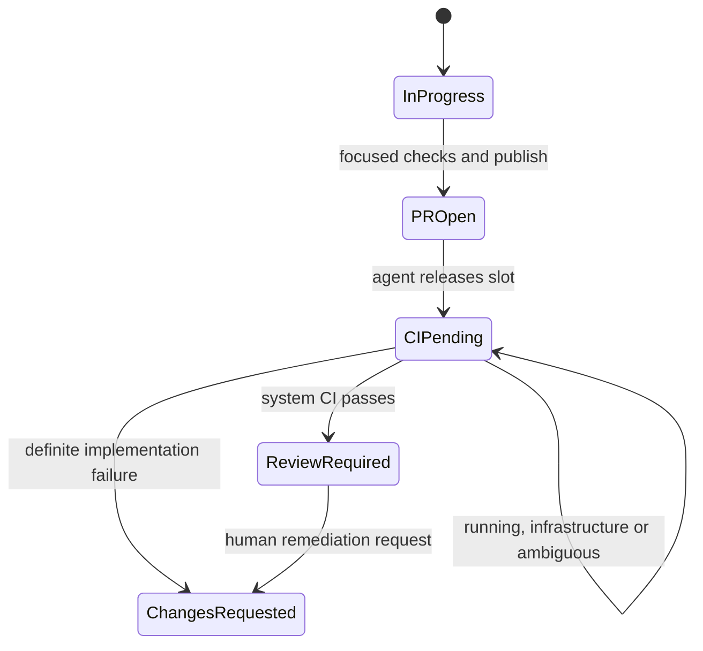
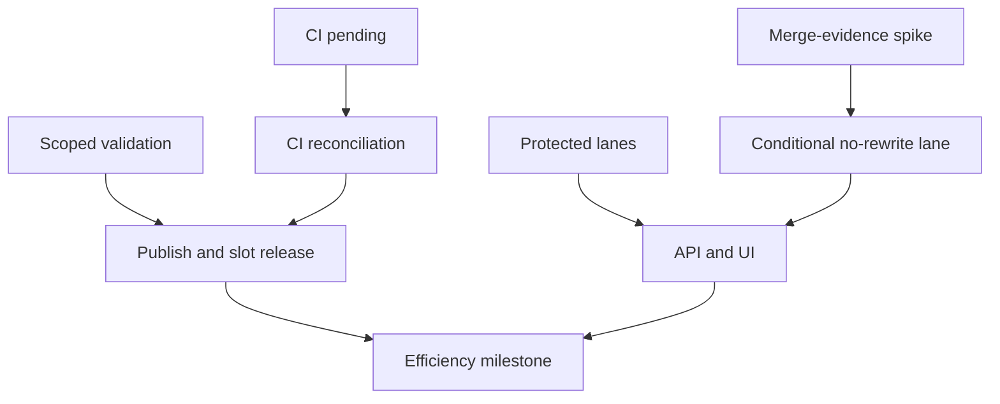

# Parallel Delivery Efficiency and Integration Control (Phase 15.5)

Status: Planned interstitial design authority. Defines the bounded workflow
correction required before ATLAS-253 may begin Phase 15's live ceiling ramp.

## Problem and outcome

Ten available workers do not create ten useful delivery lanes when every agent
repeats the repository-wide test matrix, waits for CI and rewrites its branch
after every sibling merge. That operating model spends agent turns on work CI
already owns and turns independent implementation into avoidable integration
contention.

Phase 15.5 separates four kinds of capacity and authority:

- an agent owns implementation and focused local confidence;
- CI owns complete system-tier validation for the published identity;
- Atlas owns deterministic admission and bounded queue state;
- the operator owns review, rebase, conflict resolution and merge.

The outcome is higher accepted flow with less duplicated validation and fewer
unnecessary branch rewrites. The phase does not raise concurrency. Its closure
is the explicit operator release gate for ATLAS-253, which still owns Phase
15's controlled one-to-three-to-five-to-seven-to-ten exercise.

## Binding decisions

| Decision | Contract |
| --- | --- |
| Local validation | Agents run ticket-required and affected checks selected by a deterministic repository-owned registry. Unknown or protected surfaces fall back to a complete local sweep. |
| CI authority | Complete CI remains mandatory and is the only system-tier authority. Scoped local checks are confidence evidence, never completion evidence. |
| Agent lifetime | After focused checks and one successful publication, the ticket enters `CI Pending`; the Symphony slot is released and the agent does not poll CI. |
| CI reconciliation | Atlas observes pinned GitHub check evidence and performs one deterministic state transition. Infrastructure, pending and ambiguous outcomes remain held without retry churn. |
| Capacity accounting | Working, CI/integration and review occupancy are separate budgets. Freeing a worker never makes the CI-pending queue unbounded. |
| Conflict avoidance | Declared protected surfaces are exclusive integration lanes. Independent surfaces remain parallel. |
| Freshness | A clean candidate may avoid branch rewrite only after a feasibility spike proves exact repository, PR, base, head and synthetic-merge identities from authoritative GitHub evidence. |
| Rebase fallback | A conflict, stale identity, provider ambiguity or failed spike routes to the delivered operator-owned rebase lane. Atlas never resolves or publishes a rebase automatically. |
| Existing Phase 15 work | ATLAS-250 and ATLAS-251 continue normally and become prerequisites of the Phase 15.5 API/UI tickets. They are not recreated or rewritten. |
| Ramp release | ATLAS-253 remains `Needs Human` until the Phase 15.5 milestone and closure are reviewed and merged. |

## Authority and non-authority

Phase 15.5 may calculate validation plans, observe commit-pinned CI, classify
outcomes, hold or advance tickets through governed PM transitions, calculate
protected-lane occupancy and present integration pressure.

It may not skip required CI, mark agent claims as system-tier, merge a pull
request, rebase or force-push a branch, resolve a conflict, cancel a worker,
change the Symphony ceiling, approve a plan, weaken branch protection, mutate
GitHub checks or grant itself credentials. An optimisation that cannot prove
its inputs fails closed to the existing safer path.

## Local confidence and complete CI

### Validation registry

A digest-pinned declarative registry at
`atlas/verification/validation_registry_v1.json` maps narrow repository paths
and registered ticket requirements to ordered profiles. The versioned v1
profiles are Python tests, static checks, documentation, database/schema,
generated OpenAPI client drift, Operator UI unit/build, browser/end-to-end,
workflow contracts and the complete local sweep. The registry declares both
commands and selection reasons. Its content hash is checked before use; a
schema, version or digest mismatch is registry drift and selects the safe
complete-sweep baseline embedded in code.

`atlas validation-plan` accepts a full lowercase 40- or 64-character base
object id, a full head object id, and every repository-relative path in that
exact diff. Repeatable `--ticket-requirement` values name registry ids and
repeatable `--ticket-test` values add explicit test files. The optional
`--expect-registry-version` pins a caller to the policy version it reviewed.
The CLI uses only read-only Git operations to derive the exact base-to-head
name-status diff, including both sides of renames, and compares that trusted
set with the supplied paths. It also proves every explicit ticket test is a
blob at the supplied head. It does not execute validation commands or write
repository/external state. It emits human-readable output by default or
canonical compact JSON with `--json`, containing:

- the repository identities used;
- the changed-path proof status;
- every selected profile and command;
- the path or ticket requirement that selected it;
- every mandatory changed or ticket-declared test file;
- any protected-surface reason; and
- whether the complete-sweep fallback is mandatory.

Inputs and rendered fields have fixed count and length bounds. Input order,
duplicates, clocks, UUIDs and model interpretation do not affect the plan;
identical identities and changed-path sets serialize to identical bytes.
Changed tests, tests added for changed behaviour and ticket-declared tests are
additive mandatory inputs. Ticket-test paths must match a configured Python,
Vitest or Playwright runner and exist at the supplied head. There is no
exclusion option, and an invalid or unregistered free-form value cannot remove
a profile. Unknown paths, omitted or mismatched diffs, Git discovery failure,
unprovable ticket tests, ambiguous or inconsistent identities, registry drift,
oversized input and protected cross-cutting surfaces select the documented
complete local sweep rather than an incomplete result. The registry, pure
classifier and read-only CLI adapter are themselves protected validation-policy
surfaces.

The complete local sweep runs the unfiltered Python test/static/documentation/
architecture gates and both Operator UI cold-checkout wrappers. It remains an
explicit profile and the conservative fallback. CI independently runs every
required job, including event-scoped gates such as PR-title provenance; local
profile selection never changes the CI workflow.

### Evidence boundary

Agent-run scoped checks are agent-tier evidence: useful for handoff and
debugging, but insufficient for completion. CI executes the complete required
matrix against the authoritative candidate identity and supplies system-tier
evidence. No local optimisation removes, weakens or conditionally skips a
required CI job.

An unchanged head is validated locally once per selected plan. Repetition of a
complete sweep for the same identity requires an explicit fallback reason; it
is not a default handoff ritual.

Before publication the agent supplies the exact base/head, every changed path,
ticket requirement and explicit test file to the deterministic planner, then
runs every ordered command and explicit test target. A failed selected check
blocks publication. The complete local sweep runs only when the named
`full-sweep` conservative profile is selected or the operator explicitly
instructs it; the agent neither narrows the plan nor adds a model-selected
check. Any head change makes the prior plan and results historical only.

## CI-pending lifecycle

### State mapping

`CI Pending` is the Atlas team's Linear `started` state
`85cdfa65-b990-41cc-a4ea-0071868ba27f`, mapped exactly to `ci_pending`. It is
observed by Atlas and deliberately absent from Symphony's active and terminal
state lists. It means implementation has published one candidate and is waiting
for authoritative checks; it is neither working occupancy nor a review verdict.

After successful publication the agent first enters `PR Open`, making the
published-PR prerequisite durable, then owns only `PR Open → CI Pending` and
stops. It does not wait, poll, interpret remote failures or consume a Symphony
working slot. The handoff records the exact plan, commands and local results as
agent-tier confidence. Atlas alone owns `CI Pending → Review Required` and `CI
Pending → Changes Requested`; browser and Symphony paths own neither exit. A
changed head invalidates earlier CI authority.

The CI reconciler consumes trusted check evidence pinned to the current head:

- all required checks passed: transition to `Review Required`;
- a definite implementation-owned failure: transition to `Changes Requested`;
- checks running or queued: remain `CI Pending`;
- provider outage, rate limit, missing check, malformed payload, unknown
  conclusion or identity mismatch: remain held with a typed reason.

The actionable failure rule is deliberately narrower than generic FAILED
normalisation: every required system-tier check must be present and determinate,
and each deciding failed observation must carry the provider's explicit
`failure` conclusion. Partial sets, timeouts, cancellation, stale heads and
contradictory current observations cannot send implementation back to Symphony.

Only an owner-specific PM boundary performs Linear transitions. The generic
Linear status pull may mirror the agent-owned `PR Open → CI Pending` entry, but
it rejects arbitrary entries and every CI-pending exit as a deduplicated
ownership anomaly. ATLAS-256's trusted CI reconciler is the only seam that can
exercise the Atlas-owned exits. It re-reads the PR head, complete board, active
policy, coherent snapshot and product/ticket-scoped evidence assessment
immediately before the write under the shared product lease. Any change to the
assessment or its deciding evidence ids records a typed hold and requires a
fresh tick. Each determinate decision is appended with the exact identity and
bounded check results, and a durable fence is committed before the single
Linear mutation. A transport-ambiguous mutation remains fenced until a fresh
complete board observation proves source, target or external movement; that
reconciliation tick never retries the write. Duplicate observations are
therefore idempotent, and concurrent owners, lease loss or identity movement
produce zero mutations. A new head restarts the lifecycle with new evidence;
previous records remain history.

These states are deliberately different claims. `CI Pending` says only that a
locally validated candidate was published and CI now owns classification.
`Review Required` says the system-tier required-check set passed for that exact
head and the candidate may enter operator acceptance. Final completion still
requires the accepted exact-head evidence, required human approval, manual
merge and merged-proof verification; neither local success nor Review Required
is `Done`. A shorter valid local plan never shortens or weakens the complete CI
matrix.

## Three separate capacity budgets

Phase 15's working and review budgets remain binding. ATLAS-255 adds one
operator-owned integration budget for the CI-pending queue:

| Budget | Counts | Releases when |
| --- | --- | --- |
| Working | Ready/active Symphony work under the Phase 15 policy | Work publishes or otherwise leaves the active delivery states |
| Integration | `CI Pending` published heads awaiting a determinate CI outcome | Required checks become determinate for the same identity |
| Review | Existing Phase 15 acceptance pressure | Existing review policy releases it |

A ticket moves between budgets; releasing one budget does not erase downstream
pressure. Admission stops when any applicable budget or protected lane is
full. Paused or draining modes retain their existing Phase 15 semantics.
No budget is a utilisation target and none authorises Symphony cancellation.

## Protected integration lanes

### Classification

The digest-pinned repository registry at
`atlas/pm/protected_lane_registry_v1.json` declares stable lane keys, strict
integer capacities and additive matcher rules. Version 1 bounds six lanes at
capacity one: database migrations, generated API/client contracts, workflow
configuration, planning sources/renders, shared dependency manifests and the
explicitly operator-declared admission-control hotspot. The parser rejects an
unknown version, digest drift, duplicate/ambiguous lane or rule identity,
unbounded capacity, non-canonical selector/path or a lane without a rule.

Before admission, a ticket is classified only from its stored `component`,
`tags`, `relevant_docs` and `documentation_requirements`. Components and tags
are NFKC-normalised, trimmed and case-folded; declared paths must already be
canonical repository-relative paths. Objective, context, acceptance criteria,
implementation notes, title and other model prose are never inspected. Every
matched lane and its declaration/rule evidence are retained. Distinct
declarations can select multiple lanes, while one declaration selecting
different lanes, a non-canonical path or contradictory canonical tag
declarations is a typed fail-closed classification. A multi-lane candidate is
feasible only when all matching lanes have capacity.

### Behaviour

Protected lanes serialize only conflict-prone integration surfaces. Every
working and CI-pending ticket consumes all of its valid matches; review-only and
pre-delivery tickets do not occupy a lane. Each saturation hold names the lane,
simulated count, capacity and sorted current owning ticket keys without exposing
secrets. Occupancy and classification are part of the coherent snapshot, whose
active-surface fingerprint is independent of source order.

Candidate ranking is unchanged. The first reason-free candidate in the
existing stable order is selected, a higher held candidate may be skipped for
the highest feasible one, and every lower feasible candidate receives the
existing `single_write_limit` even when it names another lane. Immediately
before the one external admission write, Atlas reloads the digest-pinned
registry and rebuilds protected-lane state across both deterministic race
seams. Registry identity or active-surface movement yields a typed stale result,
persists no write fence and admits nobody.

The registry is operator-owned configuration reviewed like other delivery
policy. Its loader and classifier have no GitHub client, Git command, Linear
writer, Symphony adapter or policy-revision service. A hold never mutates a
diff, rebases Git, demotes a ticket, cancels a worker, optimises policy or widens
capacity. Atlas does not infer a permanent lane from model judgement or learn
one automatically from a conflict. Publication-time verification of declared
paths remains a separate downstream control; admission does not inspect a
GitHub diff.

## Exact-base acceptance without unnecessary rewrite

### Why this is a spike first

Being behind `main` is not itself a semantic defect. A clean candidate can be
evaluated as the exact synthetic merge of current base plus unchanged head,
but only if GitHub exposes identities and checks strongly enough to bind the
acceptance decision. The sixth ticket is therefore an evidence spike, not an
implementation assumption.

The spike must record, across controlled clean, conflicting and moving-base
PRs:

- repository and PR identity;
- current protected base branch and fetched base commit;
- candidate head commit;
- GitHub mergeability state and its convergence behaviour;
- synthetic merge commit/tree identity where available;
- required-check association and whether it is unambiguously tied to that
  synthetic identity; and
- behaviour under head movement, base movement, conflict, provider delay and
  malformed/partial responses.

PASS requires reproducible authoritative evidence that the accepted snapshot
is exactly the candidate head integrated with the current base, with no stale
reuse window and no reliance on an agent-provided merge claim. If GitHub cannot
provide that contract for this repository and branch protection, the spike
records FAIL and the no-rewrite path is not implemented.

### Conditional no-rewrite lane

Only after spike PASS may Atlas classify a candidate as `exact-base clean`.
Acceptance pins repository, PR, base branch, base commit, candidate head,
synthetic merge identity, required-check set and acceptance-criteria
fingerprint. Any movement or ambiguity invalidates the classification and all
derived authority.

An exact-base-clean classification permits review of the unchanged candidate
without force-pushing a rebased head. It does not merge the PR or bypass
required checks. A true conflict, failed mergeability, absent synthetic
identity, branch-protection mismatch or stale observation routes to
`rebase required` or `indeterminate`. The delivered Phase 12 operator lane
remains the only rebase/publish mechanism.

## API and Operator UI

After ATLAS-250 delivers the Phase 15 API, the Phase 15.5 API extension exposes
bounded projections for CI-pending integration occupancy, protected-lane
holds, current candidate identities, validation-plan summaries and typed
freshness outcomes. It adds no generic mutation route and returns no raw
provider payload, credential, command output or workspace path.

After ATLAS-251 delivers the Phase 15 UI, the console shows working,
CI-pending integration and review pressure separately. It distinguishes
waiting from failure, explains protected-lane holds, marks identity movement
stale and never presents a no-rewrite classification as a merge action. Policy
changes retain the existing authenticated confirmation and receipt boundary.

## Symphony workflow contract

The binding workflow prompt instructs an implementation agent to:

1. inspect the exact ticket requirements and changed surfaces;
2. rebase once onto current `origin/main` for the candidate publication;
3. calculate the deterministic plan from exact identities, every changed path,
   ticket requirement and explicit test file;
4. run every selected command and explicit test, publishing nothing on failure;
5. publish the unchanged validated candidate once and record the exact bounded
   local results;
6. enter `CI Pending`; and
7. stop the session in the same turn.

`WORKFLOW.md` mechanically proves that `CI Pending` is absent from
`active_states`, so the tracker transition releases the Symphony slot instead
of relying on an instruction to wait quietly. A later system-tier failure can
return the preserved workspace only through `Changes Requested`; a pass moves
to `Review Required` without redispatching the agent.

The workflow forbids agent-side CI polling, repeated full sweeps for an
unchanged head without a fallback reason, automatic rebase/conflict resolution
and mutation of the ceiling. System reconciliation, operator review and the
existing integration lane continue after the agent releases its slot.

## Existing-ticket and release sequencing

ATLAS-250 and ATLAS-251 are already minted Phase 15 delivery contracts. They
should continue after PR #315 rather than wait for Phase 15.5 implementation.
The new API ticket depends on ATLAS-250; the new UI ticket depends on ATLAS-251
and that API extension. This avoids reopening their accepted definitions while
giving the new projections stable extension points.

An existing ticket cannot depend on a future unminted stub. Therefore
ATLAS-253 is governed by an operator release gate: keep it in `Needs Human`,
merge and apply the Phase 15.5 planning inputs, deliver the Phase 15.5 graph,
merge its closure, then deliberately release ATLAS-253. No automation performs
that release.

## Delivery graph

The validation, CI-lifecycle and merge-evidence lanes can begin independently
once their listed existing prerequisites are satisfied. The milestone joins
them and remains the only Phase 15.5 closure authority.

## Milestone and closure

Before running the milestone, the operator records fixed observation windows,
an independent workload and numerical PASS/FAIL thresholds for:

- agent active time and local-validation time;
- duplicate complete sweeps per unchanged identity;
- CI queue/run time and indeterminate outcomes;
- working, CI-pending integration and review queue bounds;
- review dwell, conflicts and rebases; and
- accepted completed flow, not merely PR creation or worker utilisation.

The controlled run includes protected-lane collisions, definite code failure,
infrastructure failure, provider ambiguity, head/base movement and a genuine
merge conflict. Repository and external-call spies prove the absence of
automatic merge, rebase, push, worker cancellation, CI mutation, plan
approval, permission expansion, deployment and secret-bearing retained
evidence.

Phase 15.5 closes only when every predeclared threshold and authority invariant
passes and the Phase 15.5 closure report lands at
docs/closure/phase-15.5-closure-report.md. A failed or
ambiguous result records the evidence, leaves Phase 15.5 open, keeps ATLAS-253
in `Needs Human` and leaves `WORKFLOW.md`'s committed ceiling unchanged.

## Explicit non-goals

- Raising or dynamically selecting `max_concurrent_agents`.
- Executing any ATLAS-253 ramp gate.
- Removing complete CI jobs or treating focused local tests as completion.
- Automatic GitHub merge, merge queue, rebase, force-push or conflict repair.
- Predictive or learned test-impact selection.
- Agent/model scoring or automatic routing; that belongs to Phase 16.
- Cancelling sessions, deleting workspaces or demoting active tickets.
- Remote hosting, multi-product allocation or deployment authority.
