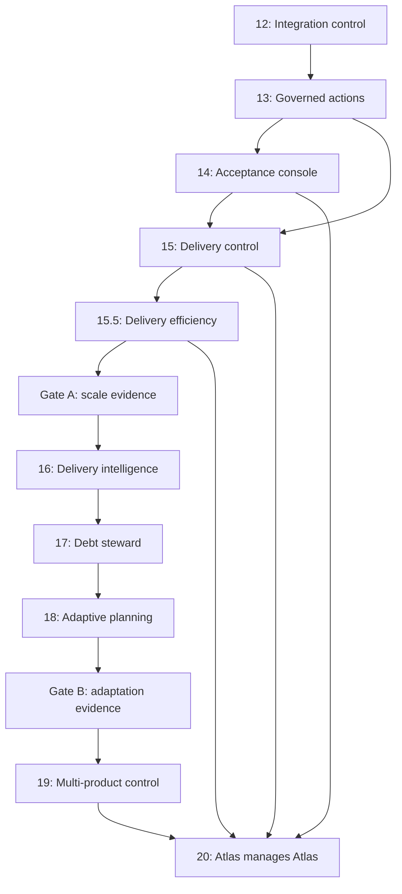

# Phase 13–20 Programme Horizon

Status: Architectural direction active after Phase 14 closure. The governed
Wave A plan/apply introduced Phases 13–15; Phases 13 and 14 are closed, Phase
15 is in delivery and interstitial Phase 15.5 is prepared as its efficiency
and integration prerequisite. Phases 16–20 are provisional programme
commitments that require later design gates before ticket creation.

## Authority of this document

This document records the intended architectural progression from Atlas's
delivered Phase 12 baseline to the Phase 20 capstone. It fixes programme
ordering, authority boundaries, cross-phase dependencies, planning gates and
falsifiable outcomes. It does not define ticket contracts, reserve ticket keys,
authorise implementation or replace an individual phase design.

The implementation roadmap owns phase order and current state. A canonical
phase design, written before that phase begins, will own its detailed domain,
API, UI and storage contracts. If later evidence invalidates a horizon
assumption, a governed documentation change must amend this document before
the affected phase is ticketised.

No Phase 16–20 inbox stubs may be created merely because the phase appears
here. Their ticket batches are deliberately deferred by the rolling-wave gates
below.

## Programme objective

Phase 12 proved exact-head integration control. The next programme turns the
delivered read surfaces and governed delivery loop into a controlled,
measurable and eventually multi-product engineering system without granting
Atlas unilateral strategic, review, merge, permission or deployment authority.

The progression is:

1. secure the first operator write;
2. compress exact-head human acceptance;
3. govern multi-agent delivery capacity;
4. remove duplicated validation and avoidable integration churn;
5. measure delivery outcomes and agent performance;
6. record technical debt and reliability risk;
7. turn evidence into governed planning proposals;
8. isolate and coordinate multiple products; and
9. prove the complete loop on Atlas itself.

## Non-negotiable architecture boundaries

The following invariants apply through Phase 20:

- **Human authority remains explicit.** Atlas may recommend, prepare and
  verify. The operator still approves plans, promotes governed knowledge,
  accepts reviews, merges pull requests and authorises policy changes.
- **Symphony remains the scheduler and runner.** Atlas controls admission to
  `Ready for Agent`, supplies context and judges outcomes. It does not create a
  second agent scheduler, reach into Symphony sessions or terminate workers.
- **One writer owns each state edge.** New controls extend the existing field
  and transition ownership model; they do not introduce competing Atlas,
  Linear, browser or agent writers.
- **Exact-head evidence remains binding.** A changed PR head, base, repository,
  acceptance contract or policy revision invalidates authority derived from an
  earlier snapshot.
- **Observation precedes adaptation.** Atlas must first collect reproducible
  delivery evidence, then identify debt, then propose planning changes. It may
  not optimise from an opaque score or an agent's self-report.
- **External writes fail closed.** Stale, partial, ambiguous or cross-product
  state results in no admission, mutation, publication or completion.
- **Product boundaries are security boundaries.** Product, repository,
  tracker, credentials, evidence, policy and capacity are explicitly scoped
  before multi-product operation begins.
- **Capability cannot authorise itself.** Atlas cannot approve its own plan,
  review its own work, expand its permissions, weaken its evidence policy,
  merge its own PR or deploy itself.

## Programme map

| Phase | Capability | New bounded authority | Human gate retained | Planning state |
| --- | --- | --- | --- | --- |
| 13 — Governed Operator Actions | Secure writable operator foundation | Promote or reject DRAFT lessons through authenticated, audited commands | Operator chooses every disposition | Closed 2026-08-11 |
| 14 — Review Acceptance Console | Exact-head browser acceptance | Pull evidence, record confirmations and run verification for one pinned PR head | Operator reviews and merges manually | Closed 2026-08-12 |
| 15 — Multi-Agent Delivery Control | Capacity-aware ticket admission | Admit or hold dependency-ready work within operator-owned policy | Operator changes policy and agent ceiling | In delivery |
| 15.5 — Parallel Delivery Efficiency and Integration Control | Scoped local confidence and bounded integration flow | Reconcile CI-pending work and classify exact-base candidates within explicit budgets | Operator retains rebase, conflict, review, merge and ramp release | Planning inputs prepared |
| 16 — Delivery Intelligence and Agent Evaluation | Reproducible delivery measurement | Persist and compare observations; no delivery mutation | Operator interprets recommendations | Horizon; redesign gate after Phases 15 and 15.5 |
| 17 — Technical Debt and Reliability Steward | Evidence-backed quality stewardship | Record code-quality debt and draft remediation proposals | Operator decides whether work enters planning | Horizon; redesign gate after Phases 15 and 15.5 |
| 18 — Governed Adaptive Planning | Outcome-informed planning proposals | Assemble bounded, anchored plan amendments | `atlas apply` remains operator-controlled | Horizon; redesign gate after Phases 15 and 15.5 |
| 19 — Multi-Product Control Plane | Isolated coordination across products | Apply product-scoped policy and capacity | Operator onboards products and allocates capacity | Horizon; redesign gate after Phase 18 |
| 20 — Atlas Managing Atlas | Self-improvement capstone | Compose existing capabilities into one governed loop | All strategy, plan, review, merge and permission gates remain human | Horizon; redesign gate after Phase 18 |

## Dependencies and closure gates

Phase 14 design may overlap Phase 13 foundations, and Phase 15's deterministic
capacity engine may begin once its required Phase 13 primitives exist.
However, Phase 15 cannot close or raise the live ceiling to ten until Phase 14
has proved that review throughput can absorb the admitted work.

Phase 15.5 begins while Phase 15 is in flight to separate scoped local
confidence from complete CI authority, bound CI/integration pressure and prove
whether clean exact-base candidates can avoid branch rewrite. It changes no
Symphony ceiling. Its closure releases ATLAS-253 to run Phase 15's controlled
ceiling milestone.

Phase 16 begins only after Phases 15 and 15.5 produce trustworthy admission,
queue and integration events. Phase 17 consumes Phase 16's evidence rather
than inventing a second telemetry path. Phase 18 consumes measured delivery
outcomes, accepted lessons and recorded debt through the existing
deterministic planning boundary.

Phase 19 follows the adaptive-planning proof because product isolation must
scope every planning, evidence and capacity operation. Phase 20 is a capstone
over Phases 13–19, not a shortcut around any of them.

## Phase 13 — Governed Operator Actions

### Outcome

Atlas gains its first authenticated browser write. The single operator can
promote a DRAFT lesson with an assigned confidence or reject it, using the same
domain behaviour as the CLI.

### Direction fixed here

- Loopback-only single-operator sessions and server-owned actor identity.
- Origin, Host, CSRF, content-type and session-expiry enforcement.
- Idempotent command handling with altered-replay rejection.
- Append-only action receipts committed atomically with successful mutations.
- Compare-and-set lesson disposition so stale tabs and CLI races cannot win.
- No generic resource patch route and no GitHub or Linear write.

### Falsifiable milestone

Through a seeded live UI and API, authenticate, promote one DRAFT lesson and
reject another, then prove final states, server attribution, durable receipts
and the ACTIVE-only context-retrieval effect. Hostile origin, missing CSRF,
duplicate or altered replay, expired session, stale-state race and receipt
failure must produce no unintended lesson mutation. **Passed:** executable
evidence and residual risks are recorded in
`docs/closure/phase-13-closure-report.md`.

## Phase 14 — Review Acceptance Console

### Outcome

The delivered review queue becomes a stepwise browser workflow for one exact
PR head: preflight, evidence pull, live-criteria confirmation, verification and
an advisory ready-for-manual-merge result.

### Direction fixed here

- Immutable acceptance sessions pin repository, PR, close-set, head, base and
  acceptance-criteria fingerprint.
- Phase 12's shared classifier remains the only mainline-freshness authority.
- Every action uses Phase 13 authentication, actor and receipt controls.
- Head, base, repository, eligibility or criteria movement stales the session.
- Old-head evidence and confirmations remain history and never authorise a new
  head.
- Atlas presents readiness but exposes no merge, rebase or Linear action.

### Falsifiable milestone

Take a seeded, exact-main Review Required PR through all console steps until
the exact verified head is reported ready for manual merge, while proving
Atlas does not merge it. Head or main movement, criteria drift, old-head
evidence, missing human confirmation, non-passed verification, timeout,
replay, cross-tab race and receipt failure must fail closed with typed reasons.

## Phase 15 — Multi-Agent Delivery Control

### Outcome

Atlas can safely expose up to ten Symphony agent slots without turning raw
execution capacity into an unbounded review queue. Dependency-ready means
eligible; a deterministic admission policy decides whether eligible work may
enter `Ready for Agent` now.

### Direction fixed here

- A durable operator-owned policy defines a working budget, review budget,
  risk and component-lane limits, and running, paused or draining mode.
- Working occupancy counts queued and active delivery states. Review occupancy
  is tracked separately so a full acceptance queue can stop new admission even
  when Symphony slots appear free.
- Admission ranks eligible tickets deterministically using dependency unlock,
  critical-path position, priority, risk, review pressure and age. Every admit
  or hold decision has an explainable reason.
- The admission pass reads one coherent sync and policy snapshot. Stale Linear
  state, partial reads, a concurrent tick or a policy revision produces zero
  promotions.
- Pause and drain stop new admission; they never demote a ticket, cancel a
  running agent, delete a workspace or terminate Symphony work.
- Phase 13's action ledger governs policy changes. The PM Engine remains the
  sole writer of the `Ready for Agent` transition.
- The current serialized ceiling of one remains unchanged on ordinary `main`
  until the controlled ramp closes at ten. Three, five, seven and ten are
  operator-selected milestone-branch ceilings, not targets Atlas tries to fill.

### Falsifiable milestone

Against more than ten independent seeded tickets and a live controlled ramp,
prove Atlas never exceeds either budget, review pressure halts admission,
Changes Requested work is not starved, lane limits prevent conflicting work,
and pause/drain preserve active agents. Stale sync, partial Linear failure,
concurrent admission and duplicate commands must admit nobody unexpectedly.
After the 1, 3, 5 and 7 gates pass, the operator sets `WORKFLOW.md` on the
dedicated milestone branch to `max_concurrent_agents: 10` and runs the
ten-agent exercise. Only after that gate passes may the Phase 15
milestone/closure change merge `max_concurrent_agents: 10` to `main`. A failed
gate restores or retains the last proven branch value, records the failure,
leaves Phase 15 open and merges no ceiling change to `main`; closure below ten
is not permitted.

## Phase 15.5 — Parallel Delivery Efficiency and Integration Control

### Outcome

Atlas preserves parallel implementation capacity by assigning agents focused
local confidence checks, making complete CI authoritative, releasing Symphony
slots while checks run and bounding integration pressure separately from
working and review capacity.

### Direction fixed here

- A deterministic repository-owned validation registry selects ticket-required
  and affected local checks. Unknown or protected changes conservatively select
  the complete sweep; CI still runs every required repository gate.
- Published work enters a non-active `CI Pending` lifecycle. Agents publish
  once and stop; system-tier CI reconciliation advances determinate outcomes.
- Working, CI-pending, integration and review occupancy are separate policy
  budgets. A free worker is not evidence that downstream capacity is free.
- Protected migration, generated-contract, workflow, planning and hotspot
  surfaces use deterministic exclusive integration lanes while independent
  work remains parallel.
- A bounded GitHub evidence spike must prove exact base, head and synthetic
  merge identity before any clean candidate may avoid branch rewrite.
  Conflict, movement or ambiguity falls back to Phase 12's operator rebase
  lane; Atlas never rebases or resolves conflicts.
- ATLAS-250 and ATLAS-251 remain prerequisites for API and UI extensions.
  Accepted PR #335 closed Phase 15.5 and released ATLAS-253 for its separately
  governed Phase 15 live ramp.
- The phase changes no `WORKFLOW.md` ceiling and does not execute the Phase 15
  ramp.

### Falsifiable milestone

Against a fixed independent workload and predeclared thresholds, prove more
accepted flow with fewer duplicate complete local sweeps, no agent CI polling,
bounded CI/integration/review queues and fewer avoidable rebases. Seed protected
surface contention, code and infrastructure failures, identity movement,
provider ambiguity and a true conflict. Every case must route without
automatic merge, rebase, push, worker cancellation or ceiling change. Any
failed or ambiguous threshold leaves Phase 15.5 open and ATLAS-253 held.

## Phase 16 — Delivery Intelligence and Agent Evaluation

### Outcome

Atlas can determine whether increased concurrency improves delivery quality,
speed and cost rather than merely increasing activity.

### Direction fixed here

- Append-oriented delivery events support reproducible ticket, PR, CI, review,
  rebase, acceptance and completion timelines.
- Queue depth, blocked time, review dwell, rework, conflict, failure, retry and
  throughput metrics derive from authoritative events.
- Agent, model and provider metadata is captured where available and compared
  by work type and risk class. Missing cost or token data remains explicitly
  unknown.
- The true last-successful Linear sync time replaces projections derived from
  ticket definition cursors.
- Reports expose sample size and uncertainty. No opaque aggregate score may
  automatically route work, select a model or change capacity.

### Falsifiable milestone

Replay a seeded delivery corpus and reproduce identical metrics, then compare
a controlled multi-agent delivery wave by lead time, review burden, rework,
failure and cost. Missing, duplicated or out-of-order events must be visible
and must not silently become zero-valued success.

## Phase 17 — Technical Debt and Reliability Steward

### Outcome

Atlas continuously records evidence-backed code-quality debt and reliability
risk, distinguishes recurrence from duplication, and drafts bounded
remediation proposals.

### Direction fixed here

- Delivery-anomaly `DebtItem` records remain distinct from the deferred
  code-quality debt register required by ADR-0011.
- Sensors may cover flaky tests, coverage regression, duplication, dependency
  and security posture, large-file or complexity pressure, and documentation
  freshness.
- Every observation pins repository, commit, sensor version, evidence digest,
  owner scope, first/last seen time and lifecycle state.
- Repeated scans are idempotent; resolved debt can recur as a new evidence
  episode without erasing history.
- The steward may record debt and draft remediation. It cannot edit code,
  create Linear tickets, mutate priorities or waive a failing quality gate.

### Falsifiable milestone

Seed several debt classes, repeated scans, a resolution and a recurrence.
Prove deterministic deduplication, preserved evidence, correct ageing and a
bounded proposal for each actionable item. A sensor timeout, partial result or
untrusted agent claim must never close debt or create delivery work.

## Phase 18 — Governed Adaptive Planning

### Outcome

Atlas can use delivery intelligence, accepted lessons and recorded debt to
propose bounded improvements to future work while preserving deterministic
reconciliation and operator-owned apply.

### Direction fixed here

- Recommendations are durable, attributable and anchored to exact evidence.
- Supported proposal classes include ticket split, dependency or priority
  adjustment, recurring-failure remediation, obsolete-future-work retirement
  and amendments to future phase assumptions.
- The planner may assemble a proposal, but existing immutability, key authority,
  gates, diff review and `atlas apply` remain binding.
- In-flight work cannot be silently rewritten. Strategy, product goals and
  acceptance-policy weakening require an explicit operator-authored change.
- Repeated recommendations deduplicate against their evidence and record the
  operator's accepted, rejected or superseded disposition.

### Falsifiable milestone

Starting from a measured recurring delivery weakness, produce an evidence-
anchored bounded plan amendment, present its deterministic diff, receive an
operator decision and apply the approved change through the existing key
authority. Rejection, stale evidence, changed source documents and a concurrent
PlanRun must produce no store or planning-render mutation.

## Phase 19 — Multi-Product Control Plane

### Outcome

Atlas can coordinate multiple repositories and tracker projects while keeping
their identities, credentials, policy, evidence, knowledge and capacity
strictly isolated.

### Direction fixed here

- Product identity scopes every repository, tracker, external key, event,
  receipt, evidence record, planning run and capacity decision.
- Product onboarding is an authenticated operator action with explicit
  repository and tracker allow-lists; credentials remain runtime-owned.
- The invariant Symphony workflow body remains shared while only declared
  per-product configuration is rendered.
- Capacity is allocated by product without oversubscribing the global ceiling.
  A product cannot inspect or consume another product's protected state.
- Cross-product lessons and playbooks are deny-by-default and require explicit
  operator promotion into a shareable form.
- Portfolio views use typed, bounded aggregates and cannot become an unscoped
  write surface.

### Falsifiable milestone

Operate two seeded products whose tracker keys and branch names intentionally
collide. Prove isolated planning, admission, evidence, acceptance, receipts and
credentials, plus a governed global capacity allocation. A wrong product,
repository or tracker identity must fail before any external write, and no
cross-product record may appear in either product's context pack.

## Phase 20 — Atlas Managing Atlas

### Outcome

Atlas proves that it can improve its own engineering system under the same
governance it applies to other products. This phase composes the preceding
capabilities and closes the self-improvement loop; it should not introduce a
new broad authority subsystem.

### Direction fixed here

- Atlas may detect and evidence a weakness in its own delivery process.
- It may draft a bounded improvement programme and show expected cost, risk,
  dependencies and measurable outcome.
- After operator approval and apply, it may admit the resulting work within
  product, capacity, risk and review budgets.
- It may follow exact-head delivery, acceptance and post-delivery measurement,
  then record the resulting lesson and debt change.
- It cannot approve the proposal, review the PR, merge, deploy, expand its own
  permissions, alter the operator identity or weaken the policy judging the
  work.

### Falsifiable milestone

Atlas identifies a recurring weakness in Atlas delivery, assembles exact
supporting evidence, proposes a bounded programme, receives operator approval,
creates governed tickets, admits them within the configured limits, follows
their PRs through exact-head acceptance and measures the result. The operator
must perform the plan approval, review and merge gates. Seed self-approval,
permission expansion, policy weakening, stale evidence and cross-product
confusion attempts; each must fail closed and remain auditable.

## Rolling-wave planning gates

### Gate 0 — planning integrity before Wave A

Status: SATISFIED by the hand-delivered Planning Batch Integrity Guard.

Atlas rejects invalid exact-path fields and validates dependency identity,
sibling ordering, dependency cycles and exact committed manifest coverage
before either plan path persists a PlanRun. Ordered phase stubs require one
committed `planning-batch-*.yaml` manifest; its base-to-HEAD file set and
ordered stub list must match the active inbox exactly. Apply re-runs the same
guard before confirmation and retires the manifest with the considered stubs.
Ordinary unnumbered PM follow-up stubs retain their existing manifest-free
path, while receiving the same path, identity, order and cycle checks.

The repair was delivered without using the defective planning path to mint a
ticket for itself, closing the circular-authority concern. Wave A may proceed
through the repaired canonical plan/apply path.

### Wave A — Phases 13–15.5

Gate 0 was satisfied and the prepared Phase 13–15 designs and ordered stubs
entered one accepted Wave A dependency graph through the exact
`atlas plan --stubs-only` and `atlas apply` boundary. Phase 13 is closed. Phase
14 is closed. Phase 15 is in flight; Phase 15.5 is a closed interstitial
prerequisite correction applied through its own governed batch. Accepted PR
#335 released ATLAS-253 for the operator-checkpointed **1 → 3 → 5 → 7 → 10**
ramp without changing the committed one-agent ceiling.

### Gate A — after Phases 15 and 15.5

Before ticketising Phases 16–18, review:

- observed review and integration throughput at each tested ceiling;
- scoped-local versus complete-CI cost and duplicated-validation evidence;
- CI-pending and protected-integration queue pressure;
- whether ten agents is useful capacity or merely theoretical headroom;
- completeness and trustworthiness of delivery-event sources;
- unresolved Phase 13–15 security, audit and stale-state findings;
- the delivered schemas and APIs that Phase 16 would consume; and
- whether the proposed debt entity still satisfies ADR-0011.

Gate A may rename, reorder, split or defer Phases 16–18. It must preserve the
human apply boundary and observation-before-adaptation invariant.

### Gate B — after Phase 18

Before ticketising Phases 19–20, review:

- whether adaptive proposals improved delivery without increasing unsafe or
  low-value work;
- the evidence and disposition history for rejected recommendations;
- the real second product and its repository/tracker/security requirements;
- data-isolation, credential and capacity-allocation threat models; and
- whether Atlas can demonstrate the capstone without deployment or merge
  authority.

Gate B may defer multi-product work if no real second-product need exists. The
Phase 20 capstone cannot bypass Phase 19 isolation by treating Atlas as an
implicitly global product.

## Capacity ramp policy

Until Phase 15 closes successfully at ten, the repo-owned Symphony ceiling on
ordinary `main` remains one. Phase 15.5 changes no ceiling and must close
before ATLAS-253 is released. Only the operator may then raise the dedicated
milestone-branch declaration after the preceding level has produced enough
independent work and review evidence:

| Ceiling | Purpose |
| ---: | --- |
| 1 | Serialized Gate 1 baseline and current ATLAS-054M runtime |
| 3 | First controlled increase after Gate 1 PASS |
| 5 | Controlled test of stable review and stale-write behaviour |
| 7 | Stress dependency lanes, review dwell and Changes Requested recovery |
| 10 | Phase 15 milestone ceiling after all fail-closed controls pass |

The configured ceiling is maximum available capacity. Atlas may intentionally
leave slots idle when dependencies, risk lanes or review capacity say that no
more work should be admitted. Ten is the mandatory Phase 15 exit condition,
not an aspirational target: its successful gate and the landed
`WORKFLOW.md` ceiling change are both required before closure.

## Explicit programme non-goals

The Phase 13–20 programme does not include:

- automatic GitHub merge, merge queue control or automatic conflict resolution;
- production deployment or release authority;
- remote hosted operation, team accounts, roles or delegated approval;
- autonomous product strategy or acceptance-policy changes;
- agent self-verification or evidence derived solely from agent claims;
- an Atlas-owned replacement for Symphony scheduling and workspace lifecycle;
- automatic model selection from an unexplained score; or
- unrestricted cross-product knowledge or credential sharing.

Hosted operation, release governance and production deployment require a later
explicit programme. They must not enter Phase 20 as an implied consequence of
Atlas managing its engineering loop.

## Programme success condition

The programme succeeds when Atlas can coordinate up to ten agents across
strictly scoped products, measure what happened, identify a bounded improvement
to its own delivery system, propose governed work, follow exact-head execution
and verify the result—while every strategic, planning, review, merge,
permission and deployment decision remains attributable to the operator.
