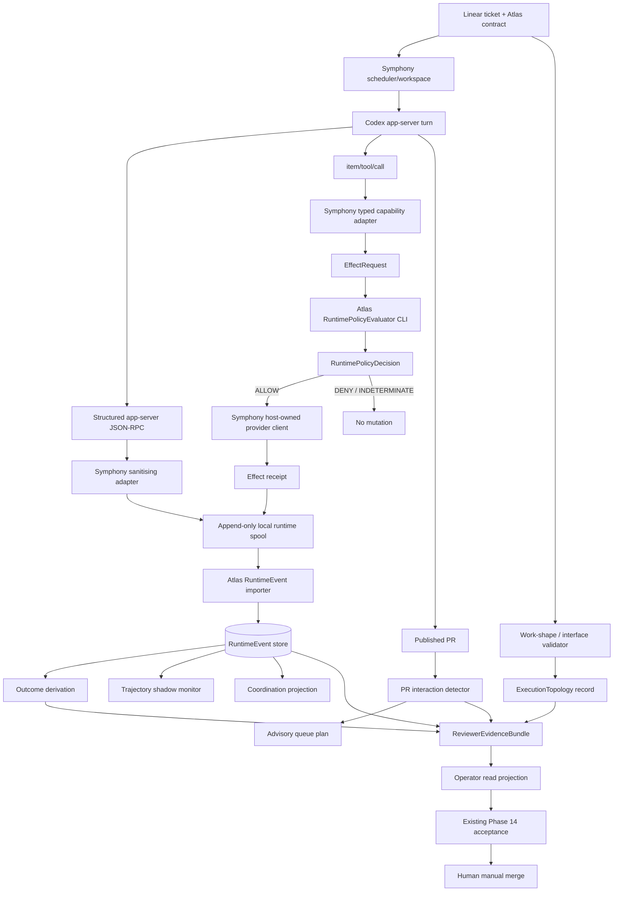
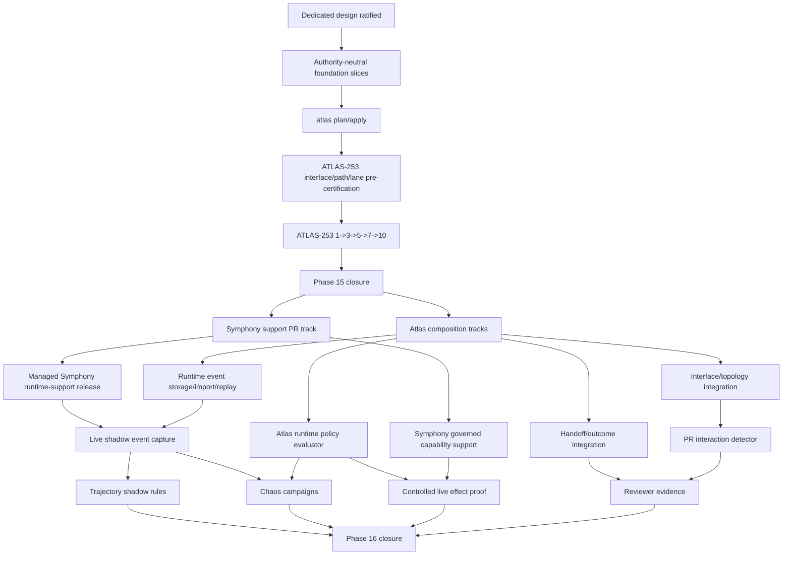

# Atlas Phase 16 — Agent Runtime and Integration Safety


> **Operator ratification record — 20 August 2026.** This dedicated Phase 16 design is accepted for planning the authority-neutral Track-A controlled-delivery overlap. Ratification does not activate Phase 16 production authority, change Symphony, close Phase 15, or authorise Track B/S/M implementation before their owning gates.

**Status:** Ratified design and Track-A ticketisation authority for the authority-neutral controlled Phase 16 overlap. Real ticket keys still require `atlas plan --stubs-only`, operator proposal review and `atlas apply`; this ratification does not activate Phase 16 production/runtime authority, change Symphony or ATLAS-253 authority, permit Track B/S/M implementation, or close Phase 16.
**Date:** 20 August 2026.
**Phase:** 16 — Agent Runtime and Integration Safety.
**Architecture horizon:** `Atlas Agentic Engineering Programme Design v4 — Cumulative Research Edition`, including completed Experiments E and F.
**Current Atlas baseline:** `derekrivers/atlas` `main` at `563d96a4b189d8d43fd57f7569d87513a6c6163f`.
**Pinned Symphony feasibility baseline:** `derekrivers/symphony-1` `e5c5e48917e9e91ffb6709ab5a2a02c5af16bf02`.
**Pinned Codex feasibility baseline:** `codex-cli 0.147.0`; generated app-server protocol fingerprint `35a2fe7f243d088c41a8151628232e2785abf2bfc341dd4b1c7bb789b1b5e226`.
**Current operating disposition:** Phase 15.5 closed; ATLAS-253 open and paused before real workload admission; ordinary Atlas `main` remains Symphony ceiling one while Phase 15 is open.
**Canonical repository location:** `docs/atlas/phase-16-agent-runtime-and-integration-safety.md`.
**Ticket identity rule:** all `P16-*`, `R16-*`, `M16-*` identifiers in this document are design slice identifiers only. Real `ATLAS-N` keys are minted later through `atlas plan` / operator review / `atlas apply`.

---

# 0. Design authority, preservation and source basis

## 0.1 Purpose of this document

The architecture horizon establishes **what Phase 16 must accomplish and what authority it may never gain**. This document establishes **how Phase 16 will be built, proven, decomposed and rolled out**.

It is deliberately more specific than the horizon. Where implementation alternatives remained open in the horizon, this design resolves them. It does not weaken, reinterpret or silently remove a horizon invariant.

The authority chain remains:

```text
research
  -> cumulative architecture horizon
  -> this dedicated Phase 16 design
  -> committed Phase 16 planning inputs
  -> atlas plan --stubs-only
  -> operator proposal review
  -> atlas apply
  -> Linear admission
  -> Symphony execution
  -> system-tier evidence
  -> human acceptance / manual merge
```

No section of this design authorises a shortcut around that sequence.

## 0.2 Binding source material

This design consumes the cumulative horizon and its retained research basis:

- BulkPR-Bench — interacting PR governance;
- LivePlan — deterministic trajectory monitoring and bounded steering;
- AgentChaos — programmatic fault injection and false-success prevention;
- Dogwood — runtime policy outside model reasoning;
- Vercel software-factory design — specialised stages, reviewer-oriented evidence, least privilege;
- When Agents Coordinate — task-shaped coordination, measurable interactions, structural rather than nominal coordination;
- Atlas Phase 15 delivery-control design;
- Atlas Phase 15.5 parallel-delivery and integration-control design;
- Atlas Symphony integration design;
- Experiment E — runtime adapter/effect-boundary feasibility;
- Experiment F — semantic-interface retrospective.

The historical Atlas/Symphony source anchors used by this design are listed in section 34.

## 0.3 Preservation rule

This design does not supersede delivered Phase 14, Phase 15 or Phase 15.5 contracts. It consumes them.

If a later Phase 16 design revision changes a ruling in this document, it must:

1. identify the old ruling by section/decision id;
2. explain why evidence made it obsolete or unsafe;
3. name the replacement;
4. preserve the superseded ruling in a design decision ledger.

Silent architectural drift is prohibited.

## 0.4 Phase 16 design acceptance does not activate Phase 16

Ratifying this document means only that the design is accepted as planning authority.

Ratification does **not**:

- start Symphony;
- alter `WORKFLOW.md`;
- alter the Phase 15 ceiling;
- admit a workload;
- enable runtime event capture;
- enable steering;
- change a Linear tool;
- activate runtime-policy enforcement;
- change PR queue decisions;
- alter review acceptance;
- change manual merge ownership.

---

# 1. Phase outcome

Phase 16 creates the governed runtime substrate that later Atlas phases may optimise.

At closure, Atlas can:

1. receive **sanitised structured runtime events** from the Symphony-owned Codex app-server boundary without log scraping;
2. preserve exact runtime identity across Atlas ticket, runtime attempt, Codex thread and Codex turn;
3. reconstruct event completeness honestly, including gaps, duplicates, unsupported channels and out-of-order observations;
4. record work-shape, role, interface and handoff identities without changing the production executor topology;
5. detect explicit file-disjoint semantic interface coupling deterministically;
6. classify run-level outcomes separately from Linear workflow state;
7. run deterministic trajectory rules in **shadow mode**;
8. prove safe degradation under injected crash, omission and value faults;
9. prove one real Linear effect can be executed through a host-owned, typed, non-bypassable capability boundary in a controlled governed profile;
10. reason over interacting published PRs with typed, stale-aware evidence while keeping queue planning advisory;
11. produce reviewer-oriented evidence without replacing the Phase 14 exact-head acceptance chain;
12. measure bounded reviewer/operator burden proxies without mislabelling them as literal human-attention minutes.

Phase 16 is successful when these mechanisms are **deterministic, replayable, bounded and authority-safe**. It is not successful merely because more telemetry exists.

---

# 2. Non-negotiable inherited invariants

## 2.1 Source-of-truth invariant

- Repository documents own intent.
- Atlas storage owns operational state traceable to intent.
- `docs/planning/*` remains apply-owned output.
- Linear and GitHub are controlled external systems, not hidden competing authorities.
- Runtime events are **observations**, not a second ticket state machine.

## 2.2 Human authority invariant

The operator retains:

- design ratification;
- plan approval;
- policy/permission expansion;
- topology activation beyond proven defaults;
- semantic resolution of uncertain interface conflicts;
- review acceptance;
- manual merge;
- production activation of steering, routing or new external capabilities.

## 2.3 Symphony invariant

Symphony remains scheduler, worker, workspace and live Codex-session owner.

Atlas must not:

- open an independent second Codex control session for an existing Symphony worker;
- cancel or restart a worker to simulate steering;
- infer worker occupancy from policy or queue state;
- take ownership of Symphony workspace lifecycle.

## 2.4 Evidence invariant

- agent-tier local validation remains confidence evidence;
- GitHub CI remains system-tier complete validation;
- exact-head/current-main acceptance remains binding;
- changed head/base/runtime identity makes earlier authority historical;
- model narrative never becomes system-tier merely because it is structured.

## 2.5 Phase 15.5 capacity invariant

Working, integration, review and protected-lane pressure remain separate.

Phase 16 does not collapse those budgets into one “agent capacity” number.

## 2.6 Capability invariant

A capability cannot authorise itself.

A runtime monitor, interface validator, policy evaluator, relation detector or queue planner cannot widen its own permissions, lower its own evidence standard or approve its own activation.

---

# 3. Resolved Phase 16 decision ledger

All blocking Phase 16 decisions are resolved here. Any implementation ticket that discovers a genuinely new architectural decision must stop at `Needs Human`; it may not silently re-open one of these decisions.

| ID | Decision | Phase 16 ruling |
|---|---|---|
| P16-D01 | Production execution topology | **Baseline single executor remains the only production topology in Phase 16.** Work shape is classified in shadow; role expansion is not automatic. |
| P16-D02 | Work-shape vocabulary | Freeze `INDEPENDENT_LEAVES`, `PIPELINE`, `SHARED_SPEC`, `SHARED_INTERFACE`, `CO_DELIVERY_GROUP`, `UNKNOWN`. `UNKNOWN` never proves independence. |
| P16-D03 | Coordinator role | No production coordinator role in Phase 16. A future coordinator must own explicit contracts/decisions/artifacts; a prompt title is insufficient. |
| P16-D04 | Coordination channel | Phase 16 creates **no new direct peer-chat/message bus**. Persistent cross-role facts use typed durable handoffs/artifacts. Runtime-observed peer messaging may be recorded when instrumented; otherwise it is `UNKNOWN`. |
| P16-D05 | Interface discovery authority | Explicit named contracts only. LLM inference may suggest a candidate later but cannot create a blocking contract or admission hold. |
| P16-D06 | Interface location | Canonical interface definitions live in a repository-owned `interface-contract-registry/v1`. After the ramp, the canonical Ticket/ProposalTicket contract gains machine-readable `interface_usages[]`; the initial ATLAS-253 overlap uses a frozen pre-certification artifact and does not require that Ticket-schema change first. |
| P16-D07 | Interface semantics | Dependency = predecessor; protected lane = repository contention; InterfaceContract = compatibility/authority invariant across independently editable surfaces. |
| P16-D08 | Interface interaction | `consume+consume` neutral; `change+consume` requires compatibility proof; `change+change` requires serialization, explicit owner or co-delivery; stale/ownerless material contract fails conservative. |
| P16-D09 | Runtime event source | Symphony-owned Codex app-server structured JSON-RPC seam only; no log scraping. |
| P16-D10 | Runtime transport | Phase 16 v1 uses a **host-local append-only sanitised event spool** between Symphony and Atlas. Symphony writes `RuntimeTransportEvent` source records; Atlas resolves them into canonical `RuntimeEvent` rows. No new writable Atlas HTTP service-auth surface is introduced merely for telemetry. |
| P16-D11 | Runtime attempt identity | Symphony generates one opaque `runtime_attempt_id` per worker lifetime. It spans that worker's Codex thread and all turns. Atlas retains it alongside `agent_run_id`, thread, turn and session identities. |
| P16-D12 | AgentRun relationship | Existing historical reconstruction remains valid. Instrumented Phase 16 runs add direct runtime identity and are joined/enriched without deleting historical reconstruction evidence. No old AgentRun identity is rewritten. |
| P16-D13 | Event sequence | Monotonic source sequence begins at 1 per `runtime_attempt_id`; duplicate source ids dedupe; missing numbers remain explicit gaps; arrival order never overwrites source order. |
| P16-D14 | Raw data | Raw JSON-RPC/transcript/tool arguments are transient projector inputs only. Durable events use bounded allowlisted metadata plus hashes/classes. |
| P16-D15 | Telemetry completeness | Every source publishes a `RuntimeSourceDescriptor` naming supported event families and sequence semantics. Unsupported/uninstrumented channels are `UNKNOWN`, not zero. Experiment G remains optional. |
| P16-D16 | Outcome taxonomy | Freeze the horizon taxonomy exactly; protected outcome value is derived deterministically from bounded facts, not selected by a model. |
| P16-D17 | `SUCCEEDED` meaning | Runtime attempt fulfilled its execution/handoff contract. It does **not** mean CI passed, review accepted, PR merged or ticket Done. |
| P16-D18 | Trajectory mode | Shadow only for Phase 16 closure. Alerts cannot steer, transition or cancel production work. |
| P16-D19 | Steering transport | Native Codex `turn/steer` with exact `expectedTurnId` only. Phase 16 may implement/test the adapter, but no production steering command surface is required for closure. |
| P16-D20 | Ambiguous steer | Never blind retry. Record `INDETERMINATE`; a later turn must not receive stale text. |
| P16-D21 | Effect gateway location | Existing Symphony dynamic-tool boundary is the host capability transport. Atlas supplies the deterministic policy evaluator; Symphony retains provider credential and executes ALLOWed effects. |
| P16-D22 | Policy evaluation transport | Phase 16 v1 uses a **strict host-local Atlas policy-evaluator command seam** invoked by Symphony with bounded JSON and a pinned policy bundle. The evaluator executable and bundle come from operator-owned immutable host identities, never the agent workspace. No provider credential is passed to the evaluator. Timeout/malformed/unavailable => DENY/INDETERMINATE. |
| P16-D23 | Generic Linear GraphQL | Unrestricted `linear_graphql` is incompatible with a non-bypassable governed Linear claim. The controlled governed profile must not advertise it or an equivalent mutation channel. |
| P16-D24 | First governed effect | One bounded comment on a dedicated controlled Linear issue is ALLOWed; a forbidden workflow-state transition request is DENYed with zero mutation. |
| P16-D25 | Normal production Linear tool | Phase 16 does **not** remove `linear_graphql` from the ordinary Phase 15 production workflow as part of ATLAS-253. The non-bypassable proof runs in an isolated governed capability profile. Wider production migration is a separate activation decision. |
| P16-D26 | PR relation authority | Deterministic/corroborated evidence first. LLM relation inference is optional/advisory and not a closure dependency. |
| P16-D27 | Queue planning | Advisory only; no merge/rebase/ticket-transition authority. |
| P16-D28 | Reviewer burden | Measure named proxies from existing durable records; never label elapsed dwell as literal human-attention time. |
| P16-D29 | Persistence activation | Pure contracts precede persistence. Schema/migration/API/UI integration occurs after ATLAS-253 overlap; no ramp-safe foundation ticket owns a migration or shared export file. |
| P16-D30 | Two-repository delivery | Atlas product work and Symphony runtime-support work are separate tracks. Atlas Symphony workers may modify only `derekrivers/atlas`; `symphony-1` support PRs are operator-reviewed support work and are never ATLAS-253 workload. |
| P16-D31 | Experiment G | Optional. Phase 16 can close by proving declared telemetry completeness and deterministic replay with live/recorded single-role events plus controlled fixtures; it need not invent multi-agent chat solely to run Experiment G. |
| P16-D32 | General admission gating | Phase 16 does not generally add interface/topology holds to normal Atlas admission. The validator is authoritative only when an explicit certification/policy invokes it. Broader automatic admission gating requires evidence-gated activation. |

---

# 4. Scope and non-goals

## 4.1 In scope

- runtime event contracts and sanitised capture;
- runtime-source and capability identity;
- event replay/completeness;
- work-shape/topology records;
- explicit interface contracts and usage declarations;
- role capability envelopes;
- typed handoffs/coordination observations;
- deterministic run outcome derivation;
- shadow trajectory monitoring;
- native steering adapter contract/testing;
- chaos harness and safety campaigns;
- runtime policy/effect request/decision/receipt contracts;
- controlled governed Linear effect proof;
- PR interaction graph observations;
- advisory queue plan;
- reviewer evidence projection and burden proxies;
- APIs/CLI/UI required to inspect this evidence without creating new protected authority;
- ATLAS-253 interface pre-certification and ramp-safe workload shaping.

## 4.2 Explicit non-goals

Phase 16 does not deliver:

- automatic multi-role production execution;
- scout routing or model routing;
- production steering based on a model advisor;
- general agent-to-agent messaging;
- automatic merge;
- automatic rebase/conflict resolution;
- broad GitHub effect mediation;
- removal of human review acceptance;
- self-modifying runtime policy;
- automatic InterfaceContract discovery from model similarity;
- production policy optimisation from one run;
- historical Change2Task corpus/evaluation lane (Phase 17);
- verified scouting rollout (Phase 18);
- proactive bug discovery (Phase 19);
- adaptive planning (Phase 20);
- multi-product orchestration (Phase 21).

---

# 5. Repository, runtime and release ownership

## 5.1 Two repositories, one governed boundary

Phase 16 spans two physical repositories but only one product authority.

### Atlas repository — `derekrivers/atlas`

Owns:

- canonical Phase 16 design and policy;
- runtime-event/domain models;
- RuntimeEvent persistence/import/replay;
- interface/topology/handoff/outcome models and validators;
- trajectory rules;
- chaos harness and Atlas-side fault semantics;
- RuntimePolicyEvaluator implementation and policy-bundle validation;
- PR interaction/queue advisory logic;
- reviewer evidence and operator projections;
- planning inputs and ATLAS ticket identity;
- phase milestone validator and closure evidence.

### Symphony support repository — `derekrivers/symphony-1`

Owns only the runtime-side adapter mechanics that physically sit beside the Codex process:

- `runtime_attempt_id` generation;
- raw Codex message -> sanitised runtime-event projection;
- source sequencing;
- append-only host-local event spool writer;
- native `turn/steer` adapter function;
- typed dynamic capability advertisement;
- invocation of the pinned Atlas RuntimePolicyEvaluator command;
- host-owned Linear effect execution after ALLOW;
- effect receipt ordering and fail-closed handling;
- controlled effect-probe harness.

Symphony does **not** gain Atlas planning, ticket, review, merge or policy-authoring authority.

## 5.2 Why Symphony support work is not an Atlas execution ticket

The canonical Atlas `WORKFLOW.md` requires the agent to work only in the provided repository checkout. The managed workflow clones `derekrivers/atlas`.

Therefore an ATLAS ticket dispatched through the current Atlas Symphony workflow must not be instructed to edit `derekrivers/symphony-1` or a second checkout.

Symphony support changes are delivered as separately reviewed support PRs/releases. They may be designed and tracked by the Phase 16 programme, but they are not counted as Atlas product workload and they are never placed in the ATLAS-253 workload manifest.

## 5.3 Runtime release promotion

A Symphony support change becomes usable by Atlas only after:

1. PR review/CI in `symphony-1`;
2. an exact support commit is selected;
3. a managed immutable release is materialised;
4. the operator updates the managed service only under an explicit Phase 16 runtime activation step;
5. runtime readback proves service unit, exact release/commit, runtime policy/config digest, event projector version and Codex protocol identity;
6. rollback to the prior known-good release is retained.

No support PR auto-deploys itself.

## 5.4 ATLAS-253 ordering constraint

No Symphony support release is required for the initial Phase 16 payload used by ATLAS-253.

The ramp-safe tranche consists only of authority-neutral Atlas repository contracts. ATLAS-253 therefore continues against its already-ratified Symphony release and Phase 15 contract.

After ATLAS-253 closes, Phase 16 may promote the first runtime-support release.

---

# 6. End-to-end Phase 16 architecture



## 6.1 Three planes

Phase 16 deliberately separates:

### Runtime plane

Symphony + Codex. Owns worker/session mechanics and host credential custody.

### Control/evidence plane

Atlas. Owns deterministic models, policy evaluation, replay, interface reasoning, outcome derivation and reviewer projections.

### External-effect plane

Provider clients such as Linear. An effect occurs only after the owning gateway has a valid current policy decision and a durable pre-effect intent/receipt boundary.

No plane silently inherits another plane's authority.

---

# 7. Runtime identity model

## 7.1 Required identity stack

Phase 16 preserves these identities separately:

```text
product_id
atlas_ticket_id
external_issue_id
agent_run_id?
runtime_attempt_id
codex_thread_id?
codex_turn_id?
session_id?
source_sequence_no
```

`?` means not every event family has that identity at emission time.

## 7.2 `runtime_attempt_id`

Symphony creates one opaque UUID for each worker lifetime immediately before starting that worker's runtime session.

Properties:

- never reused;
- does not encode a path, hostname, secret or ticket title;
- stable across all Codex turns in that worker lifetime;
- new worker retry => new `runtime_attempt_id`;
- persisted in every runtime event emitted for that attempt;
- used as the source sequencing scope.

## 7.3 Codex thread/turn/session

- one app-server thread id identifies the continuing Codex conversation;
- each `turn/start` returns a native turn id;
- current Symphony's `session_id = <thread_id>-<turn_id>` may remain as a convenience field;
- stale-safety never relies on the composite session alone when native thread/turn values are available.

## 7.4 Atlas AgentRun binding

Existing historical AgentRun reconstruction remains preserved.

For Phase 16 instrumented runs:

1. RuntimeEvent import resolves `product_id` and ticket using the exact external Linear issue identity supplied by the runtime envelope.
2. Runtime events retain `runtime_attempt_id` immediately even when no Atlas AgentRun row has yet been linked.
3. A deterministic binding service associates one runtime attempt with one Atlas AgentRun record when the dispatch/run evidence is sufficient.
4. The binding is append-only evidence: old reconstruction ids are never rewritten merely to make history look cleaner.
5. If exact binding is unavailable, `agent_run_id` remains unresolved and the runtime trace remains valid under `runtime_attempt_id`; reports expose the missing join.

This avoids inventing an exact AgentRun relation from timestamps.

## 7.5 Identity movement

Any of these movements stales dependent evidence:

- runtime attempt changes;
- Codex thread changes unexpectedly inside one attempt;
- turn id changes for a steer request;
- Symphony release/projector/policy capability fingerprint moves;
- PR head/base identity moves;
- InterfaceContract version moves when the evidence claims compatibility against the old version.

Historical evidence remains stored; authority does not transfer.

---

# 8. Runtime source descriptor

Every live/recorded runtime source must declare a versioned capability descriptor.

```text
RuntimeSourceDescriptor
  source_id
  schema_version
  product_scope
  runtime_provider
  symphony_release_sha
  event_projector_version
  codex_cli_version
  codex_protocol_fingerprint
  source_sequence_semantics
  supported_event_families[]
  supported_identity_fields[]
  supported_coordination_channels[]
  advertised_dynamic_tool_fingerprint?
  mcp_inventory_fingerprint?
  governed_channel_inventory_fingerprint?
  created_at
  fingerprint
```

Rules:

- immutable for one source configuration;
- fingerprint is deterministic over canonical fields;
- a runtime configuration change creates a new descriptor;
- reports name the descriptor fingerprint;
- missing capability is not inferred from silence;
- a source that does not instrument peer messages declares that explicitly.

---

# 9. Runtime transport envelope and RuntimeEvent v1

## 9.1 Why source and canonical event shapes are separate

Symphony owns runtime identity but does not own Atlas database UUIDs. It knows the configured product scope and the exact external tracker issue identity; it must not open Atlas storage merely to discover `product_id` or `ticket_id`.

Therefore the source transport is a separate bounded envelope:

```text
RuntimeTransportEvent
  schema_version = runtime-transport-event/v1
  product_scope
  external_issue_id
  issue_identifier
  runtime_attempt_id
  codex_thread_id?
  codex_turn_id?
  session_id?
  source_sequence_no
  observed_at
  source_descriptor_fingerprint
  event_family
  operation_kind
  operation_identity_hash?
  result_class?
  duration_ms?
  exit_code_class?
  touched_paths[]
  head_sha?
  base_sha?
  role_id?
  topology_id?
  interface_ids[]
  artifact_ids[]
  peer_role_id?
  bounded_metadata
  payload_digest?
  transport_fingerprint
```

Atlas importer resolves `product_scope + external_issue_id` against the configured product/tracker identity, then creates the canonical `RuntimeEvent`.

Unknown product scope, missing issue, duplicate external issue identity or a product/issue mismatch is an import failure. The importer never guesses from ticket title or branch name.

## 9.2 Source event key and contradiction semantics

Within one source descriptor, the tuple:

```text
(runtime_attempt_id, source_sequence_no)
```

is the source event key.

- the same key + same `transport_fingerprint` is an idempotent duplicate;
- the same key + different fingerprint is a **source contradiction**; Atlas retains the contradiction evidence and marks the trace incomplete/corrupt rather than overwriting either claim;
- a skipped sequence is a gap;
- arrival order does not redefine source order.

Persisted `RuntimeEvent.id` is deterministic from product identity, source descriptor, runtime attempt and source sequence, so repeated import cannot mint a new operational identity for the same source event.

## 9.3 Durable RuntimeEvent envelope


```text
RuntimeEvent
  id
  schema_version = runtime-event/v1
  product_id
  ticket_id?
  external_issue_id
  agent_run_id?
  runtime_attempt_id
  codex_thread_id?
  codex_turn_id?
  session_id?
  source_sequence_no
  observed_at
  source_descriptor_fingerprint
  event_family
  operation_kind
  operation_identity_hash?
  phase_classification
  result_class?
  duration_ms?
  exit_code_class?
  touched_paths[]
  head_sha?
  base_sha?
  role_id?
  topology_id?
  interface_ids[]
  artifact_ids[]
  peer_role_id?
  bounded_metadata
  payload_digest?
  canonical_fingerprint
```

## 9.4 Event families

Phase 16 v1 supports bounded families rather than exposing every raw Codex method as durable schema:

```text
RUN_STARTED
RUN_COMPLETED
RUN_FAILED
SESSION_STARTED
TURN_COMPLETED
TURN_FAILED
TURN_CANCELLED
TURN_INPUT_REQUIRED
OPERATION_STARTED
OPERATION_COMPLETED
OPERATION_FAILED
TOOL_CALL_REQUESTED
TOOL_CALL_COMPLETED
TOOL_CALL_FAILED
APPROVAL_REQUIRED
APPROVAL_AUTO_RESOLVED
NOTIFICATION
MALFORMED_PROTOCOL_MESSAGE
ROLE_STARTED
ROLE_COMPLETED
HANDOFF_CREATED
HANDOFF_CONSUMED
ARTIFACT_READ
ARTIFACT_WRITTEN
INTERFACE_CONSUMED
INTERFACE_CHANGED
INTERFACE_DECISION
PEER_MESSAGE
CAPABILITY_REQUESTED
CAPABILITY_ALLOWED
CAPABILITY_DENIED
STEERING_REQUESTED
STEERING_APPLIED
STEERING_REJECTED_STALE
STEERING_INDETERMINATE
```

A source may support only a subset.

## 9.5 Operation identity without transcript retention

Trajectory rules sometimes need to know that an operation repeated.

The projector may therefore compute `operation_identity_hash` from a normalised bounded source action, but it does not persist the source command/tool arguments by default.

Examples:

- shell command: hash of normalised command argv/string in transient memory;
- dynamic tool: hash of tool name + canonical bounded argument digest;
- file change: hash of canonical touched-path set + operation class;
- provider call: hash of effect/capability identity, not credential material.

Hashing is a correlation mechanism, not evidence of correctness.

## 9.6 Bounded metadata allowlist

Allowed metadata is event-family specific and may include:

- raw method name;
- item type;
- tool/capability name;
- error/failure class;
- token delta/counts;
- retry/attempt ordinal;
- worker host identity only if represented as a bounded configured host id, never an arbitrary filesystem path;
- validation profile ids;
- policy/effect decision ids;
- interface/handoff ids.

Forbidden durable fields include:

- raw environment;
- credentials/tokens;
- raw command output;
- arbitrary prompts/responses;
- full peer-message text;
- workspace paths;
- Git credential material;
- provider raw payloads;
- hidden evaluation content.

## 9.7 Phase classification

Deterministic classifiers may label:

`UNDERSTAND`, `LOCALISE`, `REPRODUCE`, `PATCH`, `VALIDATE`, `INTEGRATE`, `HANDOFF`, `UNKNOWN`.

The classifier uses observable operation kinds/registered command identities, not model chain-of-thought.

`UNKNOWN` is a valid normal result.

---

# 10. Runtime event transport and persistence

## 10.1 Why Phase 16 v1 uses a local spool

The current Atlas HTTP write boundary is designed for human/operator governed actions. Introducing service authentication merely to move telemetry would create a new security and operational surface before it is needed.

The v1 runtime transport is therefore a **local append-only sanitised spool** owned by the managed runtime host.

This is transport evidence, not Atlas operational authority.

## 10.2 Spool layout

Conceptual layout:

```text
<configured-runtime-spool-root>/
  <product-scope>/
    sources/
      <source-descriptor-fingerprint>.json
    attempts/
      <runtime-attempt-id>.events.ndjson
      <runtime-attempt-id>.complete.json
```

Source descriptors are written before any attempt references them. They contain only bounded capability/configuration identity, never credentials.

No workspace path, ticket title or credential appears in the filename.

The exact root is operator configuration outside the agent workspace. Live activation additionally requires a sandbox proof that a dispatched Codex process cannot read, enumerate or write the spool root. If that isolation cannot be demonstrated on the pinned runtime, the spool transport may not be activated and this design must be revised rather than accepting the spool as an uninstrumented cross-agent coordination channel.

## 10.3 Writer semantics

For each runtime attempt:

1. assign `runtime_attempt_id`;
2. set `source_sequence_no = 1`;
3. sanitise raw event;
4. build canonical event transport record;
5. append exactly one newline-delimited record using the runtime writer's bounded durability policy;
6. increment sequence only after successful append;
7. on worker completion write one bounded completion record containing final sequence and source descriptor fingerprint;
8. never expose spool location or file handles to the Codex tool/prompt surface.

A write failure:

- must not produce a fabricated event;
- does not grant Atlas scheduler authority;
- degrades observability and is visible in Symphony logs/runtime state;
- for ordinary observation may allow the agent execution to continue under an explicit `telemetry_degraded` fact;
- for a governed external effect, required effect-audit persistence failure prevents the effect from executing.

## 10.4 Importer semantics

Atlas importer:

- reads only configured product spool paths;
- rejects traversal/symlink escape/foreign product identities;
- validates size/count bounds;
- validates source descriptor fingerprint;
- resolves exact configured `product_scope` and `external_issue_id` to Atlas product/ticket identity without title/branch heuristics;
- validates schema and exact field sets;
- deduplicates by source event id/canonical fingerprint;
- records source sequence gaps;
- never reorders source sequence to hide a gap;
- persists canonical RuntimeEvent rows transactionally;
- never deletes transport files as part of ingestion;
- emits a bounded import receipt.

## 10.5 Completion and retention

Phase 16 does not choose arbitrary time-based deletion constants.

Lifecycle rule:

- spool files remain until Atlas has durably imported the complete attempt and replay/completeness checks can reproduce the source fingerprint;
- cleanup is a separate bounded maintenance action and never required for run correctness;
- canonical RuntimeEvents remain at least through ticket acceptance/Phase 16 evidence collection;
- Phase 17 owns long-term evaluation-corpus retention policy.

Disk/capacity limits remain configuration and must fail visibly rather than silently dropping old unimported evidence.

## 10.6 Replay

For one recorded attempt, replaying the canonical source twice must produce identical:

- ordered source event ids;
- event fingerprints;
- completeness/gap assessment;
- phase classifications;
- trajectory alerts;
- outcome derivation inputs.

Clock-of-replay never enters the fingerprint.

---

# 11. Work-shape classification and ExecutionTopology

## 11.1 Separate work shape from live role topology

The horizon's topology classes describe **coordination shape**, not permission to spawn extra production roles.

Phase 16 therefore records two distinct concepts:

```text
WorkShapeClassification
ExecutionTopology
```

## 11.2 WorkShapeClassification

```text
WorkShapeClassification
  id
  version
  ticket_id
  class
  evidence_refs[]
  interface_contract_ids[]
  dependency_refs[]
  protected_lane_refs[]
  unknown_reasons[]
  classifier_version
  fingerprint
```

Allowed class:

- `INDEPENDENT_LEAVES`
- `PIPELINE`
- `SHARED_SPEC`
- `SHARED_INTERFACE`
- `CO_DELIVERY_GROUP`
- `UNKNOWN`

Rules:

- deterministic/system evidence may classify;
- model advice may be stored separately but cannot set the protected value;
- incomplete material facts => `UNKNOWN`;
- `UNKNOWN` never certifies a ramp workload as independent.

## 11.3 ExecutionTopology v1

```text
ExecutionTopology
  topology_id
  schema_version
  ticket_id
  work_shape_id
  execution_mode
  roles[]
  handoffs[]
  shared_artifacts[]
  interface_contract_ids[]
  max_parallel_roles
  required_review_stages[]
  required_validation_profiles[]
  policy_fingerprint
```

Phase 16 production value:

```text
execution_mode = BASELINE_SINGLE_ROLE
roles = [implementation_executor]
max_parallel_roles = 1
```

Other topology shapes may exist in fixtures/disposable experiments but are not production defaults.

## 11.4 No scheduler side effect

Topology selection/recording is pure.

It does not:

- admit a ticket;
- spawn a worker;
- change `max_concurrent_agents`;
- create a Linear issue;
- select a model;
- cancel an existing agent.

---

# 12. RoleCapabilityEnvelope

Even though production remains one executor, Phase 16 introduces the role contract that later phases can evaluate.

```text
RoleCapabilityEnvelope
  role_id
  schema_version
  role_kind
  readable_surfaces[]
  writable_workspace_surfaces[]
  dynamic_capabilities[]
  external_effect_families[]
  credential_claims[]
  max_turns?
  max_time?
  forbidden_capabilities[]
  policy_fingerprint
```

Phase 16 baseline executor retains the existing Atlas delivery contract.

No role envelope grants authority absent from the surrounding system.

A future scout/reviewer role must be a new explicit envelope, not a prompt-only persona.

---

# 13. InterfaceContract v1

## 13.1 Purpose

An InterfaceContract exists when independently editable surfaces must agree on a named compatibility/authority invariant that is not already fully owned by a dependency, protected lane or stronger deterministic validator.

It is intentionally rare.

## 13.2 Interface kinds

```text
CONFIG_OR_SCHEMA
VOCABULARY_OR_SEMANTICS
RUNTIME_HANDOFF_OR_REACHABILITY
EVIDENCE_IDENTITY
AUTHORITY_BOUNDARY
PROTOCOL
DURABLE_IDENTIFIER
OTHER_EXPLICIT
```

`OTHER_EXPLICIT` still requires a ratified invariant and validator.

## 13.3 Canonical surface identity

Every interface surface is typed:

```text
InterfaceSurface
  kind
  identity
```

Allowed v1 kinds:

```text
REPOSITORY_PATH
REPOSITORY_PREFIX
GENERATED_CONTRACT
RUNTIME_OPERATION
PROVIDER_SCHEMA
AUTHORITY_EDGE
IDENTIFIER_NAMESPACE
```

Examples:

```text
REPOSITORY_PATH: WORKFLOW.md
RUNTIME_OPERATION: atlas-pm-sync/ci-handoff-reconcile
PROVIDER_SCHEMA: linear/tracker-provider-project-slug
AUTHORITY_EDGE: ci_pending->review_required/system-tier-reconciler
IDENTIFIER_NAMESPACE: alembic-revision-chain
```

Surface identity is canonical bounded data. Free-form prose cannot be used as a protected join key.

## 13.4 InterfaceContract

```text
InterfaceContract
  interface_id
  schema_version
  revision
  kind
  status
  owning_scope
  contract_owner
  description
  invariant_digest
  producer_surfaces[]
  consumer_surfaces[]
  change_surfaces[]
  compatibility_mode
  validation_refs[]
  evidence_requirements[]
  protected_lane_ref?
  supersedes_revision?
  fingerprint
```

`status`: `ACTIVE | RETIRED`.

`compatibility_mode`:

- `EXACT_REVISION`
- `BACKWARD_COMPATIBLE`
- `CUSTOM_VALIDATOR`

No protected contract may have empty `validation_refs`.

### Repository registry

The v1 canonical registry identity is:

```text
interface-contract-registry/v1
```

The canonical Atlas repository location is **atlas/orchestration/interface_contract_registry_v1.json**. The registry bytes/version/fingerprint are protected configuration and are never generated from model inference.

The registry may contain multiple immutable interface revisions plus one explicit active revision per interface id. A contract change is a repository review event; it is not an operational database write.

### Ticket/ProposalTicket integration after the ramp

The post-ramp schema integration adds:

```text
interface_usages: list[InterfaceUsage]
```

to the canonical planning proposal/ticket path, with stored `Ticket` defaulting to `[]` for compatibility. The planner-facing proposal contract must explicitly emit the field under the repository's existing required-field discipline once that schema version is activated.

Context Pack rendering carries the resolved active interface identity/revision and the ticket's declared usage so the executor can see the same contract Atlas validates.

The initial ATLAS-253 overlap does not depend on this schema migration; its tickets are pre-certified from the frozen design/planning contracts before manifest freeze.

## 13.5 Ownership

Two ownership concepts remain separate:

### Durable contract owner

Owns definition/version of the invariant. It is a durable system scope such as `atlas:pm`, `atlas:runtime-safety`, `atlas:architecture`, not a transient agent persona.

### Execution owner

The ticket/role currently authorised to change or decide the interface for one execution topology.

A completed ticket cannot leave the durable contract owner undefined.

## 13.6 Usage declaration

```text
InterfaceUsage
  interface_id
  expected_revision
  mode
```

`mode`:

- `CONSUME`
- `CHANGE`
- `OWN_CHANGE`

Absence means no declared material interface. It does **not** mean Atlas proved no hidden interface exists.

## 13.7 Collision semantics

For one active material interface:

| A | B | Result |
|---|---|---|
| CONSUME | CONSUME | neutral for interface independence |
| CHANGE | CONSUME | compatibility evidence required; otherwise not independent |
| OWN_CHANGE | CONSUME | compatibility evidence required; otherwise not independent |
| CHANGE | CHANGE | not independent unless explicit co-delivery owner/topology |
| OWN_CHANGE | CHANGE | owner/topology decision required |
| stale revision | any | not independent |
| ownerless material contract | any | not independent |

## 13.8 Stronger existing controls

If an existing dedicated control already owns the risk, InterfaceContract references it instead of adding a second hold.

Examples:

- Alembic revision contention -> protected database migration lane;
- generated OpenAPI -> generated-contract drift + protected lane;
- source-anchor durability -> source-anchor integrity validator.

## 13.9 Production activation

Phase 16 general admission remains `OBSERVE` for interface usage.

The validator becomes fail-closed only for explicit certification decisions such as:

- ATLAS-253 workload independence pre-certification;
- a Phase 16 milestone fixture;
- a later operator-enabled interface policy.

---

# 14. Typed handoffs and coordination observations

## 14.1 No new peer-message system

Phase 16 does not create a direct agent chat bus.

Durable coordination uses typed artifacts when a future topology needs them.

## 14.2 RuntimeHandoff

```text
RuntimeHandoff
  handoff_id
  schema_version
  product_id
  ticket_id
  topology_id
  from_role_id
  to_role_id?
  handoff_kind
  created_at
  source_runtime_attempt_id?
  interface_ids[]
  artifact_refs[]
  bounded_summary
  evidence_refs[]
  fingerprint
```

Allowed initial kinds:

- `INVESTIGATION`
- `REPRODUCTION_EVIDENCE`
- `INTERFACE_DECISION`
- `REVIEW`
- `TRAJECTORY_ALERT`

The bounded summary is not authority unless a named validator consumes it.

## 14.3 CoordinationObservation

```text
CoordinationObservation
  id
  runtime_attempt_id
  source_sequence_no
  edge_kind
  source_role_id?
  target_role_id?
  artifact_id?
  interface_id?
  observed_at
  evidence_state
```

`evidence_state` includes `OBSERVED | UNKNOWN_CHANNEL | INCOMPLETE`.

No missing channel becomes a zero edge count.

---

# 15. ExecutionOutcome v1

## 15.1 Frozen taxonomy

```text
SUCCEEDED
FLAWED
BLOCKED_ENVIRONMENT
BLOCKED_AUTHORITY
BLOCKED_DEPENDENCY
BLOCKED_INTERFACE
BLOCKED_INFRASTRUCTURE
MANUAL_BOUNDARY
INTERVENTION_REQUIRED
ABORTED_SAFE
INDETERMINATE
```

## 15.2 Semantics

### `SUCCEEDED`

The runtime attempt fulfilled its bounded execution contract and reached its expected handoff without a protected failure fact.

For the current Atlas executor this normally means the execution attempt completed its implementation/handoff responsibility. It does **not** assert CI/review/merge/Done.

### `FLAWED`

The attempt reached a nominal completion/handoff but deterministic evidence proves a non-terminal execution-quality violation that does not fit a stronger block/abort class.

A model opinion cannot produce `FLAWED`. A Phase 16 shadow trajectory alert by itself also cannot produce `FLAWED`; only a rule explicitly promoted into protected outcome policy could do so, and Phase 16 promotes none.

### `BLOCKED_ENVIRONMENT`

Local execution prerequisite absent/invalid, e.g. required runtime dependency, workspace/environment constraint.

### `BLOCKED_AUTHORITY`

The required action is outside the attempt's permitted capability/authority and cannot proceed without an authorised owner.

### `BLOCKED_DEPENDENCY`

A declared predecessor or external prerequisite is not satisfied.

### `BLOCKED_INTERFACE`

Material interface is stale, ownerless or incompatible and the protected workflow requires a hold.

### `BLOCKED_INFRASTRUCTURE`

Provider/runtime/CI transport infrastructure prevents progress and is not an implementation defect.

### `MANUAL_BOUNDARY`

The attempt intentionally reaches a human/operator step that the architecture does not automate.

### `INTERVENTION_REQUIRED`

Deterministic trajectory/policy evidence says continued autonomous execution is unsafe or nonproductive and requires operator judgement.

### `ABORTED_SAFE`

A fault/guard caused the attempt to stop safely with no prohibited mutation/false success.

### `INDETERMINATE`

Required evidence is incomplete, contradictory or ambiguous; Atlas cannot honestly choose another protected outcome.

## 15.3 Outcome facts

Outcome derivation consumes a bounded `ExecutionOutcomeFacts` structure, not free-form narrative.

Candidate facts:

```text
trace_complete
runtime_terminal_event
expected_handoff_observed
environment_block
explicit_authority_denial
unsatisfied_dependency
interface_block
infrastructure_block
manual_boundary
intervention_required
safe_abort
protected_contract_violation
material_unknowns[]
```

## 15.4 Deterministic precedence

1. material missing/contradictory evidence required to classify -> `INDETERMINATE`;
2. safe-abort guard fired -> `ABORTED_SAFE`;
3. explicit environment/authority/dependency/interface/infrastructure block -> corresponding `BLOCKED_*`;
4. deterministic intervention requirement -> `INTERVENTION_REQUIRED`;
5. explicit expected human stop -> `MANUAL_BOUNDARY`;
6. protected execution-quality violation with nominal completion -> `FLAWED`;
7. expected terminal/handoff facts complete -> `SUCCEEDED`;
8. otherwise -> `INDETERMINATE`.

A classifier must expose all contributing facts even though it emits one primary outcome.

## 15.5 Relationship to AgentRunStatus and TicketStatus

ExecutionOutcome does not replace either existing enum.

- `AgentRunStatus` remains lifecycle/storage status.
- `TicketStatus` remains workflow state.
- `ExecutionOutcome` is deterministic interpretation of one runtime attempt.

No outcome writes Linear state in Phase 16.

---

# 16. Trajectory monitoring

## 16.1 Mode

Phase 16 production mode is `SHADOW`.

Trajectory rules emit alerts only.

## 16.2 TrajectoryAlert

```text
TrajectoryAlert
  alert_id
  schema_version
  runtime_attempt_id
  rule_id
  rule_version
  severity
  first_event_sequence
  last_event_sequence
  evidence_event_ids[]
  phase_classification?
  bounded_reason_code
  created_at
  fingerprint
```

No raw transcript required.

## 16.3 Initial deterministic rules

The horizon's ten rule families remain. Implementation is deliberately split into small rule groups:

1. repeated exact operation;
2. repeated failed operation;
3. navigation/localisation dwell;
4. reproduction dwell;
5. patch dwell;
6. validation dwell;
7. no-diff handoff;
8. validation-before-handoff missing;
9. patch-before-localisation warning;
10. operation/action storm.

Thresholds are versioned configuration. They are not copied from external papers as production constants.

## 16.4 Alert quality

Each rule must have:

- positive fixture;
- negative/near-boundary fixture;
- deterministic ordering;
- missing-event behaviour;
- replay equality;
- explicit false-positive risk note.

## 16.5 No chain-of-thought dependency

Rules use observable events, operation hashes, durations and handoff facts.

They do not require hidden reasoning traces.

---

# 17. Steering

## 17.1 Phase 16 boundary

Phase 16 proves the steering primitive and exact identity handling but does not require production steering activation.

## 17.2 SteeringRequest

```text
SteeringRequest
  request_id
  product_id
  ticket_id
  runtime_attempt_id
  codex_thread_id
  expected_codex_turn_id
  alert_id?
  instruction_kind
  bounded_instruction
  policy_fingerprint
  requested_at
```

## 17.3 Symphony adapter

The adapter may send native:

```text
turn/steer(threadId, expectedTurnId, input)
```

only after confirming:

- the issue is still the expected running issue;
- runtime attempt matches;
- thread matches;
- active turn matches expected turn.

Codex then independently checks `expectedTurnId`.

## 17.4 Ambiguous transport

If Atlas/Symphony cannot prove whether a steer was accepted:

- emit `STEERING_INDETERMINATE`;
- do not automatically resend;
- do not retarget a later turn;
- leave production execution authority unchanged.

## 17.5 No Phase 16 production command surface

No Operator UI button, generic API route or automatic model advisor is required for Phase 16 closure.

---

# 18. Chaos engineering and safe degradation

## 18.1 Purpose

Chaos tests the failure semantics of the **control system**, not the intelligence of the model.

## 18.2 FaultSpec

```text
ChaosFaultSpec
  fault_id
  schema_version
  target_seam
  fault_family
  trigger
  seed
  activation_proof
  max_occurrences
  policy_fingerprint
```

Families:

- `CRASH`
- `OMISSION`
- `VALUE`

## 18.3 ChaosRun

```text
ChaosRun
  chaos_run_id
  fault_spec_fingerprint
  exact_target_identity
  started_at
  finished_at
  injection_fired
  injection_evidence
  observed_outcome
  retry_count
  wall_time_ms
  false_success
  unintended_canonical_mutation
  external_effect_count
  evidence_fingerprint
```

An experiment with `injection_fired = false` does not count.

## 18.4 Required Phase 16 campaigns

### Campaign C1 — Runtime event ingestion

Inject:

- duplicate event;
- sequence gap;
- out-of-order arrival;
- truncated record;
- malformed schema;
- source descriptor mismatch.

Pass condition:

- no fabricated complete trace;
- deterministic gap/duplicate classification;
- no canonical state mutation beyond event/import evidence.

### Campaign C2 — Runtime policy evaluator

Inject:

- evaluator timeout;
- process crash;
- malformed decision;
- wrong request fingerprint;
- stale policy fingerprint.

Pass condition:

- no governed external effect executes;
- result is DENY/INDETERMINATE;
- exact failure retained.

### Campaign C3 — Effect gateway receipt boundary

Inject persistence failure immediately before/around effect execution.

Pass condition:

- system never reports ALLOWed success without the required durable receipt/identity;
- ambiguous provider result is fenced/indeterminate, never blindly repeated.

### Campaign C4 — PR interaction provider

Inject stale/missing/malformed GitHub relation evidence.

Pass condition:

- relation becomes `UNKNOWN`/`STALE`/`DISPUTED`;
- queue planner gains no mutation authority.

## 18.5 Live provider protection

Chaos never targets uncontrolled production Linear/GitHub effects.

External-effect chaos uses fake/disposable provider seams except the separately governed bounded live effect proof.

---

# 19. Runtime policy and governed external effects

## 19.1 Core contracts

```text
EffectRequest
RuntimePolicyDecision
EffectExecutionReceipt
EffectChannelClaim
RuntimePolicyBundle
```

## 19.2 EffectRequest

```text
EffectRequest
  request_id
  schema_version
  product_id
  ticket_id
  runtime_attempt_id
  codex_thread_id?
  codex_turn_id?
  role_id
  capability_id
  effect_family
  target_identity
  canonical_arguments
  argument_digest
  source_event_id
  policy_context
  policy_context_digest
  policy_bundle_fingerprint
  requested_at
  fingerprint
```

`canonical_arguments` is a bounded typed object for that capability, not arbitrary GraphQL.

`request_id` is a host-derived idempotency identity. The executor/model may request a capability and provide only the capability's bounded arguments; it may not choose, reuse or alter `request_id`, `policy_context`, `policy_context_digest` or `policy_bundle_fingerprint`. Symphony constructs those fields from the current runtime attempt/tool-call identity and host-owned policy state.

## 19.3 RuntimePolicyContext

The evaluator receives only bounded deterministic context constructed and supplied by the host gateway. The executor cannot supply or overwrite policy-context fields:

```text
RuntimePolicyContext
  current_runtime_sequence
  prior_effect_receipts[]
  prior_policy_decision_fingerprints[]
  channel_claim_fingerprint
  bounded_external_state_identity?
```

The context contains identities/classes required by policy, not raw transcripts/provider payloads.

The first governed Linear proof uses the prior-effect history to enforce **at most one allowed comment effect per runtime attempt/controlled target**, demonstrating a bounded temporal rule without giving the evaluator provider credentials or hidden mutable state.

If the context required by a rule is missing or stale, evaluation is `INDETERMINATE`/DENY, never ALLOW by omission.

## 19.4 RuntimePolicyBundle

Repository-owned, immutable version for one activation. The canonical source location is **atlas/orchestration/runtime_policy_bundle_v1.json**; deployment materialises exact accepted bytes to a host-owned immutable path outside the agent workspace:

```text
RuntimePolicyBundle
  bundle_id
  schema_version
  product_id
  capability_specs[]
  effect_rules[]
  forbidden_effects[]
  channel_claim
  created_from_commit
  fingerprint
```

The bundle contains policy, never provider credentials.

## 19.5 RuntimePolicyDecision

```text
RuntimePolicyDecision
  decision_id
  request_fingerprint
  policy_bundle_fingerprint
  decision
  reason_codes[]
  evaluated_at
  evaluator_version
  evaluator_identity_fingerprint
  fingerprint
```

`decision`:

- `ALLOW`
- `DENY`
- `INDETERMINATE`

## 19.6 Host-local evaluator command seam

Symphony invokes a strict command conceptually equivalent to:

```text
atlas runtime-policy evaluate --request-file <bounded-json> --policy-bundle <pinned-file> --json
```

The exact CLI name is implementation detail, but the contract is binding:

- Symphony invokes an operator-configured **host evaluator path** outside every issue workspace;
- the evaluator identity is pinned by Atlas commit/package digest + evaluator version and appears in `RuntimePolicyDecision`;
- the policy bundle is an immutable host file materialised from an accepted Atlas repository identity;
- Codex cannot write either the evaluator executable/package or the policy bundle under the workspace sandbox;
- a workspace-local `atlas` executable is never policy authority;
- stdin/file contains no provider credential;
- exact request fields and size are bounded;
- evaluator performs no external mutation;
- output has exact schema;
- request fingerprint must round-trip exactly;
- evaluator timeout/crash/malformed output => no effect;
- Symphony never guesses ALLOW.

The command is host-owned, not run inside the agent workspace as an agent-selected shell action.

## 19.7 Host-owned credential

For a governed Linear capability:

```text
Codex executor           Linear mutation credential: NO
Atlas policy evaluator   Linear mutation credential: NO
Symphony host gateway    Linear mutation credential: YES
```

The executor sees the typed capability, not the credential.

## 19.8 Channel claim

```text
EffectChannelClaim
  claim_id
  effect_family
  symphony_release_sha
  codex_protocol_fingerprint
  dynamic_tool_inventory_fingerprint
  mcp_inventory_fingerprint
  credential_exposure_fingerprint
  shell_network_claim
  helper_channel_inventory[]
  generic_mutation_channel_absent
  policy_bundle_fingerprint
  evaluator_identity_fingerprint
  spool_isolation_proof_fingerprint?
  fingerprint
```

Any inventory drift stales the claim.

## 19.9 Ordinary Atlas workflow vs governed proof profile

During ATLAS-253 and until separately activated, the ordinary Atlas workflow remains unchanged and may continue to advertise its existing generic Linear tool.

The Phase 16 non-bypassable proof uses an **isolated governed capability profile** in which:

- only `linear_add_comment` and `linear_transition_issue` test capabilities are advertised;
- `linear_graphql` is absent;
- no local MCP mutation equivalent exists;
- the executor has no Linear credential or alternate readable provider credential material;
- direct read/write access to the host runtime spool/audit root is denied by the runtime sandbox proof;
- the target is a dedicated controlled Linear issue;
- the operator starts the probe explicitly.

Therefore the proof is honest but narrowly scoped.

Phase 16 does not falsely claim that all production Atlas Linear mutations are governed merely because the isolated proof passes.

## 19.10 First live effect milestone

### Allowed request

A bounded comment containing the host-generated proof marker is requested through `linear_add_comment` against the dedicated controlled issue. The host derives `request_id` from the runtime attempt and Codex tool-call identity; the model does not choose the idempotency identity. The policy allows this capability only for the exact controlled target and only when no prior executed comment receipt exists for that runtime attempt/target.

Expected:

- request fingerprint retained;
- policy `ALLOW`;
- pre-effect audit boundary durable;
- host gateway executes exactly one comment mutation;
- exact provider receipt/identity retained;
- replay of the same `request_id`/request fingerprint returns the retained outcome and **must not create a second comment**;
- the controlled comment body carries a bounded non-secret request marker so an ambiguous provider result can be reconciled by an exact fresh read without blind re-post;
- a same `request_id` with altered arguments is a conflict before provider mutation;
- no status transition occurs.

### Forbidden request

A request uses the typed `linear_transition_issue` capability to attempt the specifically forbidden workflow transition on the same controlled issue. The capability is deliberately advertised so the test exercises a real policy `DENY` rather than merely proving a missing tool name.

Expected:

- policy `DENY`;
- zero provider mutation;
- denial receipt retained;
- executor cannot invoke an alternate generic mutation channel.

## 19.11 Effect execution ordering and ambiguity fence

An ALLOW decision is necessary but insufficient to mutate the provider. The host gateway orders one effect as:

```text
1. validate current runtime/policy/channel identities
2. construct EffectRequest + RuntimePolicyContext
3. obtain matching RuntimePolicyDecision(ALLOW)
4. write and durably flush pre-effect intent/fence keyed by request_id
5. execute the exact typed provider mutation once
6. write and durably flush terminal effect receipt
7. emit bounded capability/effect events
```

If step 5 returns ambiguously or the process fails after the provider may have accepted the mutation, the pre-effect intent remains an unresolved fence. A replay must first reconcile the exact provider target using the bounded request marker/provider identity. It must never repeat the mutation merely because a terminal receipt is absent.

A DENY or INDETERMINATE decision performs step 6 as a no-effect decision receipt where applicable and never reaches the provider mutation seam.

## 19.12 GitHub publication is separately governed

Existing agent Git branch/PR publication remains outside this Linear effect claim.

Phase 16 does not represent GitHub publication as mediated by `GovernedEffectGateway` unless a later explicit design does so.

---

# 20. PR interaction intelligence

## 20.1 Goal

Detect integration relationships using exact, stale-aware evidence without converting a model opinion into merge authority.

## 20.2 PRInteractionObservation

```text
PRInteractionObservation
  observation_id
  schema_version
  repository
  pr_a_number
  pr_a_head_sha
  pr_b_number
  pr_b_head_sha
  relation
  evidence_state
  evidence_refs[]
  interface_ids[]
  protected_lane_refs[]
  dependency_refs[]
  observed_at
  detector_version
  fingerprint
```

Relations:

- `DEPENDS_ON`
- `CONFLICTS_WITH`
- `CO_DELIVERY_GROUP`
- `DUPLICATES`
- `SUPERSEDES`

Evidence state:

- `CORROBORATED`
- `POSSIBLE`
- `UNKNOWN`
- `STALE`
- `DISPUTED`

## 20.3 Deterministic evidence sources

Phase 16 detector may use:

- Atlas dependency edges;
- explicit InterfaceUsage change/consume collisions;
- exact changed-path overlap;
- protected-lane overlap;
- explicit co-delivery declarations;
- exact repository/PR/head identities;
- provider merge/conflict data only as bounded evidence, never sole acceptance authority.

## 20.4 LLM inference

Optional later advisor output may suggest `POSSIBLE` relations.

It cannot create `CORROBORATED`, reject a PR, merge, rebase or change ticket state.

## 20.5 Staleness

Any relevant PR head/base/interface revision movement stales the observation.

Old observation remains history.

---

# 21. Advisory queue planning

## 21.1 QueuePlan

```text
QueuePlan
  queue_plan_id
  repository
  snapshot_identity
  candidate_prs[]
  interaction_observation_ids[]
  disposition_by_pr[]
  unresolved_unknowns[]
  planner_version
  generated_at
  fingerprint
```

Disposition:

- `CANDIDATE_NEXT`
- `DEFER`
- `REJECT_RECOMMENDED`
- `NEEDS_HUMAN`

## 21.2 Authority

QueuePlan is advisory.

It may not:

- merge;
- close PR;
- update branch;
- rebase;
- move Linear state;
- change Symphony capacity;
- skip Phase 14 acceptance.

## 21.3 Composition

Any synthetic composition used to diagnose interaction is disposable, non-publishable and not acceptance authority.

The ATLAS-259/260 no-rewrite negative ruling remains binding.

---

# 22. ReviewerEvidenceBundle and operator burden

## 22.1 ReviewerEvidenceBundle

```text
ReviewerEvidenceBundle
  bundle_id
  repository
  pr_number
  head_sha
  base_sha
  ticket_keys[]
  runtime_attempt_ids[]
  topology_summary
  interface_summary
  validation_summary
  ci_identity_summary
  execution_outcome_summary
  trajectory_material_alerts[]
  runtime_policy_material_decisions[]
  pr_interaction_summary
  unresolved_unknowns[]
  acceptance_session_identity?
  generated_at
  projector_version
  fingerprint
```

## 22.2 What it must not contain

- raw transcript;
- full command logs;
- credentials;
- model chain-of-thought;
- hidden evaluation data;
- local re-derivation of merge readiness;
- a machine “approval” substitute.

## 22.3 Reviewer burden proxies

Phase 16 may deterministically measure:

- acceptance-session elapsed duration;
- number of governed operator actions;
- Changes Requested cycle count;
- acceptance-session stale/restart count;
- mechanical rebase count;
- semantic conflict count;
- evidence-gap/unknown count;
- number of material runtime alerts surfaced to reviewer;
- number of PR interaction unknowns/disputes surfaced.

These are reported as **burden proxies**.

They are not called human-attention minutes unless a future explicit human timing instrument provides that data.

---

# 23. Persistence and database model

## 23.1 Persistence principles

- pure contracts land before tables;
- migrations are serialized by the existing database-migration protected lane;
- append-only evidence where historical identity matters;
- active pointers/config revisions are explicit and compare-and-set where mutable policy exists;
- unknown data is stored as unknown, not filled with defaults;
- no raw runtime transcript table.

## 23.2 Candidate persistent entities

Phase 16 is expected to persist at least:

- `RuntimeSourceDescriptor`;
- `RuntimeEvent`;
- `RuntimeImportReceipt`;
- `WorkShapeClassification` / `ExecutionTopology` where needed for measured runs;
- `RuntimeHandoff`;
- `ExecutionOutcome`;
- `TrajectoryAlert`;
- `ChaosRun`;
- `RuntimePolicyDecision`;
- `EffectExecutionReceipt`;
- `PRInteractionObservation`;
- `QueuePlan`;
- optionally materialised `ReviewerEvidenceBundle` only if replay/freshness needs justify persistence; otherwise it remains a deterministic projection.

## 23.3 InterfaceContract storage

Canonical interface policy is repository-owned/versioned configuration first.

Atlas may persist observation/usage/evidence snapshots that reference the exact contract fingerprint, but the operational database does not become the hidden authority for interface definition.

## 23.4 Migration strategy

Migrations are grouped by coherent storage feature and remain small.

No ticket should simultaneously:

- introduce a domain model;
- create its migration/repository;
- expose API;
- add UI;
- perform live milestone proof.

Those are separate dependent slices.

---

# 24. Atlas package/service boundaries

Directional target:

```text
atlas.orchestration
  runtime_event_import.py
  runtime_replay.py
  topology.py
  interfaces.py
  handoffs.py
  outcomes.py
  trajectory_monitor.py
  runtime_policy.py
  pr_interactions.py
  queue_governance.py
  reviewer_evidence.py

atlas.core.models
  runtime_source_descriptor.py
  runtime_event.py
  execution_topology.py
  interface_contract.py
  role_capability_envelope.py
  runtime_handoff.py
  execution_outcome.py
  trajectory_alert.py
  chaos_run.py
  effect_request.py
  runtime_policy_decision.py
  effect_channel_claim.py
  pr_interaction.py
  queue_plan.py
  reviewer_evidence.py
```

Names are directional and may be adjusted to fit repository conventions, but layer authority is binding.

`atlas.orchestration` may compose lower layers. New lower-layer modules must not import upward and import-linter remains authoritative.

---

# 25. CLI, API and Operator UI

## 25.1 CLI first for deterministic/operator diagnostics

Candidate read-only/governed CLI families:

```text
atlas runtime events ...
atlas runtime replay ...
atlas runtime outcome ...
atlas runtime-policy evaluate ...
atlas interfaces validate ...
atlas pr interactions ...
atlas queue advise ...
```

Exact commands are implementation design, not frozen names, except the policy evaluator command contract in section 19.

## 25.2 API

Phase 16 API is read-oriented unless a separately governed operator action is explicitly required.

No generic runtime control endpoint.

No generic steer endpoint.

No generic provider mutation endpoint.

## 25.3 UI

The Operator UI may display:

- runtime outcome;
- topology/work shape;
- material interface crossings;
- trajectory alerts;
- PR interaction status;
- reviewer bundle;
- unknown/incomplete evidence.

It must not:

- compute protected classifications client-side;
- show a merge/steer/rebase control merely because data is visible;
- infer “healthy” from missing telemetry.

---

# 26. Failure taxonomy and fail-closed behaviour

| Failure | Required response |
|---|---|
| Runtime source descriptor missing/drifted | events held/untrusted for protected claims; no guessed source identity |
| Event duplicate | deterministic dedupe; record duplicate count if useful |
| Event sequence gap | trace incomplete; never interpolate |
| Event arrives out of order | store source sequence; arrival order diagnostic only |
| Malformed/oversized event | reject bounded record; trace becomes incomplete |
| Spool write failure | telemetry degraded; ordinary execution may continue; governed effect cannot rely on missing required audit |
| Runtime attempt cannot bind to AgentRun | keep exact runtime attempt trace with unresolved join |
| Work shape unknown | `UNKNOWN`; no independence claim |
| Interface stale/ownerless | fail certification/hold only where explicit policy invokes validator |
| Handoff malformed | reject/fallback only if topology policy explicitly permits |
| Outcome evidence incomplete | `INDETERMINATE` |
| Trajectory source incomplete | alert rules expose insufficiency; no fabricated green |
| Steering target stale | reject with zero steer |
| Steering result ambiguous | `INDETERMINATE`; no blind resend |
| Policy evaluator timeout/crash/malformed | DENY/INDETERMINATE; zero governed effect |
| Request/decision fingerprint mismatch | zero effect; security failure evidence |
| Generic mutation channel present in governed profile | non-bypassability claim FAIL; live effect milestone cannot pass |
| Effect provider result ambiguous | durable fence/indeterminate; no automatic repeated mutation |
| PR relation identity stale | relation `STALE`; queue plan regenerated/invalid |
| Queue evidence incomplete | advisory plan names unknowns; no mutation |
| Reviewer projection incomplete | explicit unknown; Phase 14 remains authoritative |
| Operator burden exceeds declared budget | narrow/disable producing subsystem rather than hiding alerts |

---

# 27. Security and privacy model

## 27.1 Protected assets

- Linear mutation credential;
- GitHub agent publication credential;
- runtime policy bundle;
- effect/channel inventory;
- exact runtime identity;
- InterfaceContract definitions;
- system-tier evidence identity;
- hidden future evaluation material;
- reviewer/operator decision authority.

## 27.2 Threats

Phase 16 explicitly addresses:

1. raw event/transcript leakage;
2. stale steer reaching a later turn;
3. executor bypassing governed capability through generic Linear mutation;
4. policy evaluator returning decision for a different request;
5. runtime/tool/MCP inventory moving after a governance claim;
6. interface overreach causing false serialization;
7. hidden semantic coupling falsely certified independent;
8. external automation writing Atlas-owned workflow state;
9. telemetry omission reported as healthy zero;
10. chaos experiment reporting success when injection did not fire;
11. queue advisor gradually acquiring merge authority;
12. reviewer evidence hiding unknowns to look green.

## 27.3 Secret handling

- no provider token in RuntimeEvent;
- no provider token in EffectRequest/Decision;
- no raw MCP environment dump retained;
- no raw command/provider payload in reviewer bundle;
- event spool contains already-sanitised data;
- secret canaries are used in tests around projector/importer/effect receipts.

## 27.4 Least privilege

A role/capability profile receives only what it needs.

The controlled governed-effect profile does not inherit the ordinary generic Linear mutation tool merely for convenience.

---

# 28. Observability and release metrics

Phase 16 reports at least:

### Runtime capture

- attempts observed;
- events imported;
- duplicate rate;
- gap/incomplete trace rate;
- unknown event/phase rate;
- source descriptor distribution;
- unresolved AgentRun binding count.

### Interfaces/topology

- work-shape distribution;
- interface declarations per run/ticket;
- ownerless/stale interface count;
- change/consume incompatibility count;
- consume/consume non-hold count;
- cases where stronger dedicated control was reused instead of duplicate hold.

### Outcomes/trajectory

- execution outcome distribution;
- indeterminate rate;
- alert count/rule;
- alerts per verified completion;
- false-positive review findings from controlled labels where available.

### Chaos

- injections requested/fired;
- false-success count — target zero;
- unintended canonical mutation count — target zero;
- effect count under DENY/INDETERMINATE — target zero.

### Effects

- effect requests by capability;
- ALLOW/DENY/INDETERMINATE;
- channel-claim drift count;
- duplicate/replay count;
- provider ambiguity count;
- prohibited alternate mutation count — target zero in governed profile.

### Integration/reviewer

- PR interaction state distribution;
- stale/disputed/unknown relations;
- queue plan dispositions;
- reviewer evidence completeness;
- acceptance elapsed proxy;
- governed operator action count;
- stale/rebase/rework cycles.

No metric becomes an optimisation target merely because it is collected.

---

# 29. Rollout and activation ladder

## 29.1 Runtime telemetry

```text
OFF
 -> FIXTURE_REPLAY
 -> LIVE_SHADOW_CAPTURE
 -> REVIEWER_VISIBLE
```

Runtime telemetry has no workflow-write authority.

## 29.2 Work shape/topology

```text
BASELINE_SINGLE_ROLE
 -> SHADOW_CLASSIFY
 -> OPERATOR_SELECTED_EXPERIMENT (later evidence work)
```

No Phase 16 policy-selected production role expansion.

## 29.3 Interface ownership

```text
EXPLICIT_MODEL_ONLY
 -> OBSERVE
 -> WARN_OWNERLESS
```

General production admission HOLD is not a Phase 16 default.

Explicit certification such as ATLAS-253 pre-certification may already fail closed.

## 29.4 Outcomes

```text
DERIVE_ONLY
 -> REPORT
 -> PHASE17_EVALUATION_INPUT
```

Never a ticket-state writer in Phase 16.

## 29.5 Trajectory

```text
OFF
 -> FIXTURE_REPLAY
 -> SHADOW
```

Advisory/steering activation is later evidence-gated.

## 29.6 Runtime policy/effects

```text
OFF_FOR_ORDINARY_RUNTIME
 -> CONTROLLED_GOVERNED_PROFILE
 -> LIVE_ALLOWED_DENIED_PROOF
```

Any wider production capability migration requires separate operator activation and channel inventory.

## 29.7 PR interaction

```text
OFF
 -> SHADOW
 -> ADVISORY
```

Never merge authority.

---

# 30. ATLAS-253 controlled-delivery overlap

## 30.1 Governing rule

Phase 16 implementation may supply real ATLAS-253 workload only because the cumulative horizon explicitly permits **delivery-payload overlap without authority inversion**.

Before ramp workload freeze:

- this design is ratified;
- each candidate is genuinely useful Phase 16 work;
- each candidate has no dependencies;
- touched paths are non-empty/disjoint;
- touched path families are distinct;
- protected lanes are disjoint;
- none requires a new Symphony runtime release;
- none activates Phase 16 production authority;
- none changes a material shared InterfaceContract;
- interface pre-certification says no unresolved material `change/consume`, `change/change`, stale or ownerless collision;
- exact ordinary and protected-exercise workload identities are frozen in the
  separately re-ratified ATLAS-253 v2 manifest before results.

## 30.2 Phase 15 v2 binding repair

The former v1 harness is historical-only because it could accept arbitrary
lane strings and unbound meta owners. Live proof now requires the accepted
`phase-15-ramp-workload-v2` / `phase-15-ramp-gate-receipt-v2` implementation:
the digest-pinned repository classifier recomputes every protected exercise
workload, Gate 1 binds one owner through `CI Pending`, and Gate 3 binds distinct
same-lane owner/blocked-candidate identities. The v2 implementation does not
itself re-ratify a live manifest or resume the ramp.

The interface check is a **pre-freeze certification artifact**, not a new receipt field or gate authority.

## 30.3 Workload quantity and gate reuse

The actual Phase 15 validator requires the frozen workload manifest to contain
**more than ten** independent ordinary workloads. Deliberate protected-lane
exercises occupy a separate, throughput-excluded collection and do not weaken
that floor. Every v2 gate receipt pins the same manifest fingerprint. The
receipt schema does **not** assign a fresh ordinary workload-id set to each
gate.

Therefore Phase 16 must **not** infer a requirement for `1 + 3 + 5 + 7 + 10 = 26` distinct tickets. That arithmetic describes one possible fresh-cohort operating choice, not the milestone contract. Treating it as a ticket target would create exactly the filler/over-decomposition pressure this design is intended to prevent.

Recommended workload strategy:

- produce a modest pool of genuinely independent, useful Phase 16 foundation work;
- ensure the frozen manifest contains comfortably more than ten eligible real workloads;
- retain a few real reserves so one late-discovered incompatibility does not force manifest redesign;
- let the operator's gate runbook decide which still-valid manifest workloads are active/observed at a gate;
- never split a cohesive contract solely to increase the manifest count;
- if Phase 16 cannot naturally supply enough useful independent work, supplement the manifest with a separate operator-approved real engineering calibration batch rather than filler.

This dedicated design targets **15 ramp-safe foundation contracts**: enough to exceed the actual `>10` manifest requirement with four reserves while keeping each slice architecturally coherent.

## 30.4 Ramp-safe ticket constraints

A ramp-safe Phase 16 ticket must:

- be Atlas-repository only;
- be pure model/validator/config/test work;
- have no migration;
- have no shared `__init__`/registry/manifest edit;
- have no API/UI;
- have no `WORKFLOW.md`/Symphony runtime edit;
- have no external mutation;
- have no live milestone action;
- import no sibling ramp-new module unless both are one ticket (which would make them one workload);
- be useful later in the Phase 16 composition graph.

## 30.5 Cohort freeze

Before Gate 1:

1. real ATLAS keys exist;
2. each ticket's exact contract is stable;
3. path sets/families/lanes are calculated;
4. interface pre-certification is recorded;
5. the accepted v2 implementation recomputes the exact protected-exercise
   classifier inputs against the pinned repository registry;
6. the operator separately re-ratifies and freezes the v2 manifest, including
   one Gate 1 owner and distinct Gate 3 same-lane owner/candidate bindings;
7. any candidate that no longer matches its frozen contract is not silently
   replaced by a new identity.

---

# 31. Ticket-size and decomposition policy

This section is binding on the future Phase 16 planning inputs.

## 31.1 Default ticket envelope

A normal Phase 16 ticket should own:

- **one primary domain concept or one integration seam**;
- normally one architectural layer;
- at most two layers without explicit justification;
- one external side-effect family at most;
- one schema/migration concern at most;
- one small falsifiable milestone.

## 31.2 Presumptive split triggers

Split a ticket when it combines any of:

- model + persistence + API + UI;
- runtime adapter + Atlas policy engine;
- capability implementation + live external proof;
- detector + queue planner + UI;
- chaos harness + all campaigns;
- domain contract + general production activation;
- milestone proof + implementation needed to make the proof pass.

## 31.3 Changed-path envelope

Default target:

- 1–3 production paths;
- 1–2 focused test paths;
- documentation in a separate ticket when it would otherwise turn a small implementation into a cross-cutting protected surface.

This is a design target, not a brittle numeric admission rule.

## 31.4 Turn/time design target

Tickets should be designed to complete comfortably inside the current ten-turn Symphony bound.

Planning review treats these as warning signals:

- more than four distinct implementation deliverables;
- more than one migration plus service logic;
- more than one external integration;
- more than one live proof;
- acceptance criteria spanning three or more architectural layers.

The planner must split rather than assume a long agent run will “figure it out.”

## 31.5 Milestone purity

A milestone ticket implements nothing substantial.

It may:

- assemble already-delivered capabilities;
- run frozen fixtures/live bounded proof;
- evaluate closure conditions;
- write closure evidence/docs.

If the milestone exposes a missing implementation, closure stops and a new small ticket is created. The milestone does not absorb the fix.

---

# 32. Candidate delivery graph

This is **design decomposition**, not ticket minting. The planning phase may refine names while preserving boundaries.

## 32.1 Track A — ramp-safe Atlas foundation contracts

The design identifies **15 cohesive authority-neutral contract tickets** that can be useful independently before any Phase 16 runtime authority is activated. This is intentionally only a little above ATLAS-253's real `>10` manifest requirement. It provides reserve without turning every Pydantic type into a separate ticket.

The recommended ramp implementation pattern is strict:

- one self-contained contract-family module under `atlas/core/models/` (or one equivalent pure lower-layer module when a value is not a persistent model);
- one unique focused test module;
- direct import of that module in its tests;
- **no edit** to `atlas/core/models/__init__.py`, `atlas/core/__init__.py`, `atlas/tools/schemas_export.py`, generated schema files, migrations, shared registries, `WORKFLOW.md`, API/UI or canonical docs;
- no import from another new Track-A module;
- no external write or live runtime action;
- no production activation.

Each ticket owns one coherent **contract family**, not one field/type merely to inflate ticket count. Shared exports, persistence and integration happen after the ramp.

| Slice | Contract family | Included contracts | Why it is independently useful / downstream consumer |
|---|---|---|---|
| P16-F01 | runtime source identity | `RuntimeSourceDescriptor` | pins runtime/projector/protocol/capability support identity for event import/reports |
| P16-F02 | runtime event envelopes | `RuntimeTransportEvent`, `RuntimeEvent` | defines source-side and canonical Atlas-side bounded event identities for spool/import/replay |
| P16-F03 | runtime import/trace evidence | `RuntimeImportReceipt`, `RuntimeTraceAssessment`, `RuntimeRetentionDisposition` | makes gaps/duplicates/contradictions/import lifecycle explicit for replay/outcome/maintenance |
| P16-F04 | work shape/topology | `WorkShapeClassification`, `ExecutionTopology` | separates coordination shape from production role expansion for later classification/evaluation |
| P16-F05 | role capability | `RoleCapabilityEnvelope` | makes specialised-role capability claims explicit before Phase 18+ role expansion |
| P16-F06 | semantic interface | `InterfaceSurface`, `InterfaceContract`, `InterfaceUsage`, `InterfaceValidationResult` | gives named compatibility/authority invariants one coherent domain contract for registry/certification |
| P16-F07 | handoff/coordination | `RuntimeHandoff`, `CoordinationObservation` | defines durable coordination artifacts/edges without introducing a peer-message bus |
| P16-F08 | execution outcome | `ExecutionOutcome`, `ExecutionOutcomeFacts` | freezes run-level taxonomy plus deterministic classifier input separately from AgentRun/Ticket lifecycle |
| P16-F09 | trajectory alert | `TrajectoryAlert` | defines replayable shadow rule output without steering activation |
| P16-F10 | steering identity | `SteeringRequest`, bounded `SteeringReceipt` | defines exact attempt/thread/turn binding plus stale/ambiguous semantics for the native adapter |
| P16-F11 | chaos evidence | `ChaosFaultSpec`, `ChaosRun` | defines deterministic injection identity/result facts for the later campaigns |
| P16-F12 | effect request/context | `EffectRequest`, `RuntimePolicyContext` | defines host-bound typed provider-effect request and bounded temporal-policy inputs |
| P16-F13 | effect authority/audit | `RuntimePolicyDecision`, `EffectExecutionReceipt`, `EffectChannelClaim`, `RuntimePolicyBundle` | separates policy, execution result, channel non-bypassability and bundle identity for the gateway proof |
| P16-F14 | PR integration advice | `PRInteractionObservation`, `QueuePlan` | defines exact-head stale-aware relation evidence and a separate advisory plan artifact with zero mutation authority |
| P16-F15 | reviewer evidence/cost | `ReviewerEvidenceBundle`, `ReviewerBurdenProxy` | defines bounded human-review evidence and reproducible burden proxies for API/UI/Phase 17 baseline |

### Track-A path strategy

If planning keeps these as ramp workloads, each slice receives its own exact path pair, for example:

```text
atlas/core/models/<contract_family>.py
tests/test_<contract_family>.py
```

The actual paths are frozen by the planning proposal before the ATLAS-253 manifest. No Track-A ticket adds a shared package export merely for convenience.

Core-model changes may select the existing Python/static/schema validation profiles, but they do not currently match a Phase 15.5 protected integration lane unless the ticket expands into a generated-contract/migration/shared surface — which would make it ineligible for Track A.

### Track-A manifest capacity

Fifteen cohesive contract tickets provide four reserves above the validator's actual minimum of eleven (`>10`). The number is **not** a quota: planning may remove or combine a slice if architecture review proves it is not independently valuable. If doing so would leave too little real ramp inventory, use other genuine engineering work rather than preserving artificial decomposition.

Before planning/apply, every slice must pass a human architecture check that:

- the family is useful even if ATLAS-253 did not exist;
- its contracts are tightly coupled enough to belong together;
- it has a named downstream consumer;
- it does not depend on another Track-A family;
- its tests are focused on that family rather than integration behaviour.

### Interface pre-certification for Track A

The initial contract families are intentionally **not active shared InterfaceContracts themselves** merely because they share a Phase 16 theme. Each introduces an isolated, not-yet-composed family and may consume only stable existing Python/Pydantic/repository primitives.

Pre-certification fails if planning causes any Track-A ticket to:

- import a sibling Track-A module;
- edit the same shared registry/export/schema file;
- change an already-active material InterfaceContract consumed by another workload;
- acquire a dependency;
- acquire an overlapping protected lane/path.

## 32.2 Track B — post-ramp Atlas composition

Track B begins after Phase 15 closure unless a slice is separately proven authority-neutral. These are deliberately small composition seams; planning may combine adjacent rows only when the merged ticket still owns one primary concept/seam and stays inside section 31.

### B1 — Runtime event storage/import/replay

| Slice | Responsibility | Prerequisite design slices | Size boundary |
|---|---|---|---|
| P16-C01 | integrate/export the accepted runtime source/transport/event/trace contracts into the repository's public model conventions | F01–F03 | exports/schema registration only; no table |
| P16-C02 | persist `RuntimeSourceDescriptor` | F01 | one table/repo/migration; no importer |
| P16-C03 | persist canonical `RuntimeEvent` with unique source-key/contradiction rules | F02 | one table/repo/migration; no spool parser |
| P16-C04 | persist `RuntimeImportReceipt` / trace import state | F03 | one table/repo/migration |
| P16-C05 | parse/validate spool source descriptors and `RuntimeTransportEvent` files read-only | F01–F03 | filesystem/parser only; fake sink |
| P16-C06 | bind importer to C02–C04 persistence transactionally | C02–C05 | importer/store seam only |
| P16-C07 | deterministic trace completeness/duplicate/gap projection | C03/C06/F03 | pure/read projection; no outcome rules |
| P16-C08 | runtime-attempt -> historical/current AgentRun binding/enrichment | C06 | binding only; no AgentRun semantic rewrite |
| P16-C09 | runtime replay service + read-only CLI | C06/C07 | replay/diagnostic only |
| P16-C10 | runtime read projection/API, bounded/no-store as appropriate | C06–C09 | API only; no UI |

All migration slices occupy the existing database-migration lane and therefore serialize naturally; do not combine them into one large “runtime persistence” ticket merely to reduce ticket count.

### B2 — Interface/topology integration

| Slice | Responsibility | Prerequisite | Size boundary |
|---|---|---|---|
| P16-I01 | canonical **interface_contract_registry_v1.json** loader/schema/version/fingerprint | F06 | registry policy only |
| P16-I02 | pure InterfaceContract compatibility/ownership validator | F06/I01 | no Ticket/DB/admission side effect |
| P16-I03 | deterministic WorkShape classifier from dependencies/lanes/interfaces | F04/F06/I02 | pure classification only |
| P16-I04 | add `interface_usages[]` to ProposalTicket/Ticket domain contracts | F06 | model/planner schema contract only; no persistence/materialisation |
| P16-I05 | planning/materialisation propagation of `interface_usages[]` | I04 | planning pipeline only |
| P16-I06 | persist stored Ticket interface usages / migration compatibility | I04 | storage/migration only |
| P16-I07 | Context Pack interface-usage resolution/rendering | I01/I05/I06 | context render only |
| P16-I08 | explicit interface certification command/artifact | I02/I03 | read-only certification; no admission mutation |
| P16-I09 | interface/work-shape read projection | I01–I08 | report/API read only |
| M16-02 | file-disjoint semantic interface milestone | I01–I09 | evidence-only fixture milestone |

General admission gating is not added by these slices.

### B3 — Handoff / coordination / outcome integration

| Slice | Responsibility | Prerequisite | Size boundary |
|---|---|---|---|
| P16-H01 | persist `RuntimeHandoff` | F07 | one storage seam |
| P16-H02 | persist/project `CoordinationObservation` | F07 | one storage seam |
| P16-H03 | pure ExecutionOutcome classifier + precedence | F08 | pure service/tests only |
| P16-H04 | persist derived ExecutionOutcome records | H03 | one storage seam |
| P16-H05 | runtime trace -> outcome facts integration | C07/C08/H03/H04 | projector only |
| P16-H06 | outcome/coordination read report | H01–H05 | read projection only |
| M16-03 | seeded handoff/outcome/unknown-channel milestone | H01–H06 | evidence only |

### B4 — Trajectory monitoring

| Slice | Responsibility | Prerequisite | Size boundary |
|---|---|---|---|
| P16-T01 | repeated-operation rule | C07/F09 | one rule + boundary fixtures |
| P16-T02 | repeated-failed-operation rule | C07/F09 | one rule + boundary fixtures |
| P16-T03 | localisation/navigation dwell rules | C07/F09 | one related rule group |
| P16-T04 | reproduce/patch dwell rules | C07/F09 | one related rule group |
| P16-T05 | validation dwell/action-storm rules | C07/F09 | one related rule group |
| P16-T06 | no-diff + validation-before-handoff rules | C07/F09 | handoff-readiness group |
| P16-T07 | patch-before-localisation warning | C07/F09 | one warning rule |
| P16-T08 | TrajectoryAlert persistence/read projection | T01–T07 | persistence/projection only |
| P16-T09 | shadow monitor runner over live imported events | C06/T08 | SHADOW only; no steer |
| P16-T10 | Atlas-side native steering identity/replay tests | F10 | no live/public steer endpoint |

The Symphony native steer function itself belongs to Track S.

### B5 — Chaos safe-degradation

| Slice | Responsibility | Prerequisite | Size boundary |
|---|---|---|---|
| P16-X01 | generic deterministic fault-injector seam/harness | F11 | harness only; no campaign bundle |
| P16-X02 | runtime-event ingestion fault campaign C1 | X01/C05–C07 | one campaign |
| P16-X03 | policy evaluator fault campaign C2 | X01/E01–E03 | one campaign |
| P16-X04 | effect receipt/fence fault campaign C3 | X01/E04/S07 | one campaign |
| P16-X05 | PR interaction provider fault campaign C4 | X01/P01–P03 | one campaign |
| M16-04 | frozen chaos evaluator / zero-false-success milestone | X02–X05 | evidence only |

### B6 — Runtime policy/effect mediation

| Slice | Responsibility | Prerequisite | Size boundary |
|---|---|---|---|
| P16-E01 | canonical **runtime_policy_bundle_v1.json** loader/schema/fingerprint | F12/F13 | policy config only |
| P16-E02 | pure RuntimePolicyEvaluator over request/context/bundle | F12/F13/E01 | no subprocess/provider/DB |
| P16-E03 | strict host evaluator CLI adapter + exact output contract | E02 | CLI only; still no provider mutation |
| P16-E04 | persist RuntimePolicyDecision + EffectExecutionReceipt/fence | F13 | storage seam only |
| P16-E05 | EffectChannelClaim inventory evaluator | F13 | inventory/evidence only |
| P16-E06 | policy replay/report service | E01–E05 | read/replay only |
| P16-E07 | governed-effect operator runbook/probe input contract | E03–E06 + S05–S09 | runbook/probe preparation; no live act |
| M16-05 | controlled live ALLOW/DENY Linear proof | E07 | live evidence-only milestone; operator checkpoint |

### B7 — PR interaction / queue / reviewer evidence

| Slice | Responsibility | Prerequisite | Size boundary |
|---|---|---|---|
| P16-P01 | pure deterministic PR relation detector | F14/I02 | no provider write, no queue plan |
| P16-P02 | exact-head GitHub changed-file/relation evidence adapter | P01 | provider reads only |
| P16-P03 | persist/stale PRInteractionObservation | P01/P02 | storage/staleness only |
| P16-P04 | pure advisory QueuePlan generator | F14/P03 | no API/mutation |
| P16-P05 | ReviewerEvidenceBundle projector | F15/C10/H06/T08/E06/P03/P04 | deterministic projection only |
| P16-P06 | ReviewerBurdenProxy projector from durable existing facts | F15 | metrics only |
| P16-P07 | authenticated read API for reviewer/runtime/integration evidence | P05/P06 | API only |
| P16-P08 | generated client update for P07 | P07 | generated-client protected surface only |
| P16-P09 | Operator UI reviewer evidence presentation | P08 | UI only; no controls |
| M16-06 | PR interaction/reviewer-evidence milestone | P01–P09 | evidence only |

### B8 — Final composition

| Slice | Responsibility | Prerequisite | Size boundary |
|---|---|---|---|
| M16-01 | runtime event live replay/completeness milestone | C01–C10 + supported Symphony release | evidence only |
| M16-07 | final Phase 16 closure evaluator/report | M16-01–M16-06 | closure evidence/docs only; no missing implementation |

## 32.3 Track S — Symphony Runtime Support

These are support PRs, not ATLAS tickets/workloads.

| Slice | Symphony support responsibility |
|---|---|
| R16-S01 | runtime attempt id + source sequence infrastructure |
| R16-S02 | sanitised event projector with exact allowlist/redaction tests |
| R16-S03 | append-only event spool writer + completion marker + Codex spool-isolation proof |
| R16-S04 | native `turn/steer` adapter function + stale/ambiguous tests |
| R16-S05 | typed governed capability profile and removal of generic mutation tool from that profile |
| R16-S06 | Atlas policy-evaluator command invocation + fail-closed parsing/timeouts |
| R16-S07 | pre-effect receipt/fence ordering + host Linear execution adapter |
| R16-S08 | controlled executor-originated Linear effect probe harness |
| R16-S09 | runtime/source/capability identity readback required for managed release proof |

Each support PR remains small. A single mega-PR implementing the entire runtime safety adapter is rejected.

## 32.4 Track M — evidence-only milestones

- M16-01 event replay/completeness milestone;
- M16-02 interface/topology milestone;
- M16-03 outcome/coordination milestone;
- M16-04 chaos safe-degradation milestone;
- M16-05 governed live effect milestone;
- M16-06 PR interaction/reviewer evidence milestone;
- M16-07 final Phase 16 closure milestone.

Milestones do not absorb implementation fixes.

---

# 33. Dependency and activation ordering



---

# 34. Source anchors and evidence references

## 34.1 Atlas sources

- `ARCHITECTURE.md` — source-of-truth and layer spine.
- `WORKFLOW.md` — current Atlas agent lifecycle, repository-only work rule, Phase 15 ceiling and publication/CI handoff.
- `docs/atlas/symphony-integration.md` — Symphony scheduler/workspace boundary and exact-head lifecycle.
- `docs/atlas/parallel-delivery-efficiency-and-integration-control.md` — Phase 15.5 capacity separation, validation registry, CI Pending, protected lanes and closure evidence.
- `atlas/verification/validation_registry_v1.json` — deterministic local-validation profiles/protected surfaces.
- `atlas/pm/protected_lane_registry_v1.json` — current protected integration lanes.
- `atlas/pm/agent_runs.py` — current historical AgentRun reconstruction model and its explicit lack of a Symphony callback.
- `atlas/core/models/agent_run.py` — existing AgentRun lifecycle schema.
- cumulative v4 horizon including Experiments E/F.

## 34.2 Symphony sources pinned by Experiment E

- `elixir/lib/symphony_elixir/codex/app_server.ex` — thread/turn start, structured message handling, dynamic tool calls, secret-unset launch, event callback.
- `elixir/lib/symphony_elixir/agent_runner.ex` — worker/session/turn ownership and callback forwarding.
- `elixir/lib/symphony_elixir/orchestrator.ex` — current latest-event integration and runtime snapshot.
- `elixir/lib/symphony_elixir/codex/dynamic_tool.ex` — host dynamic-tool boundary.
- `elixir/lib/symphony_elixir/tracker.ex` — bound tracker/tool/auth snapshot.
- `elixir/lib/symphony_elixir/linear/agent_tool.ex` — current unrestricted `linear_graphql` mutation path.
- `elixir/lib/symphony_elixir_web/router.ex` — current observability API shape; no event stream/steer endpoint.

## 34.3 Experiment F historical evidence

- PR #317 / PR #330 — Symphony provider project-slug semantic drift across disjoint paths.
- PR #92 / PR #204 — lesson producer/consumer vocabulary mismatch across disjoint paths.
- PR #311 — Alembic semantic revision collision with no textual conflict, now owned by protected migration lane.
- PR #327 / PR #335 — CI-handoff service production-reachability seam.
- PR #335 remediation — evidence attribution producer/consumer mismatch.

---

# 35. Test strategy

## 35.1 Every pure contract

- field/enum exactness;
- invalid/missing values;
- bounds;
- canonical serialisation/fingerprint;
- order independence where order is semantically irrelevant;
- deterministic failures;
- no I/O architecture assertion where applicable.

## 35.2 Runtime-event projector

- every supported raw method/event -> expected bounded family;
- secret/raw prompt/command/output canaries do not persist;
- operation hash stable;
- source sequence exact;
- malformed raw event classification;
- unknown raw method safely bounded;
- no event contains workspace path/credential;
- dispatched Codex sandbox cannot read/enumerate/write the configured spool root before live activation.

## 35.3 Import/replay

- exact duplicate;
- gap;
- out-of-order;
- truncated final file;
- foreign product;
- symlink escape;
- source descriptor drift;
- idempotent repeated import;
- identical replay fingerprints.

## 35.4 Interface validator

Required fixtures include:

1. Experiment-F-style file-disjoint config producer/consumer mismatch -> not independent;
2. lesson vocabulary change/consume -> compatibility required;
3. consume/consume same revision -> no hold;
4. Alembic case -> existing migration lane referenced, no duplicate generic hold;
5. unknown undeclared coupling -> no false “independent” certification from file disjointness alone;
6. stale contract revision -> fail certification;
7. ownerless material contract -> fail certification.

## 35.5 Outcome classifier

Seed every taxonomy value plus multi-fact precedence and missing-evidence cases.

## 35.6 Trajectory rules

Boundary fixtures and replay equality for every rule.

## 35.7 Effect gateway

- executor process environment lacks Linear secret;
- governed dynamic tool inventory contains only declared capabilities;
- `linear_graphql` absent in governed profile;
- no configured MCP mutation equivalent;
- request/decision fingerprint match;
- timeout/malformed evaluator -> no mutation;
- ALLOW -> exactly one bounded effect;
- repeated comment request in the same runtime attempt/target after one executed receipt -> policy denial/no second comment;
- DENY -> zero mutation;
- ambiguous provider result fenced;
- receipt persistence failure cannot produce reported success.

## 35.8 PR interaction

- head/base movement stales evidence;
- dependency relation;
- path conflict;
- interface change/consume;
- protected lane overlap;
- contradictory evidence -> `DISPUTED`;
- missing evidence -> `UNKNOWN`;
- queue planner remains pure/no mutation.

## 35.9 Reviewer projection

- no raw provider/runtime content;
- all unknowns visible;
- exact head/base shown;
- no client-side protected derivation;
- Phase 14 acceptance remains separate.

---

# 36. Phase 16 closure evidence

Phase 16 closes only when all of these are true on exact accepted identities:

1. **Runtime identity:** live shadow RuntimeEvents preserve runtime attempt, thread and turn identity where available.
2. **Replay:** one recorded live attempt replayed twice produces identical canonical event/completeness fingerprints.
3. **Incomplete evidence:** seeded gap/out-of-order/missing channels remain explicit and never become healthy zeros.
4. **Source identity:** runtime report names exact managed Symphony release, Codex/protocol, projector and capability fingerprints.
5. **Work shape:** topology/work-shape record is explicit while production execution remains baseline single-role.
6. **Interface ownership:** seeded file-disjoint semantic coupling fails independence certification.
7. **Interface precision:** two consumers of an unchanged interface do not serialize; stronger dedicated controls are not duplicated.
8. **Coordination:** bounded instrumented role/artifact/interface edges replay deterministically; unsupported channels stay unknown.
9. **Outcomes:** every seeded taxonomy case derives reproducibly; `SUCCEEDED` cannot imply ticket completion.
10. **Trajectory:** shadow rules replay deterministically with known boundary fixtures; no production steer is required.
11. **Steering primitive:** native stale-safe adapter tests prove wrong turn/ambiguous result cannot silently steer another turn.
12. **Chaos:** frozen campaigns prove injection fired and produce zero false success / unintended canonical mutation.
13. **Policy replay:** same EffectRequest + same policy bundle yields identical RuntimePolicyDecision.
14. **Governed effect:** one controlled live Linear comment is ALLOWed through the non-bypassable governed profile.
15. **Governed denial:** one forbidden transition is DENYed with zero Linear mutation.
16. **Channel claim:** governed-effect evidence proves generic Linear mutation/MCP/credential bypass absent for that executor/profile, proves immutable evaluator/policy identities and spool isolation, and inventory drift stales the claim.
17. **PR interaction:** exact-head relation observations stale on identity movement; unknown/disputed remain explicit.
18. **Queue planning:** remains advisory with zero merge/rebase/ticket-transition authority.
19. **Reviewer evidence:** bundle exposes exact identities, material alerts/unknowns and no raw transcript/secret.
20. **Burden measurement:** named reviewer/operator proxies are reproducible and not mislabelled as literal attention time.
21. **Symphony boundary:** scheduler/workspace ownership is unchanged.
22. **Acceptance boundary:** Phase 14 exact-head acceptance and human manual merge remain intact.
23. **Phase 15 boundary:** ATLAS-253/Phase 15 has closed before Phase 16 closure is declared.
24. **Documentation:** architecture, runtime support, operator runbooks, policy/channel inventory and closure evidence are coherent at the accepted head.

Production model-advisor steering, automatic role routing and broad autonomous policy expansion are not closure requirements.

---

# 37. Stop/kill criteria

A Phase 16 capability remains disabled or is rolled back if:

- event capture leaks raw prompt/credential/provider material;
- event loss is silently presented as complete;
- runtime-support adapter destabilises Symphony worker/session ownership;
- interface system creates broad false serialization without proven benefit;
- outcome classifier maps incomplete evidence to success;
- trajectory alerts generate unacceptable operator noise;
- chaos campaign can produce false success or unintended canonical mutation;
- governed effect profile exposes a generic mutation bypass;
- Atlas policy evaluator can be bypassed by equivalent credential/channel path;
- PR queue advice becomes difficult to distinguish from merge authority;
- reviewer evidence hides unknowns or increases burden materially.

A negative result is a valid Phase 16 result. Safety capability may remain shadow/research-only.

---

# 38. Documentation and ADR implications

## 38.1 Canonical Phase 16 design

On adoption this document becomes the detailed Phase 16 design source.

## 38.2 Required later documentation changes

Implementation tickets update their owning docs only when the capability boundary lands.

Likely documents:

- `ARCHITECTURE.md` — runtime safety/evidence plane once delivered;
- `docs/atlas/symphony-integration.md` — runtime adapter/support release and event/effect boundaries;
- `docs/atlas/parallel-delivery-efficiency-and-integration-control.md` — only if a delivered Phase 16 mechanism materially extends inherited integration semantics;
- `docs/atlas/operator-api.md` / `operator-ui.md` for read projections;
- new runtime-safety/operator runbook;
- Phase 16 closure report.

## 38.3 ADR candidates

Likely ADRs, created only when the implementation boundary becomes canonical:

- runtime observation adapter / host-local spool;
- non-bypassable external-effect mediation;
- interface-contract authority if it later gains general admission gating;
- runtime event privacy/retention if retention becomes cross-phase policy.

ADR is not required merely to restate this design before implementation.

---

# 39. Planning-input requirements

Every Phase 16 planning stub must include, in addition to normal Atlas fields:

1. source sections from this design/horizon;
2. exact authority boundary;
3. expected repository (`atlas` or external support track — only Atlas work is minted as ATLAS execution work);
4. topology impact: `none`, `shadow classification`, or explicit experiment;
5. InterfaceContract declaration: `none`, `consume`, `change`, `own/change`;
6. existing-control check: dependency/lane/dedicated validator;
7. coordination expectation: independent / typed handoff;
8. runtime/protocol identity applicability;
9. external-effect/channel inventory applicability;
10. security/privacy/raw-data boundary;
11. deterministic failure semantics;
12. activation mode and kill criterion;
13. reviewer evidence expected;
14. run-level outcome expectations;
15. explicit non-goals preventing cross-layer creep;
16. focused falsifiable tests;
17. whether the ticket is eligible for ATLAS-253 workload and, if so, the exact reason it remains authority-neutral and dependency/interface independent.

A planning stub that leaves one of these materially unresolved is not ready for `atlas plan`.

---

# 40. Design readiness verdict

With Experiments E and F incorporated, this dedicated design resolves the blocking Phase 16 architecture choices needed before planning:

- runtime source and identity;
- runtime transport;
- two-repository ownership;
- role/topology production boundary;
- coordination channel policy;
- interface semantics and activation;
- outcome taxonomy/precedence;
- telemetry completeness semantics;
- steering transport/failure semantics;
- effect gateway/policy evaluator boundary;
- `linear_graphql` bypass handling;
- first governed live effect;
- PR interaction/queue authority;
- reviewer evidence/burden semantics;
- ATLAS-253 overlap and workload certification;
- ticket-size/decomposition rules;
- milestone purity.

**Blocking design decisions remaining before planning inputs: none.**

Non-blocking implementation details may still be refined inside the boundaries above (module names, exact CLI command spelling, database table names, UI layout), provided they do not alter authority, trust, identity or failure semantics.

The next governed programme step after operator ratification is:

```text
1. convert Track A/B/M Atlas slices into committed Phase 16 planning inputs;
2. separately record the Symphony Runtime Support Track as support-work prerequisites, not ATLAS-253 workloads;
3. run atlas plan --stubs-only;
4. review the generated ticket graph aggressively for size/dependency/interface mistakes;
5. apply only after the operator accepts that graph;
6. accept the Phase 15 v2 evidence-binding repair, then pre-certify the eligible
   real ordinary and protected-exercise workload identities;
7. separately re-ratify and freeze the exact live v2 manifest;
8. restart the existing Phase 15 governed runtime only when ATLAS-253
   prerequisites are coherent;
9. resume the ramp from the operator-paused Attempt-3 ceiling-one /
   `max_turns: 10` identity;
10. after Phase 15 closure, proceed into runtime-support promotion and the
    dependent Phase 16 composition graph.
```

---

# 41. Horizon traceability matrix

This matrix is the final design-preservation check from the cumulative horizon into this dedicated design.

| Horizon authority | Dedicated design owner | Disposition |
|---|---|---|
| Phase 16 outcome/authority | sections 1–4 | preserved; authority narrowed where necessary |
| WP-16A Runtime event envelope | sections 7–10 | resolved into source descriptor, transport envelope, canonical RuntimeEvent, spool/import/replay |
| WP-16B Topology/interface contracts | sections 11–13 | resolved; work shape separated from production role topology; exact surface grammar/registry defined |
| WP-16C Typed handoffs/outcomes | sections 14–15 | resolved; no peer bus; outcome taxonomy/precedence frozen |
| WP-16D Trajectory monitor | sections 16–17 | shadow-only closure; native stale-safe steering primitive retained |
| WP-16E Chaos | section 18 | four required safe-degradation campaigns |
| WP-16F Runtime policy/effects | section 19 | host capability transport + immutable Atlas evaluator + governed isolated Linear proof |
| WP-16G PR interaction | sections 20–21 | deterministic/stale-aware relation evidence; queue advisory only |
| WP-16H Reviewer evidence | section 22 | bounded reviewer bundle + burden proxies |
| Phase 16 failure/security/privacy | sections 26–27 | explicit fail-closed table and protected-asset threat model |
| Phase 16 metrics/rollout | sections 28–29 | explicit ladders; no hidden production activation |
| ATLAS-253 overlap rule | section 30 | preserved; interface pre-certification adds no Phase 15 receipt field |
| Future-ticket DoD / small-ticket lesson | sections 31–32, 39 | tightened into split triggers, milestone purity and candidate tracks |
| Phase 16 closure gate | section 36 | all horizon closure claims represented and Experiment E/F clarifications retained |
| Experiment E | sections 3, 5, 7–10, 17, 19, 27, 35–36 | runtime/steer/effect findings made binding; generic GraphQL negative finding preserved |
| Experiment F | sections 3, 13, 30, 35–36 | explicit-contract-first interface rule and existing-control precision preserved |

### Previously open Phase 16 ledger items

| Horizon decision | Resolution here |
|---|---|
| DEC-016-09 risk-selected topology | P16-D01/P16-D02: classify in shadow; production stays baseline single-role |
| DEC-016-11 coordination-channel policy | P16-D04: no new peer bus; typed durable handoff when needed |
| DEC-016-13 outcome taxonomy | P16-D16/P16-D17 + section 15: taxonomy and precedence frozen |
| DEC-016-14 telemetry completeness | P16-D15 + sections 8–10: declared source capabilities; unknown remains unknown; G optional |
| DEC-016-29 interface surface identifiers | P16-D06/P16-D08 + section 13.3: exact typed surface kinds/identities |

No mandatory Phase 16 horizon decision remains in `PHASE_DESIGN`/experiment status after ratification of this document.

---

# 42. Final design statement

Phase 16 does **not** make Atlas safer by giving the model more control.

It makes the runtime safer by turning previously implicit behaviour into explicit, identity-pinned system contracts:

```text
STRUCTURED EVENTS, NOT LOG SCRAPING
EXACT ATTEMPT / THREAD / TURN IDENTITY, NOT SESSION GUESSING
SHADOW CLASSIFICATION, NOT PREMATURE MULTI-ROLE ROUTING
EXPLICIT INTERFACES, NOT FILE-DISJOINT ASSUMPTIONS
TYPED HANDOFFS, NOT CONVERSATION AS STATE
DETERMINISTIC OUTCOMES, NOT MODEL SELF-GRADING
SHADOW TRAJECTORY RULES, NOT AUTONOMOUS STEERING BY DEFAULT
FAULT INJECTION, NOT HAPPY-PATH CONFIDENCE
TYPED CAPABILITIES, NOT AMBIENT MUTATION AUTHORITY
STALE-AWARE PR RELATIONS, NOT QUEUE GUESSING
REVIEWER EVIDENCE, NOT HUMAN TRACE RECONSTRUCTION
```

The production execution topology remains conservative while the evidence substrate becomes richer.

That is the intended Phase 16 advance: **make the software factory observable, explicit and governable before asking it to become more autonomous.**
